# RV32I 5-Stage MASTER SoC + SLAVE Bubble Display 발표자료 내용 정리

이 문서는 발표자료를 만들기 전, 아래 두 FPGA 프로젝트의 현재 RTL/SW 기준으로 각 장에 넣을 핵심 내용을 정리한 초안이다.

| 구분 | 프로젝트 | 실제 top | 역할 |
| --- | --- | --- | --- |
| MASTER FPGA | `.` | `TOP` | RV32I 5-stage CPU SoC, APB peripherals, Bubble Sort firmware 실행 |
| SLAVE FPGA | `../SLVAE_BUBBLE` | `Top` | SPI trace 수신, I2C register target, FND 표시 |

> 현재 구현 기준 주의:
> - `sw/apps/hello_world/src/main.c`는 UART `0..9`, `s/S`, `p/P`, `n/N`, `r/R`와 GPIO bit0 start, bit1 pause/resume, bit2 one-step, bit3 reset을 처리한다.
> - MASTER에는 `APB_Timer`가 추가되어 `0x4000_6000` APB window에서 100 Hz machine timer interrupt를 만든다. 이 Timer interrupt는 INTC source가 아니라 core의 `iTimerIrqPending`으로 직접 들어간다.
> - SLAVE `SLVAE_BUBBLE/src/SortSlaveRegs.sv`는 현재 display mode `0=pass`, `1=swap`, `2=total`만 허용한다. 반면 MASTER firmware는 `0=pass`, `1=compare`, `2=swap`, `3=total`을 정의하므로, 발표에서는 현 코드 정합성 이슈로 짚는 것이 안전하다.

## 1. 표지

발표 제목은 `RV32I 5-Stage MASTER SoC와 SLAVE Bubble Display 연동 프로젝트`로 잡는다.

표지에 넣을 핵심 정보:

| 항목 | 내용 |
| --- | --- |
| Demo | 4개 digit Bubble Sort를 RV32I firmware로 실행 |
| MASTER | RV32I 5-stage core + Data RAM + AXI4-Lite/APB MMIO + UART/GPIO/I2C/SPI/FND/INTC/Timer |
| SLAVE | SPI 24-byte trace frame decoder + I2C readable/writable register target + FND renderer |
| Board | Basys3, `xc7a35tcpg236-1` |
| Clock | 외부 100 MHz, MASTER 내부 system clock은 `P_SYS_CLK_DIVIDE=4`로 25 MHz |
| 관찰 포인트 | MASTER FND는 배열 값, SLAVE FND는 SPI trace로 갱신된 pass/swap/total 계열 값 |

한 줄 소개:

```text
RV32I CPU가 bare-metal C firmware를 실행해 Bubble Sort를 수행하고,
정렬 진행 trace를 SPI로 SLAVE FPGA에 전달하며,
I2C register read/write로 SLAVE 연결 상태와 표시 설정을 관리하는 two-FPGA SoC demo.
```

## 2. 목차 설명

| 장 | 설명 방향 |
| --- | --- |
| 1. 표지 | 프로젝트 이름, MASTER/SLAVE FPGA 구분, demo 목적 |
| 2. 목차 설명 | 발표 흐름을 시스템, core, bus, interrupt, slave, software build 순서로 안내 |
| 3. 프로젝트 목적 | 사용자가 입력한 4개 digit을 RV32I firmware가 정렬하고 두 보드에 상태를 표시하는 시나리오 |
| 4. SOC Block Diagram | MASTER top view 기준으로 CPU, RAM, AXI4-Lite/APB bridge, peripherals, SLAVE link 설명 |
| 5. Core 설명 | RISC-V 5-stage pipeline 구조와 CSR/trap/forward/stall 설명 |
| 6. Bus Matrix Address Map | `DataBusInterconnect` native routing과 `DataBusAxiLiteMaster` APB-window AXI4-Lite 변환 설명 |
| 7. AXI4-Lite Definition | AW/W/B/AR/R 채널, valid/ready handshake, OKAY/SLVERR 정의 |
| 8. DataBusAxiLiteMaster FSM | native request를 AXI4-Lite master transaction으로 만드는 FSM |
| 9. AXI4-Lite to APB Bridge FSM | AXI4-Lite slave가 APB SETUP/ACCESS phase를 생성하는 FSM |
| 10. APB Peripheral Bus | APB master phase와 APBMux select/response mux 설명 |
| 11. APB Slaves | UART, GPIO, I2C, SPI, FND, INTC, Timer의 register 역할 |
| 12. INTC like PLIC | gateway, pending, claim, complete, priority, vector table block 설명 |
| 13. RAW IRQ | peripheral raw IRQ가 INTC source ID로 들어오는 조건과 Timer MTIP 조건 |
| 14. Slave Module | SLAVE `Top` 내부 SPI/I2C/FND module 역할 |
| 15. SW code ASM | SW Algorithm State Machine: boot/main loop/trap/demo state flow |
| 16. SW code C 구조 | Application, HAL, driver-like function 계층 |
| 17. Compile | C/startup assembly가 RISC-V GCC로 ELF/LST/BIN이 되는 과정 |
| 18. Linker/Objcopy/MEM | linker script, ELF, objcopy, little-endian `.mem`, InstrRom 반영 |

## 3. 프로젝트 목적 : 동작 시나리오

이 프로젝트의 목적은 직접 만든 RV32I 5-stage CPU가 실제 SoC처럼 동작하는 모습을 보이는 것이다. 단순히 CPU가 명령어를 실행하는 데서 끝나는 것이 아니라, 사람이 넣은 입력을 받고, 내부 상태를 기억하고, 주변장치를 제어하고, interrupt로 시간을 나누어 쓰고, 다른 FPGA와 통신하는 전체 흐름을 하나의 demo로 보여준다.

Demo는 두 개의 FPGA 보드로 구성된다. MASTER FPGA에는 RV32I CPU SoC가 올라가고, SLAVE FPGA는 CPU 없이 MASTER가 보내는 trace와 설정값을 받아 표시 장치처럼 동작한다. 사용자는 PC의 UART terminal에서 숫자를 입력하거나 MASTER 보드 버튼을 눌러 정렬을 시작한다. 입력된 값은 하드웨어가 자동으로 FND에 복사하는 구조가 아니라, CPU가 먼저 firmware의 배열 상태로 저장한 뒤 APB FND register에 다시 써서 화면에 보여주는 구조다. 그래서 사용자 눈에는 UART 입력 직후 MASTER FND가 바로 바뀌는 것처럼 보인다.

예를 들어 UART로 `1`, `2`, `5`, `3`을 차례로 입력하면 MASTER FND는 `0001`, `0012`, `0125`, `1253` 순서로 바뀐다. 이후 start 명령을 주면 CPU가 네 개의 값을 차례로 비교하고, 앞의 값이 더 크면 두 값을 바꾼다. 정렬 중에는 MASTER FND에 현재 배열이 계속 갱신되고, 일시정지 상태에서는 현재 위치에서 멈춘다. 사용자는 pause/resume으로 진행을 멈추거나, paused 상태에서 one-step 버튼/명령으로 비교 한 번만 진행할 수 있다.

정렬 진행 속도와 주기 작업은 APB Timer가 만든 100 Hz tick을 기준으로 돌아간다. Timer는 10 ms마다 machine timer interrupt를 만들고, firmware는 이 tick을 기준으로 정렬 step, GPIO debounce, SLAVE health check, SPI/I2C timeout을 처리한다. 그래서 firmware가 긴 delay loop에 묶이지 않고, UART/GPIO/INTC 처리와 정렬 진행을 같이 다룰 수 있다.

SLAVE FPGA는 정렬 결과만 받는 단순 출력 장치가 아니다. MASTER는 정렬이 진행될 때마다 "지금 비교 중인지, swap이 있었는지, 몇 번째 pass인지, 전체 step 수가 얼마인지" 같은 진행 정보를 SPI frame으로 SLAVE에 보낸다. SLAVE는 이 frame을 받아 내부 counter와 상태값을 갱신하고, I2C로 설정된 display mode에 따라 FND에 값을 표시한다. 현재 SLAVE RTL은 pass/swap/total 표시를 지원하고, compare 표시 모드는 MASTER firmware 정의와 아직 맞지 않는 부분이 있다.

I2C는 MASTER가 SLAVE를 설정하고 상태를 읽기 위한 제어 통로로 사용된다. MASTER는 부팅 후 SLAVE ID를 읽어 연결 여부를 확인하고, SLAVE FND 밝기와 표시 모드를 쓴다. 동작 중에는 주기적으로 SLAVE가 아직 응답 가능한지 확인하고, 오류가 나면 I2C core를 reset한 뒤 다시 연결을 시도한다. 즉 SPI는 "정렬 진행 데이터 전달", I2C는 "SLAVE 설정과 상태 확인" 역할로 나뉜다.

사용자 관점의 동작 시나리오는 다음과 같다.

| 순서 | 사용자가 보는 동작 | 내부에서 일어나는 일 |
| ---: | --- | --- |
| 1 | MASTER와 SLAVE 보드 reset을 해제한다 | MASTER CPU가 firmware 실행을 시작하고 Timer, UART, GPIO, I2C, SPI, FND, interrupt controller를 준비한다 |
| 2 | MASTER FND에 `0000`이 보인다 | 정렬 배열과 counter가 초기화된다 |
| 3 | UART로 `1`, `2`, `5`, `3`을 입력한다 | 입력값이 4칸 배열에 저장되고 MASTER FND가 `1253`까지 갱신된다 |
| 4 | UART `s` 또는 MASTER 버튼으로 정렬을 시작한다 | CPU가 Bubble Sort를 시작하고 비교/swap 진행 정보를 만든다 |
| 5 | MASTER FND의 배열 값이 정렬 과정에 따라 바뀐다 | 100 Hz Timer tick마다 정렬 step이 진행되고 필요한 경우 두 값을 교환한다 |
| 6 | 일시정지/한 단계 진행을 눌러 정렬 흐름을 관찰한다 | paused 상태에서는 자동 step을 멈추고, one-step 입력이 있을 때만 다음 비교를 수행한다 |
| 7 | SLAVE FND에는 선택된 counter가 표시된다 | MASTER가 SPI로 trace frame을 보내고, I2C로 SLAVE display mode/brightness를 제어한다 |
| 8 | 정렬 완료 후 MASTER FND에 `1235`가 남는다 | 정렬 완료 frame이 SLAVE로 전달되고 최종 counter가 유지된다 |
| 9 | UART terminal에 `01 02 03 05`가 출력된다 | CPU가 최종 배열을 UART TX로 출력한다 |

현재 demo에서 직접 사용하는 명령은 다음과 같다.

| 입력 | 사용자 의미 |
| --- | --- |
| UART `0`-`9` | 숫자 입력 |
| UART `s`/`S` | 정렬 시작 |
| UART `p`/`P` | 정렬 pause/resume |
| UART `n`/`N` | paused 상태에서 one-step 진행 |
| UART `r`/`R` | demo reset |
| GPIO bit0 버튼 | 정렬 시작 |
| GPIO bit1 버튼 | 정렬 pause/resume |
| GPIO bit2 버튼 | paused 상태에서 one-step 진행 |
| GPIO bit3 버튼 | demo reset |

## 4. SOC Block Diagram : Top View SVG

발표자료에는 현재 RTL 기준으로 갱신한 SVG를 사용한다.

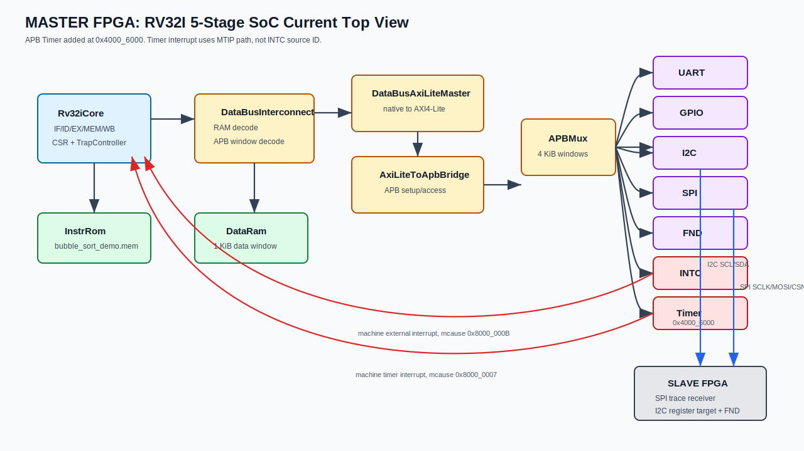

설명 포인트:

| Block | 설명 |
| --- | --- |
| `TOP` | MASTER SoC top. clock divide, reset sync, core, memory, bus, peripherals, external pins를 소유 |
| `Rv32iCore` | instruction/data bus를 밖으로 노출하는 5-stage CPU core |
| `InstrRom` | firmware `.mem`을 instruction fetch path에 제공 |
| `DataRam` | 1 KiB data RAM. `.bss`, stack, volatile globals 저장 |
| `DataBusInterconnect` | CPU native data request를 RAM window와 APB window로 decode |
| `DataBusAxiLiteMaster` | APB-window native request를 AXI4-Lite master transaction으로 변환 |
| `AxiLiteToApbBridge` | AXI4-Lite slave transaction을 APB SETUP/ACCESS로 변환 |
| `APBMux` | address `[31:12]` 기준으로 UART/GPIO/I2C/INTC/SPI/FND/Timer select |
| `InterruptController` | 6개 peripheral IRQ source를 machine external interrupt로 합성 |
| `APB_Timer` | 100 Hz tick 생성, core machine timer interrupt pending 출력 |
| `APB_SPI` | SLAVE로 24-byte Bubble Sort trace frame 전송 |
| `APB_I2C` | SLAVE register target probe/read/write |
| `APB_FND` | MASTER local 4-digit FND 표시 |

MASTER와 SLAVE 연결:

| MASTER pin role | SLAVE pin role | 설명 |
| --- | --- | --- |
| `oSpiSclk` | `iSpiSclk` | SPI clock |
| `oSpiMosi` | `iSpiMosi` | SPI trace data, MSB-first |
| `oSpiCsN` | `iSpiCsN` | SPI chip-select, active-low |
| `ioI2cScl` | `iI2cScl` | I2C SCL |
| `ioI2cSda` | `ioI2cSda` | I2C SDA open-drain |
| GND | GND | 공통 기준 전위 필수 |

## 5. Core 설명 : RISC-V Core Diagram SVG

발표자료에는 기존 core SVG를 사용한다.

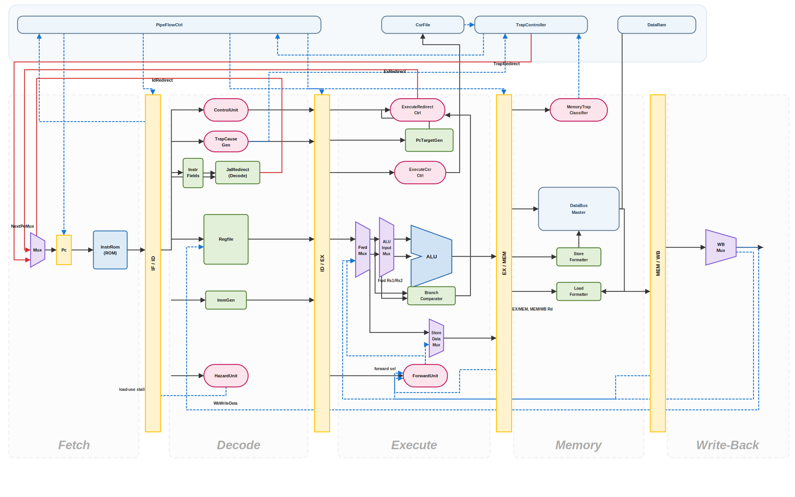

Timer interrupt가 추가된 trap 경로는 아래 보조 SVG로 설명한다.

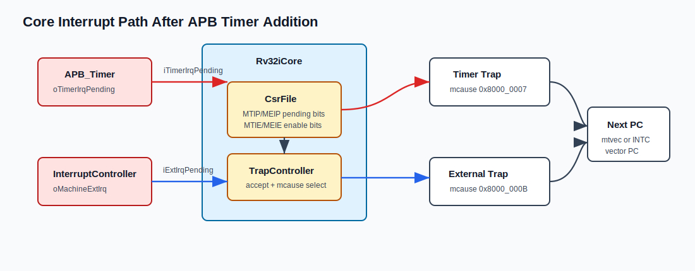

Core 핵심 설명:

| Stage | 주요 module | 역할 |
| --- | --- | --- |
| IF | `FetchStage`, `Pc`, `NextPcMux` 계열 | PC 선택, instruction bus request 생성, instruction fetch |
| IF/ID | `IfIdReg` | fetch 결과를 decode stage로 전달. stall/flush 대상 |
| ID | `DecodeStage`, `ControlUnit`, `Regfile`, `ImmGen`, `HazardUnit` | opcode 분류, control 생성, register read, load-use hazard 검출 |
| ID/EX | `IdExReg` | operand/control bundle을 execute stage로 전달 |
| EX | `ExecuteStage`, `Alu`, branch/jump/CSR control | ALU 연산, branch/jump redirect, CSR write, MRET, EX trap 판단 |
| EX/MEM | `ExMemReg` | memory access 정보 전달 |
| MEM | `MemoryStage`, `StoreFormatter`, `LoadFormatter`, `MemoryTrapClassifier` | load/store request 생성, byte enable/data formatting, bus error/misalignment trap |
| MEM/WB | `MemWbReg` | write-back data 전달 |
| WB | `WriteBackStage` | ALU/MEM/PC+4 중 register write-back data 선택 |

Core에서 발표해야 할 설계 포인트:

| 주제 | 내용 |
| --- | --- |
| ISA 범위 | RV32I + Zicsr build target. `MainDecoder`는 R/I/load/store/branch/LUI/AUIPC/JAL/JALR/system class를 분류 |
| Forwarding | EX/MEM, MEM/WB 결과를 execute operand로 forwarding해 data hazard 완화 |
| Load-use stall | load 결과가 바로 다음 instruction operand로 필요하면 IF/ID hold 및 ID/EX bubble 삽입 |
| Redirect | branch/jump/MRET/trap이 발생하면 front-end flush와 PC redirect 수행 |
| Memory stall | APB access가 끝나지 않으면 `MemApbStall`로 pipeline hold |
| Trap/interrupt | `CsrFile`과 `TrapController`가 `mstatus`, `mie`, `mip`, `mtvec`, `mepc`, `mcause`를 처리 |
| INTC vector | `IntcVectorValid`가 있으면 machine external interrupt target PC를 INTC vector table로 override 가능 |
| Timer interrupt | `APB_Timer.oTimerIrqPending`이 core `iTimerIrqPending`으로 들어오고, CSR `mip.MTIP`/`mie.MTIE` 조건에서 `mcause=0x8000_0007` trap 발생 |

## 6. Bus Matrix Address Map [DataBusAxiLiteMaster / DataBusInterconnect]

CPU memory stage는 `rv32i_pkg::DataBusReq_t` native request를 만든다.

```systemverilog
typedef struct packed {
  logic        ReqValid;
  logic        ReqWrite;
  logic [31:0] ReqAddr;
  logic [3:0]  ReqByteEn;
  logic [31:0] ReqWdata;
} DataBusReq_t;
```

`DataBusInterconnect` routing:

| Address range | Target | 응답 특성 |
| --- | --- | --- |
| `0x0000_0000` - `0x0000_03FF` | `DataRam` | local RAM, immediate read/write path |
| `0x4000_0000` - `0x4000_FFFF` | APB window | `DataBusAxiLiteMaster` -> `AxiLiteToApbBridge` -> APB slaves |
| 그 외 | decode error | `RspErr=1`로 memory access trap 가능 |

APB peripheral address map:

| Peripheral | Base | Window | RTL/SW 기준 |
| --- | ---: | ---: | --- |
| UART | `0x4000_0000` | 4 KiB | `APB_UART`, `SOC_APB_UART_BASE` |
| GPIO | `0x4000_1000` | 4 KiB | `APB_GPIO`, `SOC_APB_GPIO_BASE` |
| I2C MASTER | `0x4000_2000` | 4 KiB | `APB_I2C`, `SOC_APB_I2C_BASE` |
| INTC | `0x4000_3000` | 4 KiB | `InterruptController`, `SOC_APB_INTC_BASE` |
| SPI MASTER | `0x4000_4000` | 4 KiB | `APB_SPI`, `SOC_APB_SPI_BASE` |
| FND | `0x4000_5000` | 4 KiB | `APB_FND`, `SOC_APB_FND_BASE` |
| TIMER | `0x4000_6000` | 4 KiB | `APB_Timer`, `SOC_APB_TIMER_BASE` |

`DataBusAxiLiteMaster`는 APB window에 대해서만 동작한다. native request를 latch한 뒤 write면 AW/W/B channel, read면 AR/R channel을 사용하고, AXI response를 다시 native `RspReady`, `RspRdata`, `RspErr`로 되돌린다.

## 7. AXI4 LITE Definition

이 프로젝트에서 사용하는 AXI4-Lite는 32-bit data, 32-bit address, single-beat MMIO transaction 용도이다. burst, ID, outstanding multiple transaction은 사용하지 않는다.

| Channel | 방향 | 주요 signal | 의미 |
| --- | --- | --- | --- |
| Write Address | master -> slave | `AWADDR`, `AWPROT`, `AWVALID`; slave -> master `AWREADY` | write 주소 handshake |
| Write Data | master -> slave | `WDATA`, `WSTRB`, `WVALID`; slave -> master `WREADY` | write data/strobe handshake |
| Write Response | slave -> master | `BRESP`, `BVALID`; master -> slave `BREADY` | write 완료 및 error 응답 |
| Read Address | master -> slave | `ARADDR`, `ARPROT`, `ARVALID`; slave -> master `ARREADY` | read 주소 handshake |
| Read Data | slave -> master | `RDATA`, `RRESP`, `RVALID`; master -> slave `RREADY` | read data 및 error 응답 |

Handshake 규칙:

| 규칙 | 설명 |
| --- | --- |
| `VALID && READY` | 해당 channel transfer가 그 cycle에 성립 |
| AW/W 독립성 | write address와 write data는 서로 다른 cycle에 accept될 수 있음 |
| Response 유지 | slave는 `BVALID`/`RVALID`을 master의 `BREADY`/`RREADY`까지 유지 |
| `OKAY` | `2'b00`, 정상 응답 |
| `SLVERR` | `2'b10`, APB slave error 또는 local decode error를 AXI error로 변환 |
| `PROT` | 현재 RTL에서는 `AWPROT`, `ARPROT` 모두 `3'b000` 고정 |

## 8. [DataBusAxiLiteMaster] AXI4 LITE MASTER FSM SVG 및 LOGIC 설명

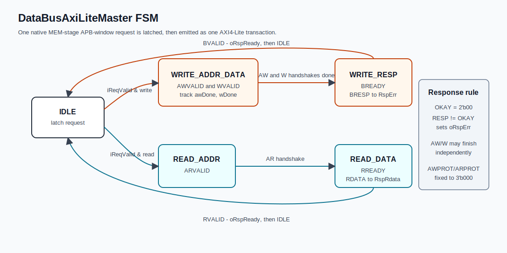

RTL state:

| State | 조건/출력 | 다음 상태 |
| --- | --- | --- |
| `IDLE` | request 대기. `iReqValid`이면 주소, byte enable, write data latch | write면 `WRITE_ADDR_DATA`, read면 `READ_ADDR` |
| `WRITE_ADDR_DATA` | `AWVALID`와 `WVALID` assert. `awDone`, `wDone`으로 독립 handshake 추적 | AW와 W가 모두 완료되면 `WRITE_RESP` |
| `WRITE_RESP` | `BREADY=1`. `BVALID`을 기다림 | `BVALID`이면 native `oRspReady=1`, 이후 `IDLE` |
| `READ_ADDR` | `ARVALID=1` | `ARREADY` handshake 후 `READ_DATA` |
| `READ_DATA` | `RREADY=1`. `RVALID`을 기다림 | `RVALID`이면 `oRspReady=1`, `oRspRdata=iAxiRdata`, 이후 `IDLE` |

Logic 설명:

| 항목 | 설명 |
| --- | --- |
| request isolation | `IDLE`에서 request를 latch하므로 transaction 도중 native bus 입력이 바뀌어도 진행 중 AXI transaction은 유지 |
| write handshake | AW/W가 따로 accept되어도 `awDone`, `wDone`이 각각 저장되어 두 channel 완료 후 B response로 이동 |
| read handshake | AR accept 후 R channel만 기다림 |
| error mapping | `BRESP != OKAY` 또는 `RRESP != OKAY`이면 `oRspErr=1` |
| pipeline 영향 | `oRspReady`가 오기 전까지 core memory path는 `MemApbStall`로 hold |

## 9. [AXI4 Lite to APB Bridge] AXI4 LITE SLAVE FSM SVG 및 LOGIC 설명

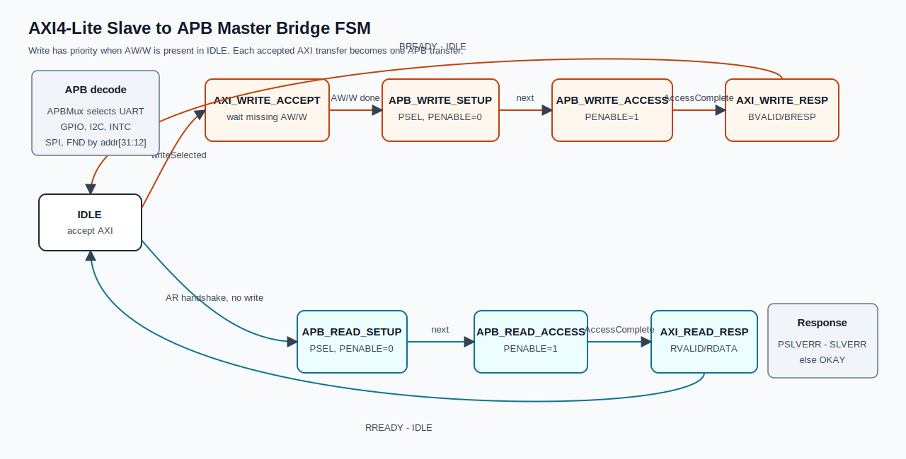

RTL state:

| State | 설명 |
| --- | --- |
| `IDLE` | AXI write/read request accept 대기. write가 있으면 read보다 우선 |
| `AXI_WRITE_ACCEPT` | AW 또는 W 중 아직 handshake되지 않은 channel을 계속 ready 처리 |
| `APB_WRITE_SETUP` | APB setup phase. PSEL assert, PENABLE deassert |
| `APB_WRITE_ACCESS` | APB access phase. PENABLE assert, selected slave `PREADY` 또는 local decode error 대기 |
| `AXI_WRITE_RESP` | APB 결과를 `BRESP`로 변환해 `BVALID` 제공 |
| `APB_READ_SETUP` | APB read setup phase |
| `APB_READ_ACCESS` | APB read access phase. read data/error capture |
| `AXI_READ_RESP` | APB 결과를 `RDATA/RRESP`로 변환해 `RVALID` 제공 |

Bridge logic:

| 항목 | 설명 |
| --- | --- |
| write priority | `writeSelected = IDLE && (AWVALID || WVALID)`. 이때 `ARREADY`는 내려가 read보다 write를 먼저 처리 |
| request latch | AW handshake에서 `reqAddr`, W handshake에서 `reqStrb/reqWdata` 저장 |
| APB address | APB slave 내부 offset은 `reqAddr[11:0]` |
| APB select | `APBMux`가 `reqAddr[31:12]`로 UART/GPIO/I2C/INTC/SPI/FND/Timer PSEL 생성 |
| completion | `AccessComplete = PENABLE && (selected PREADY || local decode miss)` |
| AXI response | selected slave `PSLVERR` 또는 local miss면 `SLVERR`, 아니면 `OKAY` |

## 10. [APB Peripheral Bus] APB MASTER FSM SVG 및 LOGIC 설명

현 `TOP.sv`에서는 `AxiLiteToApbBridge`가 APB master 역할을 수행한다. 별도 `APBMASTER/APBCtrl` module도 repo에 남아 있으며, APB protocol phase는 동일하게 `IDLE -> SETUP -> ACCESS` 구조로 설명할 수 있다.

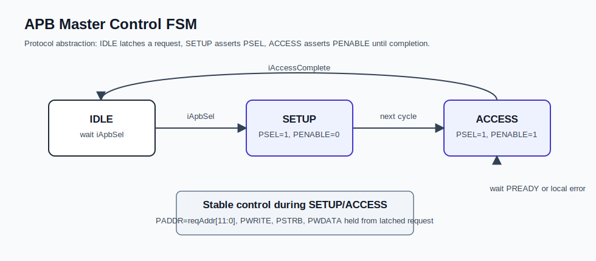

APB phase 설명:

| Phase | `PSEL` | `PENABLE` | 설명 |
| --- | --- | --- | --- |
| IDLE | 0 | 0 | request 없음 |
| SETUP | 1 | 0 | address/control/data가 안정화되는 첫 cycle |
| ACCESS | 1 | 1 | selected slave가 `PREADY=1`을 줄 때 transfer 완료 |

APB bus signal:

| Signal | 설명 |
| --- | --- |
| `PADDR[11:0]` | 각 4 KiB peripheral window 내부 offset |
| `PWRITE` | 1이면 write, 0이면 read |
| `PSTRB[3:0]` | byte write enable |
| `PWDATA[31:0]` | write data |
| `PRDATA[31:0]` | selected slave read data |
| `PREADY` | slave access completion |
| `PSLVERR` | invalid access, FIFO full/empty 등 slave-level error |

`APBMux` 역할:

| 기능 | 설명 |
| --- | --- |
| decode | address `[31:12]`가 peripheral base `[31:12]`와 일치하는지 비교 |
| one-hot PSEL | phase active일 때 selected peripheral만 `PSEL=1` |
| response mux | selected `PRDATA/PREADY/PSLVERR`를 bridge completion channel로 전달 |
| local decode error | 어떤 window에도 맞지 않으면 `AccessComplete=1`, `PSLVERR=1` |

## 11. [APB Slaves] APB SLAVE PERI 역할 및 정의 간략설명

MASTER APB slaves:

| Slave | Base | 주요 register | 역할 |
| --- | ---: | --- | --- |
| `APB_UART` | `0x4000_0000` | `CTRL`, `STATUS`, `TXDATA`, `RXDATA`, `IRQ_EN` | UART RX command 입력, UART TX 결과 출력 |
| `APB_GPIO` | `0x4000_1000` | `DATA_OUT`, `DATA_IN`, `DIR`, `IRQ_RISE_EN`, `IRQ_FALL_EN`, `IRQ_STATUS` | button command, GPIO edge IRQ, debounce 대상 input |
| `APB_I2C` | `0x4000_2000` | `CTRL`, `STATUS`, `SLAVE_ADDR`, `REG_ADDR`, `WDATA`, `RDATA`, `LEN`, `CLKDIV`, `IRQ_STATUS`, `IRQ_ENABLE` | SLAVE register target read/write |
| `InterruptController` | `0x4000_3000` | `PENDING`, `ENABLE`, `CLAIM`, `COMPLETE`, `CTRL`, `THRESHOLD`, `INFO`, `PRIORITY`, `VECTOR` | PLIC-lite interrupt aggregation |
| `APB_SPI` | `0x4000_4000` | `CTRL`, `STATUS`, `TXDATA`, `RXDATA`, `CLKDIV`, `CS_CTRL`, `FRAME_LEN`, `IRQ_STATUS`, `IRQ_ENABLE` | 24-byte trace frame 송신 |
| `APB_FND` | `0x4000_5000` | `DIGITS_BCD`, `BLINK_MASK`, `DP_MASK`, `CTRL` | MASTER 4-digit FND 표시 |
| `APB_Timer` | `0x4000_6000` | `CTRL`, `STATUS`, `PRESCALE`, `PERIOD`, `COUNT`, `COMPARE`, `INFO` | 100 Hz tick, timeout/debounce/sort step 기준, machine timer interrupt |

MASTER APB 상세 register offset map:

| Peripheral | Offset | Register | Access | 핵심 bit/역할 |
| --- | ---: | --- | --- | --- |
| UART | `0x000` | `CTRL` | RW | bit0 RX enable, bit1 TX enable |
| UART | `0x004` | `STATUS` | RO | bit0 RX valid, bit1 TX ready, bit2 TX busy, bit3 RX overflow |
| UART | `0x008` | `TXDATA` | WO | TX FIFO push, full이면 `PSLVERR` |
| UART | `0x00C` | `RXDATA` | RO | RX FIFO pop, empty이면 `PSLVERR` |
| UART | `0x010` | `IRQ_EN` | RW | bit0 RX IRQ enable |
| GPIO | `0x000` | `DATA_OUT` | RW | output data register |
| GPIO | `0x004` | `DATA_IN` | RO | sampled GPIO input |
| GPIO | `0x008` | `DIR` | RW | 1이면 output enable |
| GPIO | `0x00C` | `IRQ_RISE_EN` | RW | rising-edge IRQ enable mask |
| GPIO | `0x010` | `IRQ_FALL_EN` | RW | falling-edge IRQ enable mask |
| GPIO | `0x014` | `IRQ_STATUS` | RW1C | sticky edge status, write 1 clear |
| I2C | `0x000` | `CTRL` | RW | bit0 enable, bit1 start pulse, bit2 read/write, bit3 core reset |
| I2C | `0x004` | `STATUS` | RO | bit0 busy, bit1 done, bit2 ack_ok, bit3 rx_valid, bit4 error |
| I2C | `0x008` | `SLAVE_ADDR` | RW | 7-bit target address, demo SLAVE는 `0x42` |
| I2C | `0x00C` | `REG_ADDR` | RW | target register pointer |
| I2C | `0x010` | `WDATA` | RW | write payload |
| I2C | `0x014` | `RDATA` | RO | read payload |
| I2C | `0x018` | `LEN` | RW | transfer length field |
| I2C | `0x01C` | `CLKDIV` | RW | SCL timing divider, firmware default `99` |
| I2C | `0x020` | `IRQ_STATUS` | RW1C | bit0 done, bit1 rx_valid, bit2 tx_ready, bit8 nack, bit9 arb_lost, bit10 bus_error, bit11 timeout |
| I2C | `0x024` | `IRQ_ENABLE` | RW | I2C IRQ enable mask |
| SPI | `0x000` | `CTRL` | RW | bit0 enable, bit1 start pulse, bit2 TX FIFO clear, bit3 RX FIFO clear, bit4 CPOL, bit5 CPHA, bit6 LSB-first |
| SPI | `0x004` | `STATUS` | RO | bit0 busy, bit1 TX ready, bit2 TX empty, bit3 RX valid, bit4 frame_done, bit5 error |
| SPI | `0x008` | `TXDATA` | WO | TX FIFO push |
| SPI | `0x00C` | `RXDATA` | RO | RX FIFO pop/read |
| SPI | `0x010` | `CLKDIV` | RW | SPI clock divider |
| SPI | `0x014` | `CS_CTRL` | RW | chip-select control, demo default `1` |
| SPI | `0x018` | `FRAME_LEN` | RW | frame byte count, demo `24` |
| SPI | `0x01C` | `IRQ_STATUS` | RW1C | bit0 frame_done, bit1 tx_ready, bit2 rx_valid, bit8 rx_overflow, bit9 tx_underflow, bit10 mode_error, bit11 frame_drop |
| SPI | `0x020` | `IRQ_ENABLE` | RW | SPI IRQ enable mask |
| FND | `0x000` | `DIGITS_BCD` | RW | 16-bit packed 4-digit hex payload |
| FND | `0x004` | `BLINK_MASK` | RW | per-digit blink mask |
| FND | `0x008` | `DP_MASK` | RW | decimal-point mask |
| FND | `0x00C` | `CTRL` | RW | bit0 display enable |
| Timer | `0x000` | `CTRL` | RW | bit0 enable, bit1 periodic, bit2 interrupt enable, bit3 clear count pulse, bit4 start pulse, bit5 stop pulse |
| Timer | `0x004` | `STATUS` | RW1C | bit0 irq_pending, bit1 match, bit2 overflow, bit8 running |
| Timer | `0x008` | `PRESCALE` | RW | system clock을 timer count tick으로 나누는 divider. firmware는 25 MHz 기준 `24999` |
| Timer | `0x00C` | `PERIOD` | RW | periodic match 주기. firmware는 `9`로 설정해 1 kHz count tick 10개마다 100 Hz interrupt |
| Timer | `0x010` | `COUNT` | RW | timer count 값 |
| Timer | `0x014` | `COMPARE` | RW | one-shot compare 기준. current firmware는 periodic mode라 `0xFFFF_FFFF`로 둠 |
| Timer | `0x018` | `INFO` | RO | feature/version 정보 `0x0007_2001`, write 시 `PSLVERR` |

Peripheral별 발표 포인트:

| Peripheral | 발표 포인트 |
| --- | --- |
| UART | RX FIFO에 byte가 있으면 command 처리. TX FIFO ready를 확인한 뒤 결과 hex 문자열 출력 |
| GPIO | lower 4 bit를 command source로 사용. bit0 sort, bit1 pause/resume, bit2 one-step, bit3 reset. IRQ status는 write-to-clear이고 firmware가 Timer tick으로 debounce 보강 |
| I2C | `SLAVE_ADDR=0x42`, register pointer 기반 read/write. open-drain SDA/SCL 전제 |
| SPI | 32-byte TX/RX FIFO, 기본 frame length 24. mode0, MSB-first trace 전송 |
| FND | 16-bit value를 4개 hex digit으로 표시. display enable, blink mask, decimal point mask 제어 |
| INTC | source priority, threshold, claim/complete로 peripheral IRQ service 순서 결정 |
| Timer | `PRESCALE=24999`, `PERIOD=9`, periodic interrupt enable로 100 Hz system tick 생성 |

## 12. [INTC like PLIC] INTC BLOCK DIAGRAM SVG

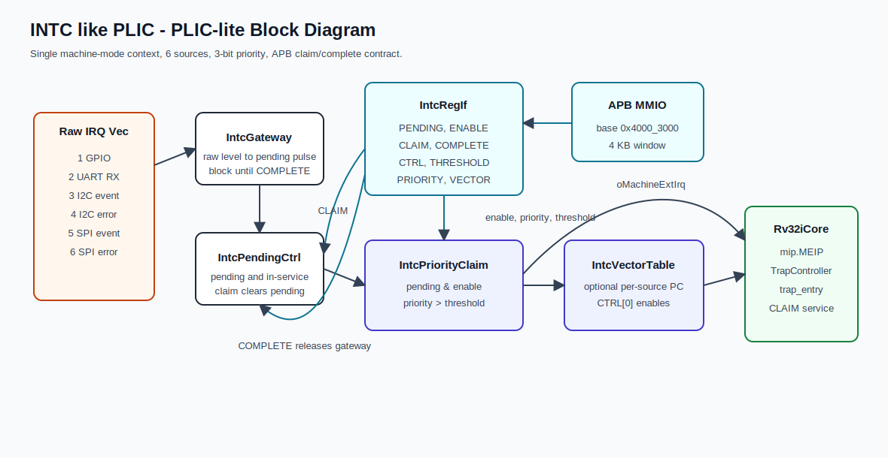

기존 interrupt/trap flow SVG도 같이 사용할 수 있다.

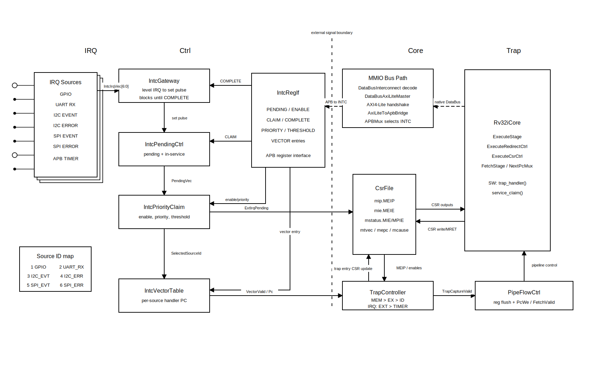

INTC 구성:

| Block | 역할 |
| --- | --- |
| `IntcGateway` | raw IRQ level을 pending set pulse로 변환하고, SW `COMPLETE` 전까지 같은 source 재알림 차단 |
| `IntcPendingCtrl` | pending bit와 in-service bit 관리. `CLAIM` read 시 pending clear/in-service set |
| `IntcPriorityClaim` | pending, enable, priority, threshold 조건으로 source ID 선택 |
| `IntcRegIf` | APB register map 제공. enable, priority, threshold, vector table 저장 |
| `IntcVectorTable` | `CTRL[0]`가 set이고 selected source vector가 valid하면 trap PC override |
| `CsrFile` | `mip.MEIP = software MEIP || INTC oMachineExtIrq`, `mip.MTIP = software MTIP || TimerIrqPending` |
| `TrapController` | external interrupt는 `mstatus.MIE && mie.MEIE && mip.MEIP`, timer interrupt는 `mstatus.MIE && mie.MTIE && mip.MTIP` 조건에서 accept |

Timer와 INTC의 관계:

| 항목 | 설명 |
| --- | --- |
| INTC 담당 | GPIO/UART/I2C/SPI raw IRQ 6개를 PLIC-lite 방식으로 priority/claim/complete 처리 |
| Timer 담당 | `APB_Timer`가 `oTimerIrqPending`을 core에 직접 연결해 machine timer interrupt 생성 |
| firmware 구분 | `trap_handler()`가 `mcause=0x8000_0007`이면 Timer status를 W1C clear하고 tick 증가, `mcause=0x8000_000B`이면 INTC `CLAIM` 처리 |

INTC register map:

| Offset | Register | Access | 설명 |
| ---: | --- | --- | --- |
| `0x000` | `PENDING` | RO | pending source bitmap |
| `0x004` | `ENABLE` | RW | interrupt enable bitmap |
| `0x008` | `CLAIM` | RO | selected source ID read, side effect로 claim |
| `0x00C` | `COMPLETE` | WO | completed source ID write |
| `0x010` | `CTRL` | RW | bit0: per-source vector enable |
| `0x014` | `THRESHOLD` | RW | priority threshold |
| `0x018` | `INFO` | RO | source count, priority width, feature bits |
| `0x020 + 4*id` | `PRIORITY0 + 4*id` / `PRIORITY[id]` | RW | source `id=1..6` priority |
| `0x080 + 4*id` | `VECTOR0 + 4*id` / `VECTOR[id]` | RW | source `id=1..6` handler PC |

Priority rule:

```text
eligible = pending[source] && enable[source] && (priority[source] > threshold)
```

큰 priority 값이 우선이고, priority가 같으면 낮은 source ID가 우선이다.

## 13. RAW IRQ 설명 - 각 PERI별 IRQ Trigger 설명

Source ID map:

| Source ID | RTL signal | Peripheral | 의미 |
| ---: | --- | --- | --- |
| 1 | `GpioIrq` | GPIO | GPIO edge IRQ |
| 2 | `UartIrq` | UART | UART RX FIFO not empty |
| 3 | `I2cEventIrq` | I2C | I2C done/rx_valid/tx_ready event |
| 4 | `I2cErrorIrq` | I2C | I2C nack/arbitration/bus/timeout error |
| 5 | `SpiEventIrq` | SPI | SPI frame_done/tx_ready/rx_valid event |
| 6 | `SpiErrorIrq` | SPI | SPI rx_overflow/tx_underflow/mode_error/frame_drop |

Timer interrupt는 위 Source ID map에 들어가지 않는다.

| Interrupt | RTL path | `mcause` | Clear/service 방식 |
| --- | --- | ---: | --- |
| Machine timer interrupt | `APB_Timer.oTimerIrqPending` -> `Rv32iCore.iTimerIrqPending` -> CSR `mip.MTIP` | `0x8000_0007` | firmware가 `TIMER_STATUS`의 `IRQ_PENDING/MATCH/OVERFLOW` bit를 write-1-clear하고 `g_ticks`를 증가 |

Trigger 상세:

| Source | Raw IRQ trigger | Clear/service 방식 |
| --- | --- | --- |
| GPIO | `GpioIrqCtrl`이 enabled rising/falling edge를 sticky `IRQ_STATUS`로 set하고 `oIrq=|IRQ_STATUS` | SW가 `GPIO_IRQ_STATUS`에 set bit를 write해 clear |
| UART RX | `!RxFifoEmpty && RxIrqEn` | SW가 `UART_RXDATA`를 read해 FIFO를 pop. FIFO가 empty되면 raw IRQ deassert |
| I2C event | `IRQ_STATUS & IRQ_ENABLE & 0x000F`. RTL은 bit0 done, bit1 rx_valid, bit2 tx_ready를 set. bit3은 현재 core에서 set하지 않음 | SW가 `I2C_IRQ_STATUS`에 cause bit write해 clear |
| I2C error | `IRQ_STATUS & IRQ_ENABLE & 0x0F00`. bit8 nack, bit9 arb_lost, bit10 bus_error, bit11 timeout | demo는 error source만 enable. error 시 SLAVE link disable/reset |
| SPI event | `IRQ_STATUS & IRQ_ENABLE & 0x0007`. bit0 frame_done, bit1 tx_ready, bit2 rx_valid | SW가 `SPI_IRQ_STATUS`에 cause bit write해 clear |
| SPI error | `IRQ_STATUS & IRQ_ENABLE & 0x0F00`. bit8 rx_overflow, bit9 tx_underflow, bit10 mode_error, bit11 frame_drop | demo는 error source만 enable. error 시 MASTER FND에 `E2xx` 표시 |

Firmware priority 설정:

| Source | Priority |
| --- | ---: |
| GPIO | 3 |
| UART RX | 3 |
| I2C event | 2 |
| I2C error | 5 |
| SPI event | 1 |
| SPI error | 5 |

Firmware interrupt enable:

| CSR/설정 | 현재 firmware 동작 |
| --- | --- |
| `mie.MTIE` | Timer interrupt enable. 100 Hz tick 처리 |
| `mie.MEIE` | INTC external interrupt enable. GPIO/UART/I2C/SPI 처리 |
| `mstatus.MIE` | machine interrupt global enable |

## 14. Slave Module 설명

SLAVE project `SLVAE_BUBBLE`은 CPU 없이 동작하는 표시 target이다. manifest의 top은 `Top`이고, module info상 역할은 `SortDisplaySlaveTop`이다.

SLAVE block 구성:

| Module | 역할 |
| --- | --- |
| `Top` | SPI/I2C/FND submodule wiring, open-drain SDA drive |
| `SpiTraceSlave` | SPI SCLK/MOSI/CSN 동기화, byte capture, frame start/end/short detection |
| `SortTraceFrameDecoder` | 24-byte trace frame magic/version/checksum 검증 및 field 추출 |
| `SortSlaveRegs` | SLAVE_ID, display mode, status, error, brightness, counters 저장 |
| `I2cSlaveRegTarget` | I2C address match, register pointer, read/write transaction 처리 |
| `I2cSlaveProtocolFsm` | I2C address/register/write/read/ACK/repeated-start protocol FSM |
| `I2cSlaveRegMap` | readable/writable byte address decode, invalid access error pulse |
| `SlaveFndController` | selected 16-bit value를 4-digit hex FND로 표시 |

SPI trace frame format:

| Byte | 의미 |
| ---: | --- |
| 0 | magic `0xA5` |
| 1 | magic `0x5A` |
| 2 | version `0x01` |
| 3 | frame type `0x01` |
| 4-5 | frame id, little-endian |
| 6 | phase |
| 7 | flags |
| 8 | array length, 현재 4 |
| 9 | pass index |
| 10 | compare index |
| 11 | left index |
| 12 | right index |
| 13 | left value |
| 14 | right value |
| 15 | changed index |
| 16-17 | compare count |
| 18-19 | swap count |
| 20-21 | total count |
| 22 | status code |
| 23 | XOR checksum |

SLAVE I2C register map:

여기서 readable register는 MASTER가 I2C read transaction으로 값을 읽을 수 있는 SLAVE 내부 register라는 뜻이다. SPI trace로 갱신된 counter/status를 SLAVE 내부에 저장해 두고, MASTER가 필요할 때 I2C로 확인할 수 있게 만든 map이다.

| 주소 | 이름 | Access | 설명 |
| ---: | --- | --- | --- |
| `0x00`-`0x03` | `SLAVE_ID` | R | `0x534C_5631`, ASCII 성격의 `SLV1` |
| `0x04` | `DISPLAY_MODE` | R/W | SLAVE FND 표시 선택 |
| `0x08`-`0x0B` | `STATUS` | R | alive, SPI active, frame seen, error, latest phase |
| `0x0C`-`0x0D` | `LAST_FRAME_ID` | R | 마지막 정상 frame id |
| `0x10`-`0x11` | `ERROR_CODE` | R/W1C | checksum/format/short/invalid register/display mode error |
| `0x14` | `BRIGHTNESS` | R/W | 0이면 blanking 성격, nonzero면 표시 |
| `0x18`-`0x19` | `COMPARE_COUNT` | R | 마지막 정상 frame의 compare count |
| `0x1C`-`0x1D` | `SWAP_COUNT` | R | 마지막 정상 frame의 swap count |
| `0x20`-`0x21` | `TOTAL_COUNT` | R | 마지막 정상 frame의 total count |

참고: `PASS_COUNT`는 SLAVE 내부 `SortSlaveRegs`에 저장되고 display mode 0에서 SLAVE FND로 표시된다. 다만 I2C로 값을 직접 읽는 주소는 현재 없다. 즉 MASTER가 I2C read로 읽을 수 있는 counter는 `COMPARE_COUNT`, `SWAP_COUNT`, `TOTAL_COUNT`이고, pass count는 FND 표시용 내부 값이다.

Display mode:

| Mode | SLAVE FND 표시 |
| ---: | --- |
| 0 | pass count |
| 1 | swap count |
| 2 | total count |

현재 코드 정합성 체크:

| 구분 | 현재 코드 |
| --- | --- |
| SLAVE RTL 허용 mode | `0=pass`, `1=swap`, `2=total`. `3` 이상을 쓰면 `ERROR_CODE[4]` set |
| MASTER firmware 정의 | `0=pass`, `1=compare`, `2=swap`, `3=total` |
| 발표 시 언급 | display mode protocol은 맞춰야 할 부분이 남아 있다. SLAVE 쪽에 compare mode를 추가하거나, MASTER firmware mode 값을 SLAVE RTL에 맞춰 수정해야 완전히 일치한다 |

## 15. SW code ASM

여기서 ASM은 assembly가 아니라 Algorithm State Machine이다. 발표에서는 C 코드의 instruction 변환보다, firmware가 어떤 상태와 조건 판단으로 움직이는지 보여주는 chart로 설명한다.

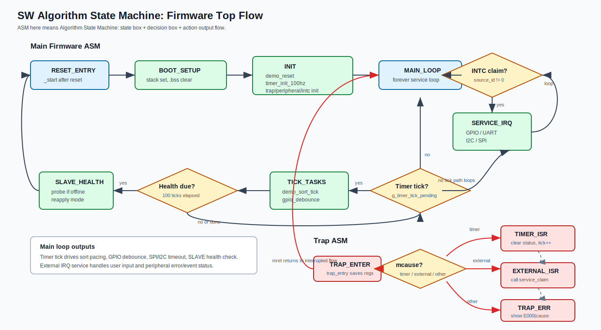

Application demo state는 별도 ASM chart로 분리해 보여준다.

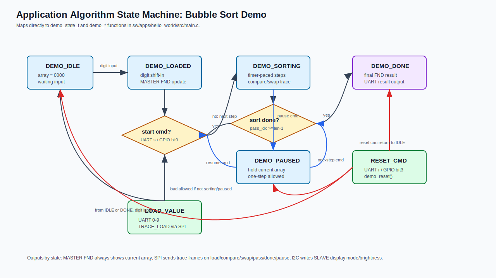

SW Algorithm State Machine 설명 방향:

| 구분 | 상태/판단 | 설명 |
| --- | --- | --- |
| boot | `RESET_ENTRY` -> `BOOT_SETUP` -> `INIT` | reset 후 stack/BSS 준비, demo reset, Timer/peripheral/trap/INTC 초기화 |
| main loop | `MAIN_LOOP` | 무한 loop에서 INTC claim과 Timer tick flag를 반복 확인 |
| external IRQ 판단 | `INTC claim?` | source ID가 있으면 GPIO/UART/I2C/SPI service로 분기 |
| periodic 판단 | `Timer tick?` | `g_timer_tick_pending`이 set되면 tick 기반 작업 수행 |
| tick action | `TICK_TASKS` | `demo_sort_tick()`, `gpio_debounce_tick()`, `slave_health_tick()` 실행 |
| trap path | `TRAP_ENTER` -> `mcause?` | Timer interrupt, external interrupt, unknown trap을 구분 |
| timer ISR | `TIMER_ISR` | `TIMER_STATUS` W1C clear, `g_ticks++`, `g_timer_tick_pending=true` |
| external ISR | `EXTERNAL_ISR` | `service_claim()`으로 INTC source 처리 |

Application demo ASM 설명 방향:

| State | 진입 조건 | 주요 output/action | 다음 상태 |
| --- | --- | --- | --- |
| `DEMO_IDLE` | reset 직후, reset command | 배열/counter 초기화, MASTER FND `0000` | digit 입력 시 `DEMO_LOADED` |
| `DEMO_LOADED` | UART digit 입력 | 배열 shift-in, MASTER FND 갱신, `TRACE_LOAD` 송신 | start 입력 시 `DEMO_SORTING`, 추가 digit이면 계속 loaded |
| `DEMO_SORTING` | UART `s` 또는 GPIO bit0 | Timer tick마다 compare/swap, SPI trace 송신, FND 갱신 | pause 입력 시 `DEMO_PAUSED`, 정렬 완료 시 `DEMO_DONE` |
| `DEMO_PAUSED` | UART `p` 또는 GPIO bit1 | 자동 정렬 step 정지, 현재 배열 유지, `TRACE_PAUSED` 송신 | resume이면 `DEMO_SORTING`, one-step이면 한 번만 compare/swap |
| `DEMO_DONE` | 마지막 pass 완료 | 최종 FND 유지, UART 결과 출력, `TRACE_DONE` 송신 | reset이면 `DEMO_IDLE`, 새 digit 입력 시 loaded 흐름 |

발표에서 강조할 점:

| 포인트 | 내용 |
| --- | --- |
| Timer 기반 설계 | 정렬 step, GPIO debounce, SLAVE health check가 모두 100 Hz Timer tick으로 묶인다 |
| interrupt와 main loop 분리 | trap handler는 tick flag나 claim 처리만 짧게 수행하고, 반복 작업은 main loop가 처리한다 |
| 입력 경로 | UART command와 GPIO button command가 같은 application state transition으로 들어간다 |
| 출력 경로 | MASTER FND는 현재 배열, SPI는 trace frame, I2C는 SLAVE 설정/상태 확인에 사용된다 |
| one-step 관찰 | `DEMO_PAUSED`에서만 step 입력이 실제 sort step을 한 번 실행한다 |

## 16. SW code : Application / HAL / Driver

현재 firmware는 파일이 완전히 `app/hal/driver` 폴더로 분리된 구조라기보다는, `main.c` 안에 application logic과 driver-like 함수가 함께 들어 있고 `soc_mmio.h`가 HAL 역할을 한다. 발표에서는 구현 파일 구조보다 설명 계층을 기준으로 나누는 것이 좋다.

| 계층 | 발표자료 형태 | 핵심 질문 |
| --- | --- | --- |
| Application | Sequence Diagram | 사용자의 입력부터 정렬, 표시, SLAVE 통신까지 어떤 순서로 진행되는가 |
| HAL | 함수 이름 + 동작 시각화 | C 코드의 이름이 어떻게 주소 접근, CSR 접근으로 바뀌는가 |
| Driver | 주소/레지스터 매핑 표 | 각 peripheral을 어떤 base/offset/register로 제어하는가 |

### Application: Sequence Diagram

첨부한 예시 이미지처럼 세로 lifeline, 단순 화살표, italic label 중심으로 그린다. 이 장에서는 함수 내부 구현보다 시간 순서를 보여준다.

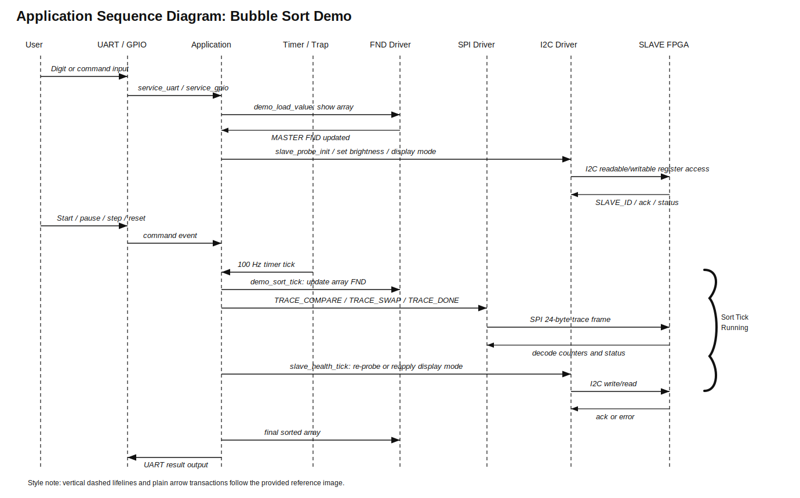

Application sequence 설명:

| 순서 | 흐름 | 의미 |
| ---: | --- | --- |
| 1 | User -> UART/GPIO -> Application | digit, start, pause, step, reset 명령이 firmware application으로 들어옴 |
| 2 | Application -> FND Driver | 입력값 또는 정렬 중 배열을 MASTER FND에 표시 |
| 3 | Application -> I2C Driver -> SLAVE FPGA | 부팅/health check 시 SLAVE ID 확인, brightness/display mode 설정 |
| 4 | Timer/Trap -> Application | 100 Hz tick이 main loop의 정렬/debounce/health 작업을 깨움 |
| 5 | Application -> SPI Driver -> SLAVE FPGA | compare/swap/pass/done/pause trace를 24-byte frame으로 전송 |
| 6 | Application -> UART/GPIO | 정렬 완료 후 UART 결과 출력, reset/pause/step 입력을 계속 수신 |

Application layer 함수:

| 함수/상태 | 발표 설명 |
| --- | --- |
| `DEMO_IDLE/LOADED/SORTING/PAUSED/DONE` | demo의 큰 상태. 입력 대기, 값 load 완료, 정렬 중, 일시정지, 완료를 구분 |
| `demo_load_value()` | UART digit을 4칸 배열에 shift-in하고 MASTER FND를 갱신 |
| `demo_start()` | pass/compare/swap/total counter를 초기화하고 정렬 상태로 전환 |
| `demo_pause()`, `demo_resume()`, `demo_step_paused()` | 정렬 관찰을 위한 pause/resume/one-step 기능 |
| `demo_sort_tick()` | Timer tick 기준으로 자동 정렬 step을 수행할지 판단 |
| `demo_sort_step()` | adjacent compare, swap, counter 증가, SPI trace 송신, pass 완료 판단 |
| `demo_finish_sort()` | 최종 결과를 MASTER FND/UART/SPI/SLAVE display mode로 반영 |

### HAL: Function Name + Operation Visualization

HAL은 peripheral 동작 자체를 숨기는 두꺼운 드라이버가 아니라, 주소/offset/bit mask와 volatile load/store helper를 제공하는 얇은 계층이다.
현재 SW tree에서 HAL로 볼 수 있는 구현 파일은 `sw/common/include/soc_mmio.h` 하나이며, 아래 표는 이 파일에 구현된 항목 전체를 기준으로 정리한 것이다.

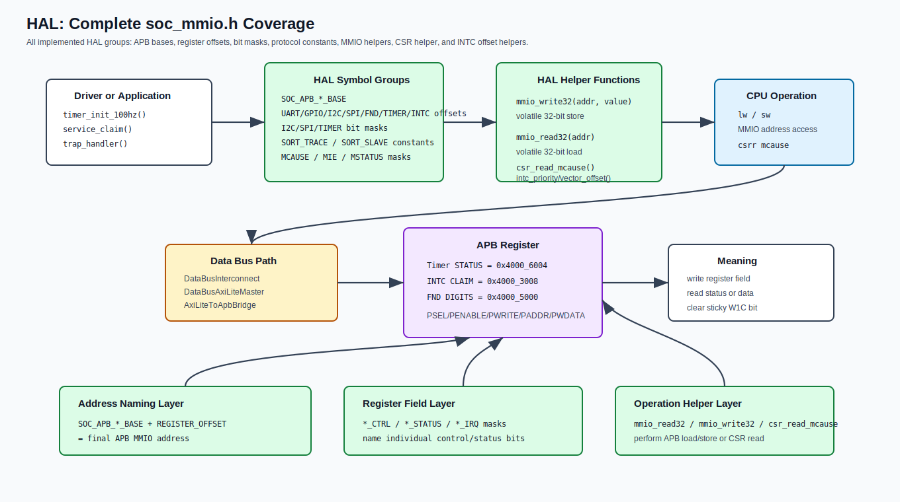

HAL 표준 설명 범위:

| HAL 분류 | 구현 항목 | 발표 설명 |
| --- | --- | --- |
| base address | `SOC_APB_*_BASE` | CPU data bus에서 APB peripheral window로 들어가는 시작 주소 |
| register offset | `UART_*`, `GPIO_*`, `I2C_*`, `SPI_*`, `FND_*`, `TIMER_*`, `INTC_*` | base address에 더해 최종 MMIO 주소를 만드는 register offset |
| bit mask | `I2C_CTRL_*`, `I2C_STATUS_*`, `I2C_IRQ_*`, `SPI_CTRL_*`, `SPI_STATUS_*`, `SPI_IRQ_*`, `TIMER_CTRL_*`, `TIMER_STATUS_*`, `MIE_*`, `MSTATUS_*` | register 내부 bit 의미를 C symbol로 표준화 |
| protocol constant | `SORT_TRACE_*`, `SORT_FRAME_*`, `SORT_SLAVE_*` | SPI trace frame과 SLAVE I2C register protocol 값 |
| helper function | `mmio_write32`, `mmio_read32`, `csr_read_mcause`, `intc_priority_offset`, `intc_vector_offset` | raw address/CSR 접근과 INTC 동적 offset 계산 |

HAL base address map:

| Symbol | Value | Target |
| --- | ---: | --- |
| `SOC_APB_UART_BASE` | `0x4000_0000` | UART APB slave |
| `SOC_APB_GPIO_BASE` | `0x4000_1000` | GPIO APB slave |
| `SOC_APB_I2C_BASE` | `0x4000_2000` | I2C master APB slave |
| `SOC_APB_INTC_BASE` | `0x4000_3000` | PLIC-lite INTC APB slave |
| `SOC_APB_SPI_BASE` | `0x4000_4000` | SPI master APB slave |
| `SOC_APB_FND_BASE` | `0x4000_5000` | MASTER FND APB slave |
| `SOC_APB_TIMER_BASE` | `0x4000_6000` | APB Timer |

HAL register offset map:

| Target | Offset symbols |
| --- | --- |
| UART | `UART_CTRL=0x000`, `UART_STATUS=0x004`, `UART_TXDATA=0x008`, `UART_RXDATA=0x00C`, `UART_IRQ_EN=0x010` |
| GPIO | `GPIO_DATA_OUT=0x000`, `GPIO_DATA_IN=0x004`, `GPIO_DIR=0x008`, `GPIO_IRQ_RISE_EN=0x00C`, `GPIO_IRQ_FALL_EN=0x010`, `GPIO_IRQ_STATUS=0x014` |
| I2C | `I2C_CTRL=0x000`, `I2C_STATUS=0x004`, `I2C_SLAVE_ADDR=0x008`, `I2C_REG_ADDR=0x00C`, `I2C_WDATA=0x010`, `I2C_RDATA=0x014`, `I2C_LEN=0x018`, `I2C_CLKDIV=0x01C`, `I2C_IRQ_STATUS=0x020`, `I2C_IRQ_ENABLE=0x024` |
| SPI | `SPI_CTRL=0x000`, `SPI_STATUS=0x004`, `SPI_TXDATA=0x008`, `SPI_RXDATA=0x00C`, `SPI_CLKDIV=0x010`, `SPI_CS_CTRL=0x014`, `SPI_FRAME_LEN=0x018`, `SPI_IRQ_STATUS=0x01C`, `SPI_IRQ_ENABLE=0x020` |
| FND | `FND_DIGITS_BCD=0x000`, `FND_BLINK_MASK=0x004`, `FND_DP_MASK=0x008`, `FND_CTRL=0x00C` |
| Timer | `TIMER_CTRL=0x000`, `TIMER_STATUS=0x004`, `TIMER_PRESCALE=0x008`, `TIMER_PERIOD=0x00C`, `TIMER_COUNT=0x010`, `TIMER_COMPARE=0x014`, `TIMER_INFO=0x018` |
| INTC | `INTC_PENDING=0x000`, `INTC_ENABLE=0x004`, `INTC_CLAIM=0x008`, `INTC_COMPLETE=0x00C`, `INTC_CTRL=0x010`, `INTC_THRESHOLD=0x014`, `INTC_INFO=0x018`, `INTC_PRIORITY0=0x020`, `INTC_VECTOR0=0x080` |

HAL bit mask and source ID map:

| Group | Symbols |
| --- | --- |
| INTC source ID | `INTC_SRC_GPIO=1`, `INTC_SRC_UART_RX=2`, `INTC_SRC_I2C_EVENT=3`, `INTC_SRC_I2C_ERROR=4`, `INTC_SRC_SPI_EVENT=5`, `INTC_SRC_SPI_ERROR=6` |
| I2C CTRL | `I2C_CTRL_ENABLE`, `I2C_CTRL_START`, `I2C_CTRL_RW`, `I2C_CTRL_CORE_RESET` |
| I2C STATUS | `I2C_STATUS_BUSY`, `I2C_STATUS_DONE`, `I2C_STATUS_ACK_OK`, `I2C_STATUS_RX_VALID`, `I2C_STATUS_ERROR` |
| I2C IRQ | `I2C_IRQ_DONE`, `I2C_IRQ_RX_VALID`, `I2C_IRQ_TX_READY`, `I2C_IRQ_SLAVE_STATUS_READY`, `I2C_IRQ_NACK`, `I2C_IRQ_ARB_LOST`, `I2C_IRQ_BUS_ERROR`, `I2C_IRQ_TIMEOUT` |
| SPI CTRL | `SPI_CTRL_ENABLE`, `SPI_CTRL_START`, `SPI_CTRL_TX_FIFO_CLR`, `SPI_CTRL_RX_FIFO_CLR`, `SPI_CTRL_CPOL`, `SPI_CTRL_CPHA`, `SPI_CTRL_LSB_FIRST` |
| SPI STATUS | `SPI_STATUS_BUSY`, `SPI_STATUS_TX_READY`, `SPI_STATUS_TX_EMPTY`, `SPI_STATUS_RX_VALID`, `SPI_STATUS_FRAME_DONE`, `SPI_STATUS_ERROR` |
| SPI IRQ | `SPI_IRQ_FRAME_DONE`, `SPI_IRQ_TX_READY`, `SPI_IRQ_RX_VALID`, `SPI_IRQ_RX_OVERFLOW`, `SPI_IRQ_TX_UNDERFLOW`, `SPI_IRQ_MODE_ERROR`, `SPI_IRQ_FRAME_DROP` |
| Timer CTRL | `TIMER_CTRL_ENABLE`, `TIMER_CTRL_PERIODIC`, `TIMER_CTRL_INT_ENABLE`, `TIMER_CTRL_CLEAR_COUNT`, `TIMER_CTRL_START`, `TIMER_CTRL_STOP` |
| Timer STATUS | `TIMER_STATUS_IRQ_PENDING`, `TIMER_STATUS_MATCH`, `TIMER_STATUS_OVERFLOW`, `TIMER_STATUS_RUNNING` |
| CSR/trap | `MCAUSE_MACHINE_TIMER_INT=0x80000007`, `MCAUSE_MACHINE_EXT_INT=0x8000000B`, `MIE_MTIE`, `MIE_MEIE`, `MSTATUS_MIE` |

HAL protocol constant map:

| Group | Symbols | 의미 |
| --- | --- | --- |
| SPI trace frame | `SORT_TRACE_FRAME_BYTES=24`, `SORT_FRAME_MAGIC0=0xA5`, `SORT_FRAME_MAGIC1=0x5A`, `SORT_FRAME_VERSION=0x01`, `SORT_FRAME_TYPE_TRACE=0x01` | MASTER가 SLAVE로 보내는 24-byte trace frame format |
| SLAVE I2C address | `SORT_SLAVE_I2C_ADDR=0x42` | MASTER I2C가 접근하는 SLAVE 7-bit address |
| SLAVE readable/writable register | `SORT_SLAVE_REG_SLAVE_ID=0x00`, `SORT_SLAVE_REG_DISPLAY_MODE=0x04`, `SORT_SLAVE_REG_STATUS=0x08`, `SORT_SLAVE_REG_LAST_FRAME_ID=0x0C`, `SORT_SLAVE_REG_ERROR_CODE=0x10`, `SORT_SLAVE_REG_BRIGHTNESS=0x14`, `SORT_SLAVE_REG_COMPARE_COUNT=0x18`, `SORT_SLAVE_REG_SWAP_COUNT=0x1C`, `SORT_SLAVE_REG_TOTAL_COUNT=0x20` | SLAVE 내부 register pointer 값 |

HAL helper function map:

| Function | 구현 동작 | 사용 목적 |
| --- | --- | --- |
| `mmio_write32(uintptr_t addr, uint32_t value)` | `*(volatile uint32_t *)addr = value` | APB register write transaction 생성 |
| `mmio_read32(uintptr_t addr)` | `return *(volatile uint32_t *)addr` | APB register read transaction 생성 |
| `csr_read_mcause(void)` | RISC-V build에서 inline asm `csrr %0, mcause` | trap 원인 구분 |
| `intc_priority_offset(source_id)` | `INTC_PRIORITY0 + source_id * 4` | INTC source별 priority register offset 계산 |
| `intc_vector_offset(source_id)` | `INTC_VECTOR0 + source_id * 4` | INTC source별 vector register offset 계산 |

HAL을 한 문장으로 설명:

```text
HAL은 raw address와 bit 번호를 C 코드 이름으로 바꾸어 주고,
Driver 함수는 그 이름을 조합해 MMIO read/write나 CSR read를 수행한다.
```

### Driver: Address/Register Mapping

Driver는 각 peripheral register를 어떤 순서와 의미로 읽고 쓰는 함수 묶음이다. 발표에서는 함수 설명보다 아래 register map 표를 먼저 보여주는 것이 이해가 빠르다.

| Driver | Base | 주요 함수 | 주요 register mapping |
| --- | ---: | --- | --- |
| Timer | `0x4000_6000` | `timer_init_100hz`, `timer_ticks`, `ticks_elapsed` | `CTRL 0x000`, `STATUS 0x004`, `PRESCALE 0x008`, `PERIOD 0x00C`, `COUNT 0x010`, `COMPARE 0x014` |
| UART | `0x4000_0000` | `service_uart`, `uart_putc`, `uart_put_result` | `CTRL 0x000`, `STATUS 0x004`, `TXDATA 0x008`, `RXDATA 0x00C`, `IRQ_EN 0x010` |
| GPIO | `0x4000_1000` | `service_gpio`, `gpio_debounce_tick`, `handle_gpio_buttons` | `DATA_OUT 0x000`, `DATA_IN 0x004`, `DIR 0x008`, `IRQ_RISE_EN 0x00C`, `IRQ_FALL_EN 0x010`, `IRQ_STATUS 0x014` |
| I2C | `0x4000_2000` | `i2c_write_reg`, `i2c_read_reg`, `slave_probe_init`, `slave_health_tick` | `CTRL 0x000`, `STATUS 0x004`, `SLAVE_ADDR 0x008`, `REG_ADDR 0x00C`, `WDATA 0x010`, `RDATA 0x014`, `LEN 0x018`, `CLKDIV 0x01C`, `IRQ_STATUS 0x020`, `IRQ_ENABLE 0x024` |
| SPI | `0x4000_4000` | `spi_wait_tx_ready`, `spi_send_frame`, `spi_send_trace` | `CTRL 0x000`, `STATUS 0x004`, `TXDATA 0x008`, `RXDATA 0x00C`, `CLKDIV 0x010`, `CS_CTRL 0x014`, `FRAME_LEN 0x018`, `IRQ_STATUS 0x01C`, `IRQ_ENABLE 0x020` |
| FND | `0x4000_5000` | `fnd_show_hex16`, `demo_show_array` | `DIGITS_BCD 0x000`, `BLINK_MASK 0x004`, `DP_MASK 0x008`, `CTRL 0x00C` |
| INTC | `0x4000_3000` | `intc_init`, `intc_claim`, `intc_complete`, `service_claim` | `PENDING 0x000`, `ENABLE 0x004`, `CLAIM 0x008`, `COMPLETE 0x00C`, `CTRL 0x010`, `THRESHOLD 0x014`, `INFO 0x018`, `PRIORITY 0x020+4*id`, `VECTOR 0x080+4*id` |

Driver별 발표 포인트:

| Driver | 발표 포인트 |
| --- | --- |
| Timer | firmware timing 기준. 25 MHz에서 `PRESCALE=24999`, `PERIOD=9`로 100 Hz tick 생성 |
| UART | RX는 command input, TX는 정렬 완료 결과 출력 |
| GPIO | bit0 sort, bit1 pause/resume, bit2 one-step, bit3 reset. Timer tick으로 debounce 보강 |
| I2C | SLAVE ID read, brightness write, display mode write, health check/re-probe |
| SPI | 24-byte sort trace frame 전송. compare/swap/pass/done/pause phase 전달 |
| FND | MASTER local display. 배열 값을 packed 16-bit hex로 표시 |
| INTC | GPIO/UART/I2C/SPI raw IRQ를 source ID로 claim/complete 처리 |

Application state:

| State | 의미 |
| --- | --- |
| `DEMO_IDLE` | reset 직후 또는 reset command 후 |
| `DEMO_LOADED` | digit이 하나 이상 load된 상태 |
| `DEMO_SORTING` | Bubble Sort 실행 중 |
| `DEMO_PAUSED` | 정렬 중 일시정지. one-step 입력만 다음 비교 수행 |
| `DEMO_DONE` | 정렬 완료 |

Trace phase:

| Phase | 값 | 의미 |
| --- | ---: | --- |
| `TRACE_LOAD` | `0x01` | digit load |
| `TRACE_COMPARE` | `0x02` | adjacent compare |
| `TRACE_SWAP` | `0x03` | swap 발생 |
| `TRACE_PASS_DONE` | `0x04` | pass 완료 |
| `TRACE_DONE` | `0x05` | 전체 정렬 완료 |
| `TRACE_PAUSED` | `0x06` | 정렬 일시정지 |

Main loop:

```c
demo_reset();
timer_init_100hz();
trap_enable();
peripheral_init();
intc_init();

while (1) {
    service_claim();
    if (g_timer_tick_pending) {
        g_timer_tick_pending = false;
        demo_sort_tick();
        gpio_debounce_tick();
        slave_health_tick();
    }
}
```

이 구조는 interrupt handler가 Timer tick을 짧게 처리하고, 실제 주기 작업은 main loop에서 수행하도록 나눈다. 외부 interrupt는 handler에서도 `service_claim()`을 호출하고, main loop에서도 한 번 더 claim을 확인해 UART/GPIO/I2C/SPI 입력 경로를 보강한다.

APB Timer를 넣으면서 firmware가 간단해진 부분:

| 이전에 복잡해지기 쉬운 부분 | 현재 구조 |
| --- | --- |
| 정렬 step 간격 | busy-wait delay 대신 `g_ticks` 기준으로 진행 |
| GPIO 버튼 튐 | 100 Hz tick에서 debounce sample 확인 |
| SPI/I2C timeout | loop count가 아니라 tick elapsed로 판단 |
| SLAVE 재연결 확인 | 100 tick, 약 1초마다 health check |

## 17. C code -> [risc-v gcc 활용] compiler -> Assembly / Object File

Firmware build script:

```bat
python tools/firmware/build_bubble_sort_firmware.py
```

Compiler flow:

```text
rv32i_startup.S + main.c + soc_mmio.h
  -> riscv*-gcc
     -march=rv32i_zicsr
     -mabi=ilp32
     -ffreestanding -nostdlib -nostartfiles -nodefaultlibs
     -Os -g -fno-builtin -fno-pic -fno-pie
     -T sw/linker/rv32i_bubble_sort_demo.ld
  -> temporary object files
  -> linked ELF
  -> objdump disassembly list
```

Build script가 하는 일:

| 단계 | 내용 |
| --- | --- |
| toolchain 탐색 | `RISCV_GCC`, PATH의 `riscv64-unknown-elf`, `riscv32-unknown-elf`, AMD toolchain 경로 순으로 탐색 |
| compile/link | startup assembly와 C application을 한 번에 freestanding ELF로 build |
| undefined check | `nm -u` 실행 |
| binary extract | `objcopy -O binary -j .text`로 instruction image만 추출 |
| disassembly | `objdump -d -M no-aliases` 결과를 `.lst`로 저장 |
| ISA audit | `ALLOWED_MNEMONICS` 목록 밖 instruction이 나오면 fail |
| size check | `.data`가 0인지, `.bss`가 1 KiB DataRam 안에 들어가는지 확인 |
| mem write | binary를 little-endian 32-bit word hex `.mem`으로 변환 |

대표 output:

| Output | 설명 |
| --- | --- |
| `output/firmware/bubble_sort_demo.elf` | linked ELF |
| `output/firmware/bubble_sort_demo.bin` | `.text` binary |
| `output/firmware/bubble_sort_demo.lst` | disassembly |
| `output/firmware/bubble_sort_demo.map` | section/symbol map |
| `output/firmware/bubble_sort_demo.mem` | InstrRom용 hex word image |

## 18. [linker] -> ELF -> [objcopy] -> MEM

Linker script 핵심:

| 항목 | 값/역할 |
| --- | --- |
| `ENTRY(_start)` | reset 후 첫 instruction symbol |
| `ROM` | origin `0x0000_0000`, length 64 KiB, `.text/.rodata` 배치 |
| `RAM` | origin `0x0000_0000`, length 1 KiB, `.data/.bss/stack` 배치 |
| `.data (NOLOAD)` | DataRam에 ROM copy path가 없으므로 build script가 nonzero `.data`를 금지 |
| `.bss (NOLOAD)` | startup assembly가 zero clear |
| `__stack_top` | `ORIGIN(RAM) + LENGTH(RAM) = 0x400` |

현재 build artifact 기준:

| 항목 | 값 |
| --- | ---: |
| `.text` size | `0xEA8` bytes |
| `.bss` size | `0x48` bytes |
| `.mem` words | 938 words |
| `TOP.P_INSTR_ADDR_WIDTH` | 10 bits, 1024 words capacity |
| build 확인 시각 | 2026-05-08 04:38 KST 기준 `tools/firmware/build_bubble_sort_firmware.py` PASS |

ELF to MEM:

```text
bubble_sort_demo.elf
  -> objcopy -O binary -j .text
  -> bubble_sort_demo.bin
  -> little-endian 32-bit word packing
  -> bubble_sort_demo.mem
```

`.mem` 변환 방식:

| 규칙 | 설명 |
| --- | --- |
| word packing | binary byte 4개를 little-endian 32-bit word로 묶어 한 줄에 8 hex digit 출력 |
| padding | 마지막 word가 모자라면 `0x13 0x00 0x00 0x00`를 추가. 이는 `addi x0, x0, 0` NOP |
| 반영 경로 | `src/timing_programs/bubble_sort_demo.mem`이 `TOP.P_INSTR_INIT_FILE` 기본값으로 사용됨 |
| 재빌드 주의 | C 코드 수정 후 output `.mem` 생성뿐 아니라 `TOP.P_INSTR_INIT_FILE`이 가리키는 `src/timing_programs/bubble_sort_demo.mem` 동기화와 bitstream 재생성이 필요 |

현재 점검 메모:

| 파일 | 현재 word 수 | 의미 |
| --- | ---: | --- |
| `output/firmware/bubble_sort_demo.mem` | 938 | 현재 firmware build script가 만든 최신 image |
| `src/timing_programs/bubble_sort_demo.mem` | 671 | `TOP` 기본 parameter가 읽는 파일. 최신 output과 다르므로 FPGA 반영 전 동기화 필요 |

## 발표자료 작성 시 넣을 근거 파일

| 목적 | 파일 |
| --- | --- |
| MASTER manifest | `../Project/RISCV_RV32I_5STAGE/fpga_auto.yml` |
| SLAVE manifest | `../Project/SLVAE_BUBBLE/fpga_auto.yml` |
| MASTER top | `../Project/RISCV_RV32I_5STAGE/src/TOP.sv` |
| Core top | `../Project/RISCV_RV32I_5STAGE/src/Rv32iCore.sv` |
| Address constants | `../Project/RISCV_RV32I_5STAGE/src/rv32i_pkg.sv`, `sw/common/include/soc_mmio.h` |
| Data bus | `DataBusInterconnect.sv`, `DataBusRouter.sv`, `DataBusRspMux.sv`, `DataBusAxiLiteMaster.sv` |
| AXI/APB bridge | `AxiLiteToApbBridge.sv`, `APBMux.sv`, `APBCtrl.sv` |
| APB peripherals | `APB_UART.sv`, `APB_GPIO.sv`, `APB_I2C.sv`, `APB_SPI.sv`, `APB_FND.sv`, `APB_Timer.sv` |
| INTC | `InterruptController.sv`, `IntcGateway.sv`, `IntcPendingCtrl.sv`, `IntcPriorityClaim.sv`, `IntcRegIf.sv`, `IntcVectorTable.sv` |
| SLAVE | `../Project/SLVAE_BUBBLE/src/Top.sv`, `SpiTraceSlave.sv`, `SortTraceFrameDecoder.sv`, `SortSlaveRegs.sv`, `I2cSlaveRegTarget.sv` |
| Firmware | `sw/apps/hello_world/src/main.c`, `sw/startup/rv32i_startup.S`, `sw/linker/rv32i_bubble_sort_demo.ld` |
| Build | `tools/firmware/build_bubble_sort_firmware.py`, `output/firmware/bubble_sort_demo.lst`, `output/firmware/bubble_sort_demo.map` |
| 발표 SVG | `md/presentation_assets/sw_algorithm_state_machine.svg`, `md/presentation_assets/sw_demo_algorithm_state_machine.svg`, `md/presentation_assets/sw_application_sequence_diagram.svg`, `md/presentation_assets/sw_hal_function_visualization.svg` |
