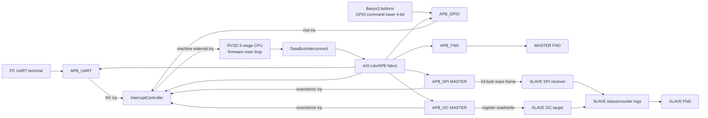
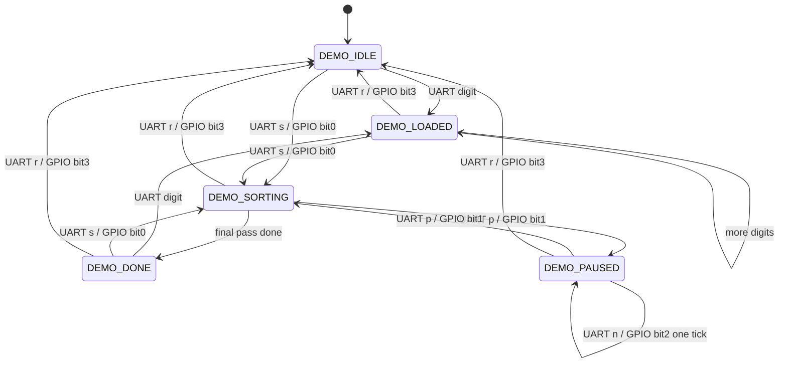

# RISCV_RV32I_5STAGE Bubble Sort 전체 동작 시나리오 가이드

이 문서는 `RISCV_RV32I_5STAGE` MASTER SoC와 `SLVAE_BUBBLE` SLAVE 표시 보드를 함께 사용해 Bubble Sort 데모가 동작하는 전체 흐름을 정리한다. UART만 보는 문서가 아니라, CPU 펌웨어가 UART, GPIO, MASTER FND, SPI, I2C, interrupt controller를 어떻게 같이 사용하는지 설명하는 시스템 시나리오 문서이다.

대상 기준:

| 항목 | 기준 |
| --- | --- |
| MASTER project | `RISCV_RV32I_5STAGE` |
| MASTER top | `src/TOP.sv` |
| MASTER firmware | `sw/apps/hello_world/src/main.c` |
| MASTER ROM image | `src/timing_programs/bubble_sort_demo.mem` |
| SLAVE project | `SLVAE_BUBBLE` |
| SLAVE top | `src/Top.sv` |
| SLAVE 역할 | SPI trace 수신, I2C register target, SLAVE FND 표시 |

## 1. 한 줄 요약

MASTER Basys3에는 RV32I 5-stage CPU SoC가 올라가고, CPU는 펌웨어를 실행하면서 입력은 UART/GPIO로 받고, 진행 상태는 MASTER FND에 바로 표시하며, 정렬 trace는 SPI로 SLAVE에 보내고, SLAVE 표시 모드는 I2C register write로 제어한다.

SLAVE Basys3는 CPU 없이 동작하는 표시 target이다. MASTER가 SPI로 보내는 24-byte trace frame을 decode해서 counter/status를 저장하고, MASTER가 I2C로 선택한 display mode에 따라 SLAVE FND에 pass, compare, swap, total, frame id, status/error 값을 표시한다.

## 2. 전체 연결 구조



이 구조에서 UART는 단순 입력 포트가 아니라 전체 데모를 구동하는 여러 입력 경로 중 하나이다. GPIO도 동일한 start/pause/step/reset 제어 경로를 제공하고, FND/SPI/I2C는 사용자가 보드에서 상태를 확인할 수 있게 만드는 관찰 경로이다.

## 3. 부팅과 초기화 시나리오

reset release 후 MASTER firmware는 다음 순서로 시스템을 준비한다.

1. `demo_reset()`으로 4칸 배열을 `0000`으로 만들고, 정렬 상태, pass/compare/swap/total counter, frame id를 초기화한다.
2. MASTER FND에 `0000`을 표시한다.
3. UART를 enable하고 RX interrupt를 켠다.
4. GPIO lower 4-bit의 rising-edge interrupt를 켠다.
5. I2C MASTER를 reset 후 enable하고 error interrupt를 켠다.
6. SPI MASTER를 mode0 기준으로 enable하고 24-byte frame 길이를 설정한다.
7. I2C로 SLAVE `SLAVE_ID`를 읽어 probe하고, `BRIGHTNESS=0x0F`, `DISPLAY_MODE=0`을 쓴다.
8. Interrupt controller source priority와 enable mask를 설정한다.
9. RISC-V machine external interrupt를 enable한다.
10. 메인 루프에서 `demo_sort_service()`, `service_claim()`, `poll_gpio_buttons()`를 반복한다.

초기화가 끝난 뒤 MASTER FND는 기본적으로 `0000`을 보인다. SLAVE가 연결되어 있으면 SLAVE FND도 display mode 0 기준 pass count, 보통 `0000`, 을 보인다.

## 4. 메모리 맵과 주변장치 역할

펌웨어는 아래 MMIO base 주소로 주변장치를 제어한다.

| Peripheral | Base | 데모에서의 역할 |
| --- | --- | --- |
| UART | `0x4000_0000` | 숫자 입력, start/pause/step/reset 명령, 정렬 완료 결과 출력 |
| GPIO | `0x4000_1000` | Basys3 버튼 lower 4-bit로 start/pause/step/reset 명령 |
| I2C MASTER | `0x4000_2000` | SLAVE ID read, display mode/brightness write, SLAVE register access |
| Interrupt controller | `0x4000_3000` | UART/GPIO/I2C/SPI interrupt source claim/complete |
| SPI MASTER | `0x4000_4000` | SLAVE로 Bubble Sort trace frame 전송 |
| FND | `0x4000_5000` | MASTER local 4-digit 상태 표시 |

Interrupt source 번호는 다음과 같다.

| Source | 의미 |
| --- | --- |
| `1` | GPIO rising-edge command |
| `2` | UART RX |
| `3` | I2C event |
| `4` | I2C error |
| `5` | SPI event |
| `6` | SPI error |

I2C/SPI error interrupt가 잡히면 MASTER FND는 error prefix를 우선 표시한다.

| Error 표시 | 의미 |
| --- | --- |
| `E1xx` | I2C error interrupt, `xx`는 I2C IRQ status 하위 byte |
| `E2xx` | SPI error interrupt, `xx`는 SPI IRQ status 하위 byte |

## 5. 입력 경로: UART와 GPIO

### UART command

UART는 `9600 baud`, `8N1`, flow control none으로 사용한다. 입력은 문자 1개 단위로 처리된다.

| UART 문자 | 동작 |
| --- | --- |
| `0`-`9` | 4칸 배열을 왼쪽으로 shift하고 새 digit을 오른쪽 끝에 입력 |
| `s` 또는 `S` | 현재 4칸 배열 정렬 시작 |
| `p` 또는 `P` | 정렬 중이면 pause, pause 상태이면 resume |
| `n` 또는 `N` | pause 상태에서 한 step 실행 |
| `r` 또는 `R` | 배열 `0000`으로 demo reset |
| 기타 문자 | 무시 |

배열 길이는 항상 4이다. 여러 자리 수는 지원하지 않으며, `12`를 보내면 값 `1`과 값 `2`가 따로 들어가 `0001 -> 0012`로 표시된다. 입력이 4개보다 적으면 왼쪽 빈 칸은 `0`으로 남고, 이 `0`도 정렬 대상이다.

정렬 중(`DEMO_SORTING`) 또는 pause 상태(`DEMO_PAUSED`)에서 들어오는 digit 입력은 배열 훼손을 막기 위해 무시된다. 정렬 완료 후 digit을 입력하면 정렬된 현재 배열을 기반으로 다시 shift 입력된다.

### GPIO command

GPIO lower 4-bit는 UART command와 같은 제어 기능을 제공한다. 현재 XDC에서 `iGpioIn[0]`부터 `iGpioIn[3]`은 Basys3 버튼에 매핑되고, `iGpioIn[4]`부터 `iGpioIn[7]`은 기존 switch mapping을 유지한다.

| GPIO bit | 버튼 | 동작 |
| --- | --- | --- |
| bit0 | `BTNR` | start |
| bit1 | `BTNL` | pause/resume |
| bit2 | `BTNU` | one step |
| bit3 | `BTNC` | reset |

펌웨어는 interrupt service와 polling을 둘 다 사용한다. lower 4-bit가 low에서 high로 바뀌는 rising edge를 command로 처리하고, 최근 sample은 `GPIO_DATA_OUT`에 저장해 다음 polling 때 edge를 계산한다.

## 6. 표시 경로: MASTER FND와 SLAVE FND

### MASTER FND

MASTER FND는 CPU가 직접 `APB_FND`에 write하는 로컬 표시 장치이다. `FND_DIGITS_BCD` 이름을 쓰지만 현재 decoder는 4-bit hex nibble 표시로 보면 된다.

| 상황 | MASTER FND 표시 |
| --- | --- |
| reset 직후 | `0000` |
| 숫자 입력 | 4칸 배열 전체, 예: `0001`, `0012`, `0125`, `1253` |
| compare/swap 후 | 4칸 배열 전체 |
| 정렬 완료 | 정렬된 4칸 배열 전체 유지 |
| I2C error | `E1xx` |
| SPI error | `E2xx` |

예를 들어 `1`, `2`, `5`, `3`을 차례로 넣으면 MASTER FND는 `0001 -> 0012 -> 0125 -> 1253`으로 바뀐다. `s`로 정렬을 시작하면 status/counter/pair가 아니라 배열 자체가 1Hz step으로 갱신되고, 완료 후 `1235`가 유지된다.

### SLAVE FND

SLAVE FND는 MASTER가 직접 segment를 제어하지 않는다. MASTER는 SPI trace frame과 I2C display mode write만 수행하고, SLAVE RTL이 내부 register 값을 골라 FND에 표시한다.

| DISPLAY_MODE | SLAVE FND 표시 |
| --- | --- |
| `0` | pass count |
| `1` | compare count |
| `2` | swap count |
| `3` | total count |
| `4` | last frame id |
| `5` | error가 있으면 error code, 아니면 status 하위 byte |

현재 MASTER firmware는 init/reset 때 mode 0을 쓰고, pass가 끝날 때 `pass_idx % 4`로 mode를 바꾸며, 정렬 완료 시 mode 3으로 total count를 보이게 한다.

## 7. Bubble Sort 실행 타임라인

아래는 `1253s`를 UART로 보내고, SLAVE가 연결되어 있는 일반적인 전체 동작 흐름이다.

| 단계 | 입력/상태 | CPU 내부 상태 | MASTER FND | SPI | I2C | SLAVE FND |
| --- | --- | --- | --- | --- | --- | --- |
| 0 | reset release | `DEMO_IDLE` | `0000` | 없음 | `SLAVE_ID` read, brightness/mode write | mode 0 기준 `0000` |
| 1 | `1` | 배열 `[0,0,0,1]`, `DEMO_LOADED` | `0001` | `TRACE_LOAD` | 없음 | frame seen, count 갱신 |
| 2 | `2` | 배열 `[0,0,1,2]` | `0012` | `TRACE_LOAD` | 없음 | frame id 증가 |
| 3 | `5` | 배열 `[0,1,2,5]` | `0125` | `TRACE_LOAD` | 없음 | frame id 증가 |
| 4 | `3` | 배열 `[1,2,5,3]` | `1253` | `TRACE_LOAD` | 없음 | frame id 증가 |
| 5 | `s` | `DEMO_SORTING` | `1253` | compare/swap/pass frame | pass 끝마다 mode write | 선택 counter 표시 |
| 6 | 정렬 중 | 1Hz마다 adjacent compare/swap | 배열 전체 | `TRACE_COMPARE`, 필요 시 `TRACE_SWAP` | pass 끝마다 `DISPLAY_MODE` 변경 | pass/compare/swap/total 중 선택값 |
| 7 | 정렬 완료 | `DEMO_DONE`, 배열 `[1,2,3,5]` | `1235` | `TRACE_DONE` | `DISPLAY_MODE=3` | total count |
| 8 | 완료 출력 | UART TX 결과 출력 | `1235` 유지 | 없음 | 없음 | total count 유지 |

정렬 완료 시 UART TX에는 정렬된 배열이 hex byte 형식으로 출력된다.

```text
01 02 03 05
```

## 8. 정렬 상태 머신

펌웨어 내부 상태는 다음 흐름으로 움직인다.



주의할 점은 `n` step 명령이 `DEMO_PAUSED` 상태에서만 의미가 있다는 것이다. loaded 상태에서 바로 수동 step으로 시작하는 명령은 현재 firmware에 없다. `s` 또는 GPIO start는 현재 4칸 배열을 기준으로 pass/compare/counter를 새로 초기화한다.

## 9. SPI trace frame

MASTER는 정렬 진행 상황을 SLAVE로 전달하기 위해 SPI mode0 기준 24-byte frame을 보낸다. SLAVE는 `CSN` falling edge를 frame start로 보고, `SCLK` rising edge에서 `MOSI`를 MSB-first로 샘플한다.

| Byte | 내용 |
| --- | --- |
| 0 | magic `0xA5` |
| 1 | magic `0x5A` |
| 2 | version `0x01` |
| 3 | frame type `0x01` |
| 4-5 | frame id, little-endian |
| 6 | phase |
| 7 | flags |
| 8 | array length, 항상 `4` |
| 9 | pass index |
| 10 | compare index |
| 11 | left index |
| 12 | right index |
| 13 | left value |
| 14 | right value |
| 15 | changed index |
| 16-17 | compare count |
| 18-19 | swap count |
| 20-21 | total count |
| 22 | status code |
| 23 | XOR checksum |

Phase 값:

| Phase | 의미 |
| --- | --- |
| `0x01` | load |
| `0x02` | compare |
| `0x03` | swap |
| `0x04` | pass done |
| `0x05` | done |
| `0x06` | paused |
| `0xE0` | error |

SLAVE decoder는 frame length, magic, version, XOR checksum을 검사한다. 정상 frame이면 frame id, phase, pass/compare/swap/total count가 `SortSlaveRegs`에 반영된다.

## 10. I2C SLAVE register scenario

MASTER의 I2C MASTER는 SLAVE address `0x42`에 접근한다. reset 직후에는 `SLAVE_ID`를 읽고, brightness와 display mode를 설정한다. 정렬 중에는 pass가 끝날 때 display mode를 바꿔 SLAVE FND가 보여주는 counter를 전환한다.

| 주소 | 이름 | R/W | 설명 |
| --- | --- | --- | --- |
| `0x00`-`0x03` | `SLAVE_ID` | R | `0x534C5631` |
| `0x04` | `DISPLAY_MODE` | R/W | SLAVE FND 표시 선택 |
| `0x08`-`0x0B` | `STATUS` | R | alive, SPI active, frame seen, error, latest phase |
| `0x0C`-`0x0D` | `LAST_FRAME_ID` | R | 마지막 정상 SPI frame id |
| `0x10`-`0x11` | `ERROR_CODE` | R/W1C | error bit read, 1을 쓴 bit clear |
| `0x14` | `BRIGHTNESS` | R/W | 0이면 blanking 성격, nonzero면 표시 |
| `0x18`-`0x19` | `COMPARE_COUNT` | R | 마지막 정상 frame의 compare count |
| `0x1C`-`0x1D` | `SWAP_COUNT` | R | 마지막 정상 frame의 swap count |
| `0x20`-`0x21` | `TOTAL_COUNT` | R | 마지막 정상 frame의 total count |

`STATUS` 하위 bit 의미:

| Bit | 의미 |
| --- | --- |
| bit0 | alive, 항상 1 |
| bit1 | SPI frame active |
| bit2 | 정상 frame을 한 번 이상 받은 상태 |
| bit3 | error code nonzero |
| bit7:4 | latest phase 하위 4 bit |

I2C SCL/SDA는 open-drain 연결을 전제로 한다. MASTER 쪽 `ioI2cScl`, `ioI2cSda`와 SLAVE 쪽 `iI2cScl`, `ioI2cSda`를 연결하고, SDA에는 pull-up이 필요하다.

## 11. MASTER + SLAVE 보드 연결

두 Basys3를 같이 사용할 때는 반드시 GND를 공통으로 묶는다.

| MASTER port | MASTER pin | SLAVE port | SLAVE pin | 설명 |
| --- | --- | --- | --- | --- |
| `ioI2cScl` | `L2` | `iI2cScl` | `L2` | I2C SCL |
| `ioI2cSda` | `J2` | `ioI2cSda` | `J2` | I2C SDA open-drain |
| `oSpiSclk` | `A14` | `iSpiSclk` | `A14` | SPI SCLK |
| `oSpiMosi` | `A16` | `iSpiMosi` | `A16` | SPI MOSI |
| `oSpiCsN` | `B16` | `iSpiCsN` | `B16` | SPI chip select, active-low |
| GND | PMOD GND | GND | PMOD GND | 공통 기준 전위 |

현재 Bubble Sort trace 시나리오에서 MASTER `iSpiMiso`는 핵심 경로가 아니다. SLAVE top도 MISO를 내보내지 않는다. 필요하면 안정된 레벨로 처리하거나 후속 확장 때 연결한다.

## 12. 추천 전체 데모 절차

### A. MASTER 단독 sanity check

목적: CPU, UART, GPIO, MASTER FND, firmware image가 기본적으로 살아 있는지 확인한다.

1. MASTER Basys3에 `RISCV_RV32I_5STAGE` bitstream을 program한다.
2. UART terminal을 `9600 8N1`, flow control none으로 연다.
3. SW15를 low로 내렸다가 high로 올려 reset을 해제한다.
4. UART로 `1`을 보내 MASTER FND가 `0001`을 표시하는지 확인한다.
5. UART로 `2`를 보내 MASTER FND가 `0012`를 표시하는지 확인한다.
6. UART로 `r`을 보내 MASTER FND가 `0000`으로 돌아오는지 확인한다.

SLAVE가 없어도 이 시나리오는 동작해야 한다. 다만 I2C target이 없으면 `E1xx` error 표시가 잠깐 또는 지속적으로 보일 수 있다.

### B. MASTER 단독 Bubble Sort

목적: UART 입력, CPU 정렬, MASTER FND 완료 표시, UART TX 결과 출력까지 확인한다.

1. reset release 후 UART로 `1253s`를 보낸다.
2. MASTER FND가 `0001 -> 0012 -> 0125 -> 1253`으로 바뀌는지 본다.
3. 정렬 중 MASTER FND가 비교 pair가 아니라 배열 전체를 유지/갱신하는지 본다.
4. 정렬 완료 후 MASTER FND가 `1235`를 유지하는지 확인한다.
5. UART TX에 `01 02 03 05`가 출력되는지 확인한다.

### C. GPIO 제어 확인

목적: UART 외의 보드 입력 경로가 정상인지 확인한다.

1. UART로 `1253`을 입력해 배열을 load한다.
2. `BTNR`에 매핑된 `iGpioIn[0]`을 눌러 start한다.
3. 정렬 중 `BTNL`에 매핑된 `iGpioIn[1]`을 눌러 pause/resume을 확인한다.
4. pause 상태에서 `BTNU`에 매핑된 `iGpioIn[2]`를 눌러 one-step을 확인한다.
5. `BTNC`에 매핑된 `iGpioIn[3]`을 눌러 reset한다.

### D. MASTER + SLAVE 전체 연동

목적: UART/GPIO input, MASTER FND, SPI trace, I2C register control, SLAVE FND까지 전체 경로를 확인한다.

1. MASTER에는 `RISCV_RV32I_5STAGE` bitstream을 program한다.
2. SLAVE에는 `SLVAE_BUBBLE` bitstream을 program한다.
3. SPI, I2C, GND를 연결표대로 연결한다.
4. I2C SDA pull-up을 확인한다.
5. 두 보드 reset을 release한다.
6. MASTER UART로 `1253s`를 보낸다.
7. MASTER FND가 입력/정렬/완료 동안 4칸 배열 상태를 표시하는지 본다.
8. SLAVE FND가 pass/compare/swap/total counter 중 선택된 값을 표시하는지 본다.
9. 완료 후 SLAVE FND가 total count mode로 전환되는지 확인한다.

성공 기준:

| 관찰 지점 | 정상 기준 |
| --- | --- |
| UART RX | 숫자와 command가 처리된다 |
| GPIO | lower 4-bit rising edge가 command로 처리된다 |
| MASTER FND | 입력, 정렬, 완료 동안 4칸 배열 상태가 표시된다 |
| SPI | SLAVE frame id/counter가 증가한다 |
| I2C | SLAVE display mode가 init/pass/done 시점에 갱신된다 |
| SLAVE FND | 선택된 counter/status 값이 4자리 hex로 표시된다 |

## 13. 문제별 빠른 점검표

### UART 입력했는데 MASTER FND가 안 바뀜

1. UART terminal이 `9600 8N1`, flow control none인지 확인한다.
2. MASTER reset SW15가 high인지 확인한다.
3. PC에서 보드로 들어가는 선이 MASTER `iUartRx`인지 확인한다.
4. 최신 bitstream이 올라갔는지 확인한다.
5. `src/timing_programs/bubble_sort_demo.mem`이 최신 firmware인지 확인한다.
6. 입력값은 ASCII `0`부터 `9`까지만 load 값으로 처리된다.

### 숫자는 들어가는데 정렬이 시작되지 않음

1. UART command는 `s` 또는 `S`인지 확인한다.
2. GPIO start는 `BTNR`/bit0 rising edge인지 확인한다.
3. 현재 배열이 이미 정렬되어 있으면 FND 값이 step마다 변하지 않을 수 있다. 그래도 SPI compare frame은 1Hz step마다 증가해야 한다.

### Pause/step이 기대처럼 안 보임

1. `p`는 `DEMO_SORTING` 상태에서 pause로 들어간다.
2. `n`은 `DEMO_PAUSED` 상태에서만 한 step을 실행한다.
3. 정렬 중 digit 입력은 무시된다.
4. 수동 step 중심 데모가 필요하면 start 직후 바로 pause한 다음 `n` 또는 `BTNU`를 사용한다.

### SLAVE FND만 안 바뀜

1. MASTER 단독 FND와 UART 결과가 먼저 정상인지 확인한다.
2. MASTER와 SLAVE GND가 공통인지 확인한다.
3. SPI `SCLK`, `MOSI`, `CSN` 배선을 확인한다.
4. I2C `SCL`, `SDA` 배선과 SDA pull-up을 확인한다.
5. SLAVE가 `SLVAE_BUBBLE` bitstream으로 program되어 있는지 확인한다.
6. MASTER FND에 `E1xx`가 뜨면 I2C, `E2xx`가 뜨면 SPI status를 먼저 본다.

## 14. Firmware와 bitstream 반영

현재 MASTER `TOP.sv`의 기본 instruction ROM은 아래 파일을 사용한다.

```text
src/timing_programs/bubble_sort_demo.mem
```

펌웨어 C 코드를 수정한 경우 C 파일만 바꿔서는 보드 동작이 바뀌지 않는다. RV32I용 `.mem`을 다시 만들고, 그 `.mem`을 `src/timing_programs/bubble_sort_demo.mem`에 반영한 뒤 bitstream을 다시 생성해야 한다.

펌웨어 빌드 스크립트:

```bat
python tools\firmware\build_bubble_sort_firmware.py
```

보드용 기본 build는 firmware 내부 기본값인 `SORT_TICK_DELAY_LOOPS=25000000`을 사용한다. 시뮬레이션은 너무 느려지지 않도록 `tools/sim/xsim_runner.py bubble_sort_e2e`가 `BUBBLE_SORT_TICK_DELAY_LOOPS=1000` override로 firmware를 빌드한다.

대표 출력:

```text
output/firmware/bubble_sort_demo.elf
output/firmware/bubble_sort_demo.bin
output/firmware/bubble_sort_demo.mem
output/firmware/bubble_sort_demo.map
output/firmware/bubble_sort_demo.lst
```

보드에 반영하려면 `output/firmware/bubble_sort_demo.mem`과 `src/timing_programs/bubble_sort_demo.mem`이 같은 내용인지 확인하고, FPGA_AUTO Vivado build flow로 bitstream을 다시 만든다.

## 15. 현재 코드 기준 제한사항

- UART 입력 숫자는 한 자리 `0`부터 `9`까지만 지원한다.
- 배열 길이는 항상 4개이며, 미입력 칸의 `0`도 정렬 대상이다.
- `n` step은 pause 상태에서만 동작한다.
- loaded 상태에서 바로 step mode로 시작하는 명령은 없다.
- 보드용 1Hz는 firmware software loop 기반 근사값이므로 실제 체감 속도는 bitstream/clock/컴파일 결과에 따라 미세 조정이 필요할 수 있다.
- SLAVE SPI는 trace receive 중심이며 MASTER `iSpiMiso` 응답은 현재 핵심 경로가 아니다.
- I2C open-drain 신호에는 pull-up이 필요하다.
- SLAVE `BRIGHTNESS`는 정밀 PWM 밝기 단계가 아니라 현재 RTL에서는 0/nonzero 성격에 가깝다.
- C firmware 변경은 `.mem` 갱신과 bitstream 재생성 없이는 보드에 반영되지 않는다.
