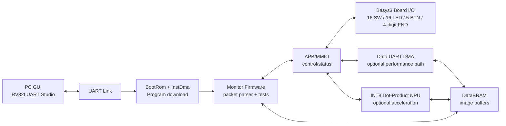

# RV32I UART Studio Image Loopback 구현 계획서

## 1. 목표

이 문서는 `RV32I UART Studio` GUI에 다음 기능을 실제 FPGA 검증 흐름으로 구현하기 위한 단계별 계획이다.

- PC에서 이미지를 업로드한다.
- UART를 통해 RISC-V SoC의 DataBRAM 또는 스트리밍 버퍼로 전송한다.
- FPGA 내부 상태, DMA 상태, DataBRAM 상태, NPU 상태를 GUI에서 읽어온다.
- FPGA에서 받은 데이터를 다시 PC로 read back 한다.
- 송신 이미지와 수신 이미지를 CRC 및 바이트 단위로 비교한다.
- Basys3 보드 상태를 실제 보드 스펙에 맞게 GUI에 표시한다.

대상 목업 이미지는 프로젝트 루트의 `rv32i_uart_studio_image_loopback_basys3.png`이다.

## 2. 현재 프로젝트 기준 요약

현재 구조에서 이미 갖고 있는 장점은 다음과 같다.

- `BootRom`이 부팅 제어를 담당한다.
- `ProgramRam`은 `InstDma` 전용 write port로 로드된다.
- `InstDma` payload 경로는 APB가 아니라 `UART -> InstDma -> ProgramRam` 직접 경로다.
- `InstDmaRegs`만 APB control/status 레지스터로 노출된다.
- CPU data bus는 DataRam과 APB MMIO window를 분리해서 접근한다.
- APB peripheral로 UART, GPIO, FND, Timer, SPI, I2C, INTC, InstDmaRegs가 존재한다.
- PC 측에는 `tools/uart/uart_bootloader_gui.py`, `make_loader_packet.py`, `send_loader_packet.py`가 있다.

현재 한계는 다음과 같다.

- `TOP.sv`의 기본 `P_GPIO_WIDTH`가 8이다.
- 현재 XDC는 Basys3의 16 switches, 16 LEDs, 5 buttons 전체를 GUI 상태 표시용으로 정리한 형태가 아니다.
- DataRam은 1KB LUT RAM 중심이며, 이미지 버퍼용 DataBRAM window가 없다.
- 이미지 loopback용 monitor protocol, firmware, Data DMA가 아직 없다.
- GUI는 Tkinter 기반 bootloader 도구에 가깝고, 목업 수준의 dock/dashboard 구조는 아직 없다.

## 3. 중요한 현실 보정

목업에 보이는 `640x480 RGB888 = 921.6KB` 이미지를 Basys3 내부 BRAM에 통째로 저장하는 것은 현실적이지 않다.

Basys3의 Artix-7 35T는 온칩 BRAM이 약 1,800 Kbits, 즉 약 225KB 수준이다. 여기에 ProgramRam, DataRam, FIFO, trace buffer, NPU buffer까지 같이 써야 하므로 이미지 전용으로 921.6KB를 확보할 수 없다.

따라서 구현 전략은 다음 중 하나로 잡는다.

| 방식 | 설명 | 추천 단계 |
|---|---|---:|
| Downscale frame | GUI에서 이미지를 128x128, 160x120 등으로 축소 후 전송 | MVP |
| Grayscale/RGB565 | RGB888 대신 8-bit gray 또는 16-bit RGB565 사용 | MVP |
| Tile/chunk loopback | 전체 이미지를 FPGA에 한 번에 저장하지 않고 chunk 단위로 전송/수신 | 중기 |
| External memory | DDR/SRAM/PSRAM 보드가 있을 때 전체 프레임 저장 | Basys3 외 확장 |

Basys3 MVP 권장 포맷은 다음과 같다.

| 포맷 | 크기 | 비고 |
|---|---:|---|
| 128x128 RGB565 | 32KB | 가장 안전한 첫 테스트 |
| 160x120 RGB565 | 37.5KB | 이미지 식별 가능, BRAM 부담 낮음 |
| 320x240 grayscale | 75KB | GUI demo용으로 괜찮음 |
| 320x240 RGB565 | 150KB | 가능은 하나 BRAM 사용량 큼 |

## 4. 최종 구조

권장 구조는 `Bootloader mode`와 `Application monitor mode`를 분리하는 것이다.



1차 구현은 firmware가 UART를 받아 DataBRAM에 쓰는 방식으로 시작한다.

2차 구현에서 UART payload를 CPU가 직접 복사하지 않고, `DataDma`가 UART stream을 DataBRAM에 직접 쓰도록 확장한다.

## 5. Basys3 보드 상태 표시 계획

목업은 실제 Basys3 사용자 I/O에 맞춰 다음만 표시한다.

| 항목 | 개수 | GUI 표시 |
|---|---:|---|
| Slide Switch | 16 | `SW15..SW0` |
| LED | 16 | `LED15..LED0` |
| Push Button | 5 | `BTNU`, `BTND`, `BTNL`, `BTNR`, `BTNC` |
| 7-segment FND | 4 digits | 현재 표시값 또는 segment raw |

구현은 두 가지 중 하나를 선택할 수 있다.

### A안: 기존 APB_GPIO 확장

- `P_GPIO_WIDTH`를 16으로 확장한다.
- `iGpioIn[15:0]`를 `SW15..SW0`에 연결한다.
- `oGpioOut[15:0]`를 `LED15..LED0`에 연결한다.
- 버튼 5개는 별도 APB register 또는 확장 GPIO bit로 제공한다.

장점은 기존 GPIO register 구조를 재사용한다는 점이다.

단점은 버튼까지 깔끔하게 포함하려면 GPIO 입력 폭을 21 이상으로 늘리거나 별도 register가 필요하다는 점이다.

### B안: APB_BoardStatus 신규 peripheral 추가

추천안은 B안이다.

신규 `APB_BoardStatus` 또는 `APB_BoardIO`를 만든다.

```text
0x4000_8000 BOARD_ID
0x4000_8004 BOARD_SW        [15:0]
0x4000_8008 BOARD_BTN       [4:0]
0x4000_800C BOARD_LED_OUT   [15:0]
0x4000_8010 BOARD_LED_SET
0x4000_8014 BOARD_LED_CLR
0x4000_8018 BOARD_FND_VALUE
0x4000_801C BOARD_STATUS
```

이렇게 하면 GUI가 `GET_BOARD_STATUS` 한 번으로 보드 그림 overlay를 안정적으로 갱신할 수 있다.

## 6. 메모리 맵 확장안

기존 APB window는 `0x4000_0000..0x4000_FFFF`이므로 새 peripheral을 아래처럼 배치한다.

| Peripheral | Base | Size | 용도 |
|---|---:|---:|---|
| UART0 | `0x4000_0000` | 4KB | 기존 |
| GPIO0 | `0x4000_1000` | 4KB | 기존 |
| I2C0 | `0x4000_2000` | 4KB | 기존 |
| INTC0 | `0x4000_3000` | 4KB | 기존 |
| SPI0 | `0x4000_4000` | 4KB | 기존 |
| FND0 | `0x4000_5000` | 4KB | 기존 |
| TIMER0 | `0x4000_6000` | 4KB | 기존 |
| InstDmaRegs | `0x4000_7000` | 4KB | 기존 bootloader DMA |
| BoardStatus | `0x4000_8000` | 4KB | 신규 board overlay |
| DataDmaRegs | `0x4000_9000` | 4KB | 신규 image/data DMA |
| NpuRegs | `0x4000_A000` | 4KB | 신규 INT8 NPU |
| TraceRegs | `0x4000_B000` | 4KB | 선택 logic analyzer |

DataBRAM은 data bus 쪽에 별도 window로 추가한다.

| Region | Base | 권장 MVP Size | 용도 |
|---|---:|---:|---|
| DataRam | `0x0000_0000` | 1KB | 기존 stack/small data |
| DataBRAM | `0x0001_0000` | 32KB 또는 64KB | 이미지/NPU/DMA scratchpad |

DataBRAM 내부 buffer layout 예시는 다음과 같다.

| Region | Offset | Size 예시 | 용도 |
|---|---:|---:|---|
| IMG_IN | `0x0000` | 32KB | PC upload image |
| IMG_OUT | `0x8000` | 32KB | FPGA readback image |
| WORK | `0x10000` | optional | NPU/intermediate |

64KB MVP에서는 `IMG_IN`과 `IMG_OUT`을 각각 32KB로 잡고 `128x128 RGB565`부터 검증한다.

## 7. UART Monitor Protocol

기존 `RAXI` bootloader packet은 ProgramRam app 다운로드 전용으로 유지한다.

GUI가 app 실행 후 사용하는 monitor protocol은 별도 magic을 둔다.

### Packet header

```text
magic      4B   "RVST"
version    1B   0x01
type       1B
flags      2B
seq        4B
addr       4B
length     4B
crc32      4B   payload CRC32
payload    N
```

모든 multi-byte field는 little-endian으로 통일한다.

### Packet type

| Type | 이름 | 방향 | 설명 |
|---:|---|---|---|
| `0x01` | PING | PC -> FPGA | link 확인 |
| `0x02` | HELLO | FPGA -> PC | firmware/version/chip id |
| `0x10` | READ32 | PC -> FPGA | MMIO 32-bit read |
| `0x11` | WRITE32 | PC -> FPGA | MMIO 32-bit write |
| `0x12` | MEM_READ | PC -> FPGA | DataBRAM read |
| `0x13` | MEM_WRITE | PC -> FPGA | DataBRAM write |
| `0x20` | GET_BOARD_STATUS | PC -> FPGA | SW/BTN/LED/FND snapshot |
| `0x30` | IMG_BEGIN | PC -> FPGA | image metadata |
| `0x31` | IMG_CHUNK | PC -> FPGA | image payload chunk |
| `0x32` | IMG_END | PC -> FPGA | write complete + CRC |
| `0x33` | IMG_READBACK | PC -> FPGA | FPGA -> PC image readback |
| `0x40` | GET_DMA_STATUS | PC -> FPGA | DMA counters/status |
| `0x50` | NPU_RUN | PC -> FPGA | NPU 실행 |
| `0x51` | GET_NPU_STATUS | PC -> FPGA | NPU status/counters |
| `0x7E` | ACK | FPGA -> PC | 성공 응답 |
| `0x7F` | NACK | FPGA -> PC | 실패 응답 |

### Board status payload

```c
typedef struct {
  uint32_t chip_id;
  uint32_t uptime_ms;
  uint32_t boot_mode;
  uint32_t sw;          // [15:0]
  uint32_t btn;         // [4:0]
  uint32_t led;         // [15:0]
  uint32_t fnd_value;   // 4 hex digits or BCD
  uint32_t dma_status;
  uint32_t dma_bytes_rx;
  uint32_t dma_bytes_tx;
  uint32_t npu_status;
  uint32_t error_code;
} board_status_t;
```

GUI는 이 packet을 100ms에서 500ms 주기로 polling한다.

## 8. RTL 구현 계획

### 8.1 Board I/O 정리

목표 파일:

- `src/TOP.sv`
- `src/APBMux.sv`
- `src/rv32i_pkg.sv`
- `src/soc_addr_pkg.sv`
- `src/APB_BoardStatus.sv`
- `constrs/basys3_top.xdc`

작업:

1. Basys3 board I/O port를 명확히 분리한다.
   - `input logic [15:0] iSw`
   - `input logic [4:0] iBtn`
   - `output logic [15:0] oLed`
   - 기존 `oSeg`, `oDp`, `oDigitSel[3:0]` 유지
2. `APB_BoardStatus`를 추가한다.
3. APB decode에 `BoardStatus` slot을 추가한다.
4. XDC를 Basys3 실제 핀맵에 맞춰 정리한다.
5. 기존 GPIO를 유지할지, board LED/SW 용도로 통합할지 결정한다.

권장 판단:

- 기존 APB_GPIO는 일반 GPIO 실험용으로 남긴다.
- Basys3 내장 LED/SW/BTN/FND 상태는 `APB_BoardStatus`에서 GUI 친화적으로 제공한다.

### 8.2 DataBRAM 추가

목표 파일:

- `src/DataBRAM.sv`
- `src/DataBusRouter.sv`
- `src/DataBusRspMux.sv`
- `src/MemoryStage.sv`
- `src/Rv32iCore.sv`
- `src/rv32i_pkg.sv`
- `src/TOP.sv`

작업:

1. DataBRAM window를 data bus에 추가한다.
2. BRAM synchronous read latency를 처리한다.
3. DataRam zero-wait 경로와 DataBRAM wait 경로를 분리한다.
4. `RspReady`를 APB뿐 아니라 RAM wait에도 사용하도록 일반화한다.
5. MVP size는 32KB 또는 64KB로 시작한다.

주의:

- 기존 1KB DataRam은 stack/hot data용으로 유지한다.
- DataBRAM은 이미지, DMA, NPU scratchpad 용도로 쓴다.

### 8.3 Image Data DMA

MVP에서는 monitor firmware가 UART RX를 읽고 DataBRAM에 쓴다.

성능 개선 단계에서 `DataDma`를 추가한다.

목표 파일:

- `src/DataDma.sv`
- `src/DataDmaRegs.sv`
- `src/UartSubsystem.sv`
- `src/UartRxRouter.sv`
- `src/UartTxRouter.sv`
- `src/TOP.sv`

작업:

1. UART router mode를 확장한다.
   - CPU mode
   - InstDma bootloader mode
   - DataDma image mode
2. `DataDma`가 UART RX payload를 DataBRAM write port로 직접 쓴다.
3. `DataDma`가 DataBRAM read port에서 UART TX로 readback 한다.
4. APB register로 base address, length, control, status, CRC, byte count를 제공한다.

## 9. Firmware 구현 계획

신규 monitor firmware app을 만든다.

목표 파일:

- `sw/apps/monitor/src/main.c`
- `sw/apps/monitor/include/monitor_protocol.h`
- `sw/common/include/soc_mmio.h`
- `sw/common/include/soc_memory.h`
- `sw/common/src/crc32.c`
- `tools/firmware/build_uart_app.py`

작업:

1. BootRom이 기존 방식으로 monitor app을 ProgramRam에 로드한다.
2. monitor app 시작 후 UART를 CPU mode로 전환한다.
3. `RVST` packet parser를 실행한다.
4. `PING`, `HELLO`, `READ32`, `WRITE32`를 먼저 구현한다.
5. `GET_BOARD_STATUS`를 구현한다.
6. `MEM_WRITE`, `MEM_READ`로 DataBRAM 접근을 구현한다.
7. `IMG_BEGIN`, `IMG_CHUNK`, `IMG_END`, `IMG_READBACK`을 구현한다.
8. CRC mismatch, timeout, bad sequence, invalid address를 NACK로 응답한다.

펌웨어는 처음부터 복잡한 image processing을 하지 않는다.

첫 목표는 다음 하나다.

```text
PC image bytes == FPGA DataBRAM bytes == PC readback bytes
```

## 10. GUI 구현 계획

목업 수준의 GUI는 현재 Tkinter bootloader GUI를 계속 키우기보다, 최종적으로 PySide6/Qt 구조가 적합하다.

다만 의존성 리스크를 낮추려면 다음 순서가 좋다.

| 단계 | GUI 방식 | 목적 |
|---|---|---|
| MVP | 현재 Tkinter 확장 | protocol bring-up |
| Studio | PySide6/Qt 신규 GUI | 목업과 유사한 dashboard |

권장 파일 구조:

```text
tools/uart/studio/
  rv32i_uart_studio.py
  serial_worker.py
  monitor_protocol.py
  image_loopback.py
  board_model.py
  packet_inspector.py
  widgets/
    image_loopback_panel.py
    board_status_panel.py
    hex_view.py
    event_log.py
    memory_map_panel.py
```

GUI 기능 우선순위:

1. COM connect/disconnect
2. bootloader packet download
3. monitor `PING/HELLO`
4. board status polling
5. image load/downscale/format conversion
6. image send to FPGA
7. readback and CRC compare
8. packet inspector and hex view
9. DMA status panel
10. NPU status panel

### Image Loopback UX

GUI는 3단 preview를 가진다.

```text
PC Upload Image -> FPGA DataBRAM Buffer -> PC Received Image
```

각 preview 밑에는 다음 정보를 표시한다.

- filename
- original resolution
- transfer resolution
- pixel format
- byte size
- CRC32
- elapsed time
- throughput
- packet count
- retry/error count

### Board Overlay UX

GUI 오른쪽 board panel은 다음 방식으로 갱신한다.

1. 배경에는 Basys3 보드 그림 또는 stylized board 이미지를 표시한다.
2. 그 위에 LED, SW, BTN, FND overlay layer를 둔다.
3. `GET_BOARD_STATUS` 응답으로 overlay state만 갱신한다.
4. LED/SW label은 `15..0` 순서를 유지한다.
5. FND는 반드시 4-digit만 표시한다.

## 11. 검증 계획

### Python/GUI 단위 테스트

- packet encode/decode
- CRC32 golden vector
- sequence number 증가
- chunk split/merge
- image format conversion
- readback compare

### Firmware 테스트

- `PING/HELLO`
- invalid packet NACK
- `READ32/WRITE32` loopback
- `GET_BOARD_STATUS`
- `MEM_WRITE/MEM_READ`
- image chunk write/readback

### RTL 시뮬레이션

- `APB_BoardStatus` register read/write
- 16 switch/button sample readback
- 16 LED output register
- DataBRAM byte-enable write/read
- Data bus wait-state handling
- DataDma UART stream to BRAM
- DataDma BRAM to UART stream
- CRC counter/checker

### FPGA Bring-up

1. 기존 bootloader app download PASS
2. monitor app download PASS
3. `HELLO` 수신 PASS
4. `GET_BOARD_STATUS`에서 SW/BTN 조작 반영 PASS
5. GUI LED write가 실제 LED에 반영 PASS
6. FND 4-digit write/readback PASS
7. 128x128 RGB565 image loopback CRC PASS
8. 160x120 RGB565 image loopback CRC PASS
9. packet loss/timeout/error handling PASS
10. DataDma 적용 후 throughput 측정 PASS

## 12. 단계별 마일스톤

### Phase 0: 기준선 고정

- 기존 UART bootloader 동작 재확인
- ProgramRam 다운로드 확인
- 현재 memory map 문서 업데이트

완료 기준:

- 기존 hello_world 또는 monitor skeleton이 UART로 다운로드되고 실행된다.

### Phase 1: Monitor Protocol MVP

- `RVST` packet 정의
- Python encoder/decoder 구현
- firmware `PING/HELLO/READ32/WRITE32` 구현

완료 기준:

- GUI 또는 CLI에서 `PING` 응답을 받고 `READ32`로 peripheral register를 읽을 수 있다.

### Phase 2: Basys3 Board Status

- 16 switches, 16 LEDs, 5 buttons, 4-digit FND 기준으로 RTL/XDC 정리
- `APB_BoardStatus` 추가
- firmware `GET_BOARD_STATUS` 구현
- GUI board overlay polling 구현

완료 기준:

- 실제 스위치/버튼 조작이 GUI overlay에 표시된다.
- GUI에서 LED/FND 값을 바꾸면 보드에 반영된다.

### Phase 3: DataBRAM Scratchpad

- 32KB 또는 64KB DataBRAM 추가
- CPU read/write 가능하게 data bus 확장
- firmware `MEM_WRITE/MEM_READ` 구현
- GUI memory map/hex view 연결

완료 기준:

- GUI가 DataBRAM에 test pattern을 쓰고 그대로 읽어 CRC PASS를 낸다.

### Phase 4: Image Loopback MVP

- GUI image load/downscale/RGB565 conversion
- `IMG_BEGIN/IMG_CHUNK/IMG_END/IMG_READBACK` 구현
- firmware-mediated DataBRAM copy
- CRC compare

완료 기준:

- 128x128 RGB565 image loopback이 PASS한다.
- GUI packet inspector에 chunk sequence가 보인다.

### Phase 5: Data UART DMA

- `DataDmaRegs`와 `DataDma` 추가
- UART router에 DataDma mode 추가
- DataBRAM direct write/readback 구현
- throughput 비교

완료 기준:

- firmware copy 방식보다 높은 throughput을 측정한다.
- DMA status panel이 busy/done/bytes/crc/error를 표시한다.

### Phase 6: NPU 연동

- INT8 dot-product NPU register 추가
- DataBRAM의 matrix/vector/input/output buffer layout 정의
- GUI NPU panel에서 run/status/result 표시

완료 기준:

- PC golden model과 FPGA NPU 결과가 일치한다.

### Phase 7: Trace/Logic Analyzer

- 내부 FSM/state/counter snapshot register 추가
- 선택적으로 BRAM trace buffer 추가
- GUI logic analyzer panel과 연결

완료 기준:

- UART/DMA/NPU 상태 전이가 GUI에서 시간 순서대로 보인다.

## 13. 우선순위 있는 작업 목록

가장 먼저 구현할 순서는 다음이 좋다.

1. `monitor_protocol.py`와 firmware `PING/HELLO`
2. `GET_BOARD_STATUS`
3. Basys3 16 SW/16 LED/5 BTN/4-digit FND RTL/XDC 정리
4. DataBRAM 32KB 또는 64KB
5. `MEM_WRITE/MEM_READ`
6. image downscale + RGB565 conversion
7. image loopback CRC
8. DataDma 최적화
9. NPU/logic analyzer 확장

이 순서로 가면 GUI 목업을 먼저 예쁘게 만드는 데서 끝나지 않고, 실제 FPGA bring-up 증거가 단계별로 쌓인다.

## 14. 완료 판정

이 기능이 완료됐다고 볼 수 있는 기준은 다음이다.

- GUI에서 monitor app을 실행 중인 FPGA에 연결된다.
- GUI board overlay가 실제 Basys3 16 switches, 16 LEDs, 5 buttons, 4-digit FND 상태와 일치한다.
- GUI에서 선택한 이미지를 FPGA용 포맷으로 변환한다.
- 이미지 payload가 DataBRAM 또는 streaming buffer로 들어간다.
- readback 데이터가 PC로 돌아온다.
- CRC, packet count, byte count, elapsed time, throughput이 GUI에 표시된다.
- 실패 시 timeout, CRC mismatch, bad sequence, invalid address가 명확히 표시된다.
- 최소 `128x128 RGB565` image loopback이 실제 Basys3에서 반복 PASS한다.

## 15. 핵심 결론

이 GUI는 단순 시각화 도구가 아니라 SoC 검증 프론트엔드로 잡는 것이 맞다.

가장 중요한 구조적 판단은 다음이다.

- bootloader download는 기존 `InstDma` 경로를 유지한다.
- app 실행 후에는 monitor protocol로 전환한다.
- 상태 읽기는 `firmware -> APB/MMIO -> UART reply` 방식으로 한다.
- 큰 이미지 전체 저장은 Basys3 BRAM 용량에 맞춰 downscale 또는 chunk streaming으로 처리한다.
- 16 LED/16 SW/5 BTN/4-digit FND는 `APB_BoardStatus`로 별도 정리하는 편이 GUI와 검증 양쪽에서 가장 깔끔하다.
