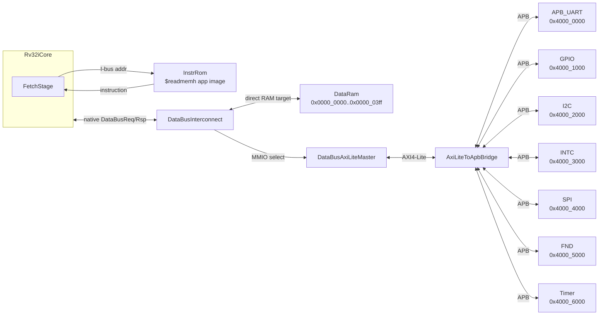
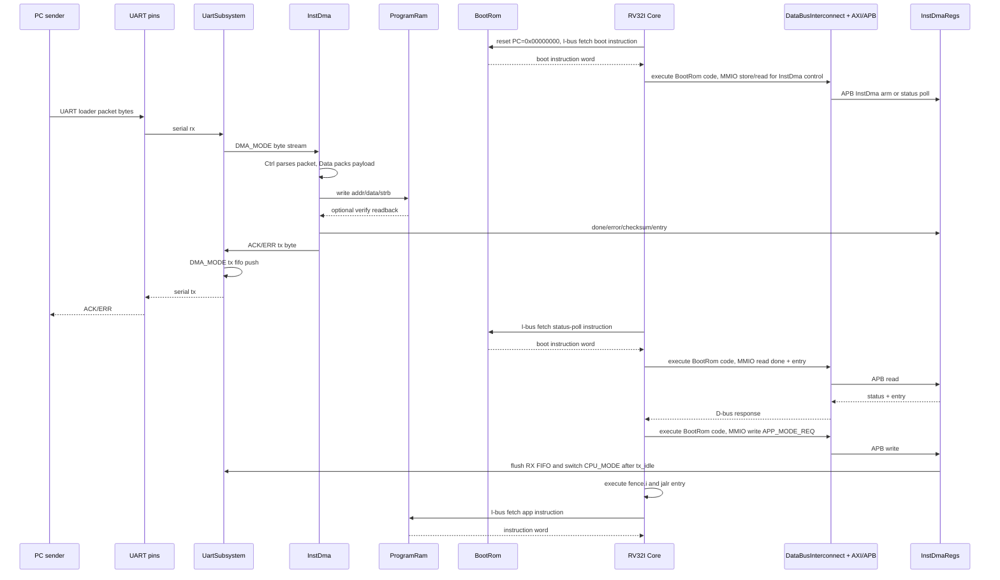
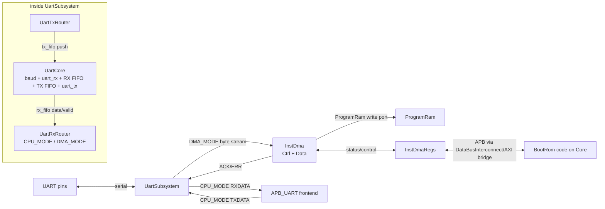
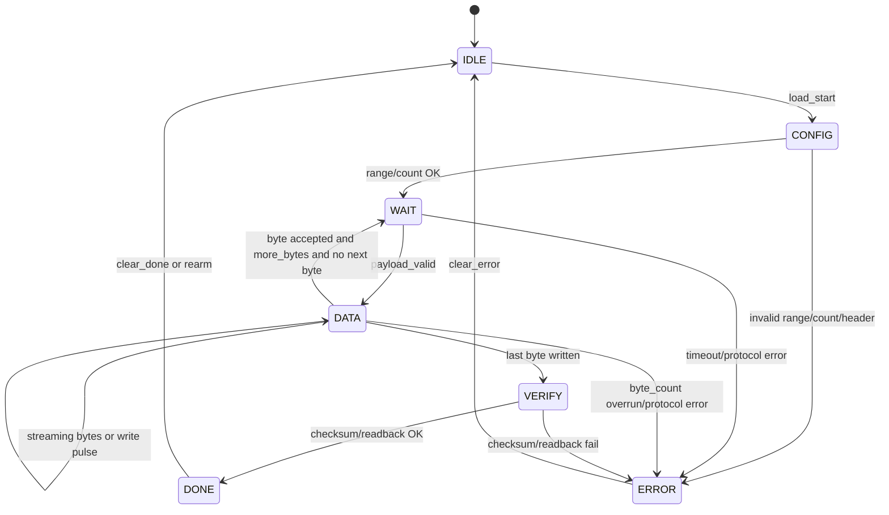
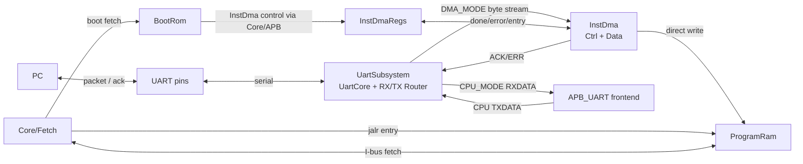

# UART InstDma and SoC Autogen Plan

## 1. 결론

최종 구조는 UART transport와 InstDma 기반 instruction image 적재 구조로 고정한다.

```text
1. 기존 InstrRom 구조를 분리한다.
   - BootRom: 고정 부트 제어 코드
   - ProgramRam: UART로 받은 앱 코드 저장 및 실행

2. BootRom 코드는 mem 이미지로 만든다.
   - reset 후 Core/Fetch가 BootRom에서 시작
   - InstDmaRegs를 arm/poll
   - InstDma 상태를 보고 app entry로 점프

3. 프로그램 적재 write path는 InstDma 전용 경로를 쓴다.
   - PC -> UART -> UartSubsystem -> InstDma -> ProgramRam

4. 앱 실행 read/fetch path는 Core의 I-bus를 쓴다.
   - ProgramRam -> I-bus response -> FetchStage -> Core pipeline
```

짧게 말하면:

```text
write: PC/UART -> UartSubsystem -> InstDma -> ProgramRam
read : FetchStage/Core I-bus -> ProgramRam
```

ProgramRam의 앱 적재 write port는 InstDma 전용으로 둔다.

## 2. 용어 정리

```text
FetchStage
  Core 내부 IF stage. PC를 만들고 instruction address를 외부 I-bus로 내보낸다.

I-bus
  Core/FetchStage가 instruction word를 요청하는 fetch 통로.

BootRom
  고정 부트 제어 코드가 들어가는 read-only instruction memory.
  bitstream에 포함되는 mem으로 초기화된다.

ProgramRam
  다운로드된 앱 instruction을 저장하는 executable RAM.
  Core는 I-bus로 읽고, InstDma는 InstDma write port로 쓴다.

UartSubsystem
  UartCore, UartRxRouter, UartTxRouter를 묶는 UART transport wrapper.
  TOP에는 UART pin, APB_UART byte interface, InstDma byte interface만 노출한다.

UartCore
  UART serial pin과 byte stream 사이를 변환하는 UART core.
  baud generator, uart_rx, RX FIFO, TX FIFO, uart_tx를 포함한다.

UartRxRouter
  UartCore RX FIFO pop route를 선택한다.
  DMA_MODE에서는 InstDma로, CPU_MODE에서는 APB_UART RXDATA로 보낸다.

UartTxRouter
  UartCore TX FIFO push source를 선택한다.
  DMA_MODE에서는 InstDma ACK/ERR, CPU_MODE에서는 APB_UART TXDATA를 받는다.

InstDma
  transport byte stream을 받아 ProgramRam instruction image를 적재하는 DMA block.
  UART protocol 자체는 모르고, router가 넘긴 byte stream을 처리한다.

InstDmaCtrl
  loader packet header/magic/checksum, DMA FSM, done/error/app_valid, ACK/ERR를 담당한다.

InstDmaData
  packet payload byte를 word로 pack하고 ProgramRam write address/data/strb를 만든다.

InstDmaRegs
  BootRom이 InstDma 상태, error, byte_count, entry_addr 등을 확인하는 APB 제어/status register.
```

## 3. 현재 프로젝트에서 확인한 사실

현재 구조:



중요한 점:

- `TOP.P_INSTR_INIT_FILE`이 앱 `.mem`을 가리키고, `InstrRom`이 `$readmemh()`로 앱을 고정한다.
- CPU reset PC는 `0x0000_0000`.
- `FetchStage`는 Core 안에 있고, 외부 instruction memory에서 instruction word를 받는다.
- 현재 UART는 앱 실행 후 APB 주변장치로 쓰는 구조다.
- 최근 구조 변경으로 Core는 AXI/APB에 직접 붙지 않고, 모든 data-side 접근은
  `DataBusInterconnect`를 먼저 지난다.
- `DataBusInterconnect`는 DataRam direct target과 MMIO/AXI-Lite target을 선택한다.
- APB peripheral 접근은 `DataBusInterconnect -> DataBusAxiLiteMaster ->
  AxiLiteToApbBridge -> APB slave` 흐름이다.
- 현재 UART register map:

```text
base        0x4000_0000
CTRL        0x000
STATUS      0x004
TXDATA      0x008
RXDATA      0x00c
IRQ_EN      0x010

STATUS[0]   RX data available
STATUS[1]   TX FIFO has space
STATUS[2]   TX busy
STATUS[3]   RX overflow sticky
```

## 4. Handoff 폴더 검토 결과

읽은 handoff 자료:

- `uart_loader_handoff/README.md`
- `uart_loader_handoff/docs/UART_LOADER_WORKFLOW.md`
- `uart_loader_handoff/docs/RAM_LOADER_LINKER_IRQ_DEBUG_KO.md`
- `uart_loader_handoff/rom_loader/firmware_sources/uart_loader_main.c`
- `uart_loader_handoff/rom_loader/firmware_sources/startup.S`
- `uart_loader_handoff/rom_loader/linker_scripts/linker_c.ld`
- `uart_loader_handoff/rom_loader/build_scripts/build_uart_loader.ps1`
- `uart_loader_handoff/rom_loader/build_scripts/bin_to_mem.py`
- `uart_loader_handoff/ram_app_support/linker_scripts/linker_ram.ld`
- `uart_loader_handoff/ram_app_support/build_scripts/build_ram_app.ps1`
- `uart_loader_handoff/ram_app_support/build_scripts/download_ram_app.ps1`
- `uart_loader_handoff/pc_tools/uart/make_loader_packet.py`
- `uart_loader_handoff/pc_tools/uart/send_loader_packet.py`
- `uart_loader_handoff/pc_tools/loader_gui.py`
- `uart_loader_handoff/artifacts/uart_loader.map`
- `uart_loader_handoff/artifacts/uart_loader.dump`
- `uart_loader_handoff/artifacts/uart_loader.mem`

활용할 것:

- UART loader packet format
- PC packet 생성/전송 tool의 기본 구조
- boot/app linker 분리 아이디어
- mem 생성 방식
- bring-up/debug 문서의 interrupt/trap 주의점

현재 프로젝트에 맞춰 바꿀 값:

```text
handoff UART_BASE        = 0x4005_0000
current UART_BASE        = 0x4000_0000

handoff UART_RXDATA      = 0x010
current UART_RXDATA      = 0x00c

handoff UART_RX_VALID    = STATUS[2]
current UART_RX_VALID    = STATUS[0]

handoff UART_BAUDDIV     = 있음
current UART_BAUDDIV     = 없음

handoff SRAM             = 0x2000_0000 계열
current data RAM         = 0x0000_0000 계열
```

## 5. 최종 구조

```mermaid
flowchart LR
  PC["PC\napp.elf/app.bin"] <-->|"UART loader packet\nACK/ERR"| UartPins["FPGA UART pins"]

  subgraph FPGA["FPGA"]
    UartPins <-->|"serial rx/tx"| UartSubsys["UartSubsystem"]

    UartSubsys -->|"DMA_MODE byte stream"| InstDma["InstDma\nCtrl + Data"]
    InstDma -->|"inst_dma_wr_en\ninst_dma_addr\ninst_dma_wdata\ninst_dma_wstrb"| ProgramRam["ProgramRam"]
    ProgramRam -->|"optional verify rdata"| InstDma
    InstDma -->|"ACK/ERR tx request"| UartSubsys

    Core["RV32I Core"] -->|"I-bus fetch addr"| InstrMux["Instruction Mux"]
    InstrMux -->|"boot range"| BootRom["BootRom\nfixed mem"]
    InstrMux -->|"app range"| ProgramRam
    BootRom -->|"instruction word"| InstrMux
    ProgramRam -->|"instruction word"| InstrMux
    InstrMux -->|"I-bus instruction"| Core

    Core <-->|"native D-bus"| DBIC["DataBusInterconnect"]
    DBIC <-->|"data RAM target"| DataRam["DataRam"]
    DBIC -->|"MMIO target select"| AXIM["DataBusAxiLiteMaster"]
    AXIM <-->|"AXI4-Lite"| AXIAPB["AxiLiteToApbBridge"]
    AXIAPB <-->|"APB control/status"| InstDmaRegs["InstDmaRegs"]
    InstDmaRegs <-->|"start/done/error/entry"| InstDma
    InstDmaRegs -->|"uart_mode/flush"| UartSubsys

    AXIAPB <-->|"runtime APB"| APB["APB peripherals"]
    APB <-->|"CPU UART registers"| ApbUart["APB_UART frontend\nno private uart_rx/tx"]
    ApbUart -->|"CPU_MODE tx request"| UartSubsys
    UartSubsys -->|"CPU_MODE RXDATA"| ApbUart
  end
```



핵심 routing/source:

```text
UART physical RX/TX block:
  UartSubsystem 내부 UartCore 1개만 보유

RX FIFO pop route:
  DMA_MODE: InstDma
  CPU_MODE: APB_UART RXDATA read

TX byte route:
  DMA_MODE: InstDma ACK/ERR
  CPU_MODE: APB_UART TXDATA

ProgramRam write source during load:
  InstDma

ProgramRam read source during execute:
  Core FetchStage through I-bus

BootRom role:
  InstDma control/status 확인, error 처리, app entry jump

APB_UART role:
  app 실행 후 CPU-facing UART register frontend
```

## 6. 부팅 시퀀스



## 7. Memory Map 제안

현재 프로젝트와 충돌을 줄이는 기본안:

```text
Instruction bus view
  0x0000_0000..0x0000_0fff  BootRom
  0x0000_1000..0x0000_ffff  ProgramRam

InstDma write view
  0x0000_1000..0x0000_ffff  ProgramRam

Data bus view
  0x0000_0000..0x0000_03ff  DataRam
  0x4000_0000..0x4000_ffff  APB peripherals

APB map
  0x4000_0000..0x4000_0fff  UART
  0x4000_1000..0x4000_1fff  GPIO
  0x4000_2000..0x4000_2fff  I2C
  0x4000_3000..0x4000_3fff  INTC
  0x4000_4000..0x4000_4fff  SPI
  0x4000_5000..0x4000_5fff  FND
  0x4000_6000..0x4000_6fff  Timer
  0x4000_7000..0x4000_7fff  InstDmaRegs
```

주의:

- 현재 구조는 I-bus와 D-bus address view가 분리된 Harvard-style map이다.
- 같은 numeric address라도 어떤 bus가 접근하느냐에 따라 대상 memory가 다르다.
- ProgramRam은 기본적으로 I-bus fetch와 InstDma write만 허용한다.
- Core D-bus에서는 ProgramRam을 직접 load/store할 수 없다.
- 따라서 앱의 `.text`는 ProgramRam에서 fetch되지만, 일반 `lw/sw` 데이터 접근은 DataRam/APB map을 따른다.
- Core data-side load/store는 항상 `DataBusInterconnect`를 통과한다.
- `DataBusInterconnect`의 1차 decode target은 DataRam direct path와 MMIO/AXI-Lite path다.
- APB 개별 slave decode는 `AxiLiteToApbBridge`/APB mux 이후에 처리한다.
- ProgramRam 앱 적재 write source는 InstDma다.
- 초기 앱 빌드는 `.rodata` 사용을 단순하게 유지하고, 빌드 tool에서 section 정책을 검사한다.
- 일반 C 호환성을 높일 때는 ProgramRam의 Core D-bus read-only mirror를 별도 옵션으로 검토한다.

## 8. RTL 작업 계획

### 8.1 InstrRom 분리

기존:

```text
Core FetchStage -> InstrRom -> instruction
```

변경:

```text
Core FetchStage -> InstrBusMux -> BootRom
                                -> ProgramRam
```

추가 파일:

```text
src/BootRom.sv
src/ProgramRam.sv
src/InstrBusMux.sv
```

`BootRom.sv`:

- `InstrRom`과 유사한 read-only ROM.
- `$readmemh(P_INIT_FILE, MemRom)` 사용.
- reset PC `0x0000_0000`에서 fetch 가능해야 한다.
- 기본 init file은 `src/timing_programs/uart_bootrom.mem`.

`ProgramRam.sv`:

최소 포트:

```text
I-bus fetch read port
  input  instr_addr
  output instr_rdata

InstDma write port
  input  inst_dma_wr_en
  input  inst_dma_addr
  input  inst_dma_wdata
  input  inst_dma_wstrb

Optional InstDma verify read port
  input  inst_dma_rd_en
  input  inst_dma_rd_addr
  output inst_dma_rd_data
```

처음 구현은 fetch를 현재 pipeline에 맞춰 zero-latency read로 유지한다.
BRAM synchronous read로 바꾸는 것은 fetch hold/valid-ready를 넣는 별도 작업으로 둔다.

`InstrBusMux.sv`:

- Fetch address가 BootRom range면 BootRom word 선택.
- Fetch address가 ProgramRam range면 ProgramRam word 선택.
- 그 외는 `32'h0000_0013` NOP 반환.

### 8.2 DataBusInterconnect 반영

최근 구조 변경은 계획에 반영한다.

```text
Core data-side path:
  Rv32iCore
    -> DataBusInterconnect
       -> DataRam direct target
       -> DataBusAxiLiteMaster
          -> AxiLiteToApbBridge
             -> APB peripherals
```

유지할 원칙:

- Core에서 AXI/APB peripheral로 직접 가는 top-level 직결은 만들지 않는다.
- InstDmaRegs도 Core에 직접 붙지 않는다. BootRom 코드가 `lw/sw`로 접근하면
  Core D-bus 요청이 `DataBusInterconnect`를 거쳐 APB slave로 도착한다.
- `DataBusInterconnect`의 target은 DataRam direct path와 MMIO/AXI-Lite path로 유지한다.
- ProgramRam InstDma write port는 `InstDma` 전용으로 유지한다.
- 향후 `.rodata` 때문에 ProgramRam D-bus read-only 노출이 필요하면,
  `DataBusInterconnect`의 read-only target으로 별도 검토한다. 이 경우에도 write는 막는다.

명명 정리:

```text
RamSel        -> DataRam select
ApbSel        -> MMIO/AXI-Lite select
DataBusRsp    <- DataRam response or MMIO response
InstDmaRegs   <- APB slave, not DataBusInterconnect 내부 register
```

### 8.3 UartCore + InstDma 추가

추가 파일 후보:

```text
src/UartSubsystem.sv
src/UartCore.sv
src/UartRxRouter.sv
src/UartTxRouter.sv
src/InstDma.sv
src/InstDmaCtrl.sv
src/InstDmaData.sv
src/InstDmaRegs.sv
```

구성:



RTL 위치:

```text
TOP.sv
  uUartSubsystem
    - TOP에서 FPGA UART pin에 직접 연결되는 UART transport wrapper
    - UartCore, UartRxRouter, UartTxRouter를 내부에 인스턴스
    - APB_UART와 InstDma 양쪽 byte interface 제공
    - InstDmaRegs에서 오는 uart_mode, flush, mode 전환 제어를 받음

  uUartCore
    - UartSubsystem 내부 모듈
    - 실제 FPGA UART pin에 직접 연결되는 유일한 UART physical block
    - 기존 uart_rx.sv, uart_tx.sv, baud_rate_generator.sv leaf 재사용
    - RX FIFO와 TX FIFO를 내장
    - TX FIFO가 비어 있고 uart_tx가 idle이면 tx_idle 제공

  uInstDma
    - Core/DataBusInterconnect 내부가 아님
    - APB_UART 내부가 아님
    - RX router의 DMA_MODE byte stream과 ProgramRam InstDma write port 사이에 위치
    - InstDmaCtrl과 InstDmaData를 묶음
    - UART PHY 로직은 포함하지 않으므로 다른 transport에도 재사용 가능

  uUartRxRouter
    - UartSubsystem 내부 모듈
    - RX FIFO pop route를 선택
    - DMA_MODE: InstDma가 pop
    - CPU_MODE: APB_UART RXDATA read가 pop
    - mode 전환 시 RX FIFO flush 지원

  uUartTxRouter
    - UartSubsystem 내부 모듈
    - UartCore TX FIFO에 들어갈 TX byte route를 선택
    - DMA_MODE: InstDma ACK/ERR
    - CPU_MODE: APB_UART TXDATA
    - ACK/ERR가 TX FIFO에 들어간 뒤 UartCore tx_idle 확인 전 mode 전환 방지

  uInstDmaRegs
    - APB slave
    - BootRom/Core가 D-bus -> DataBusInterconnect -> AXI/APB bridge로 접근
    - InstDma control/status와 uart mode control 신호로 연결

  uProgramRam
    - instruction fetch read port는 InstrBusMux/Core I-bus에 연결
    - InstDma write port는 InstDma에 연결

  uAPB_UART
    - CPU-facing APB register frontend로 정리
    - private uart_rx/uart_tx/baud generator를 갖지 않음
    - RXDATA read request와 TXDATA write request만 UartRxRouter/UartTxRouter로 전달
```

즉 위치는 이렇게 고정한다.

```text
PC
  <-> FPGA UART pins
      <-> UartSubsystem
          -> DMA_MODE: InstDma -> ProgramRam
          -> CPU_MODE: APB_UART RXDATA

APB_UART TXDATA / InstDma ACK-ERR
  -> UartSubsystem
      -> UartCore TX FIFO
      -> UartCore uart_tx
      -> FPGA UART pins

BootRom/Core
  <-> DataBusInterconnect
      <-> DataBusAxiLiteMaster
          <-> AxiLiteToApbBridge
              <-> InstDmaRegs
                  <-> InstDma control/status
```

코드 구현 단위:

```text
UartSubsystem.sv
  TOP에 노출되는 UART transport wrapper.
  UartCore, UartRxRouter, UartTxRouter를 내부에 포함한다.
  APB_UART CPU byte interface와 InstDma DMA byte interface를 제공한다.
  uart_mode, rx_flush_req, tx_idle을 한 곳에서 관리한다.

UartCore.sv
  UartSubsystem 내부 UART PHY/frontend.
  baud_rate_generator, uart_rx, RX FIFO, TX FIFO, uart_tx를 포함.
  RX FIFO read interface와 TX FIFO push/status interface를 외부에 제공.
  tx_idle = tx_fifo_empty && !tx_busy 조건을 제공.

UartRxRouter.sv
  RX FIFO 바로 뒤 pop router.
  iMode=DMA_MODE면 InstDma가 pop, CPU RXDATA read는 side-effect 없이 masked.
  iMode=CPU_MODE면 APB_UART가 pop, InstDma는 idle.
  mode 전환 시 flush/clear handshake 제공.

UartTxRouter.sv
  UartCore TX FIFO 바로 앞 TX router.
  iMode=DMA_MODE면 InstDma ACK/ERR만 TX FIFO push 가능.
  iMode=CPU_MODE면 APB_UART TXDATA만 TX FIFO push 가능.
  tx_fifo_ready는 선택된 source에게만 전달.

InstDma.sv
  transport-independent instruction image loader DMA wrapper.
  UartSubsystem에서 받은 DMA_MODE byte stream을 InstDmaCtrl/Data로 전달.
  ACK/ERR tx request를 UartSubsystem으로 전달.
  InstDmaRegs status/control을 연결.

InstDmaCtrl.sv
  control path.
  loader packet magic/header/load_addr/byte_count/entry/checksum 파싱.
  IDLE/CONFIG/WAIT/DATA/VERIFY/DONE/ERROR FSM 사용.
  InstDmaData start/config/payload_valid/payload_last를 제어.
  done/error/app_valid/error_code와 ACK/ERR를 생성.

InstDmaData.sv
  data path.
  payload byte를 ProgramRam word write로 변환.
  aligned address, wdata, wstrb, checksum, words_written 생성.

InstDmaRegs.sv
  APB register file.
  CTRL/STATUS/ERROR/ADDR/COUNT/ENTRY/CHECKSUM/WORDS_WRITTEN 제공.
  UART_MODE 또는 APP_MODE_REQ 제어 bit 제공.
  BootRom 제어 코드는 이 register file을 통해 InstDma 상태를 확인.

APB_UART.sv
  기존 module name은 유지할 수 있지만 내부 역할은 CPU-facing APB frontend로 정리.
  RXDATA read는 UartSubsystem의 CPU RX pop request가 되고,
  TXDATA write는 UartSubsystem의 CPU TX request가 된다.
```

`TOP.sv` 연결 의사코드:

```systemverilog
UartSubsystem uUartSubsystem (
  .iClk           (SysClk),
  .iRstn          (SysRstn),
  .iUartRx        (iUartRx),
  .oUartTx        (oUartTx),
  .iMode          (UartMode),
  .iRxFlushReq    (UartRxFlushReq),
  .iCpuPop        (CpuUartRxPop),
  .oCpuValid      (CpuUartRxValid),
  .oCpuData       (CpuUartRxData),
  .iCpuTxValid    (CpuUartTxValid),
  .iCpuTxData     (CpuUartTxData),
  .oCpuTxReady    (CpuUartTxReady),
  .iDmaReady      (InstDmaRxReady),
  .oDmaValid      (InstDmaRxValid),
  .oDmaData       (InstDmaRxData),
  .iDmaTxValid    (InstDmaTxValid),
  .iDmaTxData     (InstDmaTxData),
  .oDmaTxReady    (InstDmaTxReady),
  .oTxIdle        (UartTxIdle)
);

InstDma uInstDma (
  .iClk           (SysClk),
  .iRstn          (SysRstn),
  .iRxValid       (InstDmaRxValid),
  .iRxData        (InstDmaRxData),
  .oRxReady       (InstDmaRxReady),
  .oTxValid       (InstDmaTxValid),
  .oTxData        (InstDmaTxData),
  .iTxReady       (InstDmaTxReady),
  .iCtrlArm       (InstDmaCtrlArm),
  .iCtrlClearErr  (InstDmaCtrlClearErr),
  .oStatusBusy    (InstDmaBusy),
  .oStatusDone    (InstDmaDone),
  .oStatusError   (InstDmaError),
  .oEntryAddr     (InstDmaEntryAddr),
  .oPramWrEn      (PramInstDmaWrEn),
  .oPramAddr      (PramInstDmaAddr),
  .oPramWdata     (PramInstDmaWdata),
  .oPramWstrb     (PramInstDmaWstrb)
);

InstDmaRegs uInstDmaRegs (
  .iClk           (SysClk),
  .iRstn          (SysRstn),
  .iPsel          (InstDmaRegsPsel),
  .iPenable       (ApbPenable),
  .iPwrite        (ApbPwrite),
  .iPaddr         (ApbPaddr),
  .iPstrb         (ApbPstrb),
  .iPwdata        (ApbPwdata),
  .oPrdata        (InstDmaRegsPrdata),
  .oPready        (InstDmaRegsPready),
  .oPslverr       (InstDmaRegsPslverr),
  .oCtrlArm       (InstDmaCtrlArm),
  .oCtrlClearErr  (InstDmaCtrlClearErr),
  .oUartMode      (UartMode),
  .oUartRxFlushReq(UartRxFlushReq),
  .iStatusBusy    (InstDmaBusy),
  .iStatusDone    (InstDmaDone),
  .iStatusError   (InstDmaError),
  .iEntryAddr     (InstDmaEntryAddr),
  .iUartTxIdle    (UartTxIdle)
);
```

`InstDma.sv` responsibilities:

- receive DMA_MODE byte stream from `UartSubsystem`.
- parse UART loader packet through `InstDmaCtrl`.
- write ProgramRam through `InstDmaData`.
- set status done/error/app_valid.
- send ACK/ERR bytes through `UartSubsystem`.

`InstDmaCtrl.sv` responsibilities:

- packet magic/header/load_addr/byte_count/entry/checksum parsing.
- range/protocol/timeout error detection.
- IDLE/CONFIG/WAIT/DATA/VERIFY/DONE/ERROR FSM.
- InstDmaData start/config/payload control.
- done/error/app_valid/status generation.
- ACK/ERR TX byte request generation.

`InstDmaData.sv` responsibilities:

- byte-to-word packing.
- write strobe generation.
- ProgramRam write address increment.
- byte_count and words_written tracking.
- checksum accumulation.
- optional ProgramRam readback verify.

`InstDmaCtrl.sv` FSM:



상태별 역할:

```text
IDLE
  DMA inactive.
  InstDmaRegs가 arm된 뒤 UartSubsystem의 DMA_MODE byte stream을 기다림.
  busy=0, done/error는 clear 요청 전까지 유지 가능.

CONFIG
  load_addr, byte_count, entry_addr, expected_checksum latch.
  ProgramRam range, byte_count zero, end address overflow를 검사.
  InstDmaData write address/counter/checksum/word pack buffer 초기화.

WAIT
  payload byte가 들어오기를 기다리는 상태.
  payload_ready=1로 열어두고, timeout 또는 packet abort가 오면 ERROR.
  첫 byte 전뿐 아니라 UART byte 간 공백이 생길 때도 WAIT로 돌아올 수 있다.

DATA
  payload byte를 InstDmaData로 ready/valid 전달.
  InstDmaData가 addr[1:0] 기준으로 word lane, wstrb, checksum을 갱신.
  word가 가득 차거나 마지막 byte면 InstDmaData가 ProgramRam 1-cycle write pulse를 출력.
  다음 byte가 바로 이어지면 DATA 유지, gap이 있으면 WAIT로 이동.

VERIFY
  InstDmaData의 actual_checksum과 expected_checksum 비교.
  선택 기능으로 ProgramRam readback verify도 여기서 수행.
  초기 구현에서는 readback verify를 disable하고 checksum verify만 수행 가능.

DONE
  done=1, app_valid=1, entry_addr/status/words_written 고정.
  BootRom이 entry를 읽고 jump할 수 있는 상태.

ERROR
  error=1, error_code latch.
  이후 ProgramRam write를 막고 clear_error를 기다림.
```

InstDmaCtrl과 InstDmaData 사이의 최소 handshake:

```text
Ctrl -> Data
  data_start
  load_addr
  byte_count
  payload_valid
  payload_byte[7:0]
  payload_last

Data -> Ctrl
  payload_ready
  write_done
  bytes_done
  actual_checksum
  words_written
  verify_ok/error
```

ProgramRam이 1-cycle write를 항상 받을 수 있으면 `payload_ready`는 ProgramRam write pulse cycle만
잠깐 낮춰도 된다. 위 FSM에서는 별도 `WRITE_WORD` 상태를 두지 않고 `DATA` 상태의
write pulse로 처리한다. 나중에 ProgramRam에 wait/ready가 생기면 `DATA_WRITE` 하위 상태를
분리하거나 DMA 안에 1-byte skid buffer 또는 small FIFO를 추가한다.

`InstDmaRegs.sv` APB registers:

```text
0x000 CTRL
      bit0 START/ARM
      bit1 CLEAR_ERROR
      bit2 AUTO_ARM
      bit3 APP_MODE_REQ

0x004 STATUS
      bit0 ARMED
      bit1 BUSY
      bit2 DONE
      bit3 ERROR
      bit4 APP_VALID
      bit5 UART_CPU_MODE

0x008 ERROR_CODE
0x00c LOAD_ADDR
0x010 BYTE_COUNT
0x014 ENTRY_ADDR
0x018 EXPECTED_CHECKSUM
0x01c ACTUAL_CHECKSUM
0x020 WORDS_WRITTEN
```

정확히 말하면 BootRom 메모리 자체가 이 register를 읽고 쓰는 것은 아니다.
BootRom은 bitstream에 포함된 read-only instruction memory이고, Core가 BootRom에서
명령어를 fetch해서 실행한다. 그 BootRom 코드 안의 `lw/sw`가 InstDmaRegs MMIO 주소를
접근할 때만 Core D-bus transaction이 발생한다.

```text
instruction fetch:
  Core FetchStage -> I-bus -> BootRom -> instruction -> Core execute

BootRom code의 MMIO load/store:
  Core execute lw/sw -> Core D-bus -> DataBusInterconnect
    -> DataBusAxiLiteMaster -> AxiLiteToApbBridge -> InstDmaRegs
```

BootRom 코드는 InstDmaRegs를 제어/status 용도로 사용하고, 앱 적재 데이터 경로는
InstDma가 담당한다.

### 8.4 UartSubsystem routing control

UART physical block은 하나만 둔다. `CPU_MODE`/`DMA_MODE`는 UART pin mux가 아니라
RX FIFO pop route와 TX byte route를 고르는 control이다.

```text
DMA_MODE:
  FPGA UART pins -> UartCore.uart_rx -> RX FIFO
  RX FIFO pop    -> InstDma
  TX source      -> InstDma ACK/ERR
  APB_UART RXDATA read는 FIFO pop side-effect 없음
  APB_UART TXDATA write는 busy/error 또는 ignored policy 적용

CPU_MODE:
  FPGA UART pins -> UartCore.uart_rx -> RX FIFO
  RX FIFO pop    -> APB_UART RXDATA read
  TX source      -> APB_UART TXDATA write
  InstDma는 idle
```

mode 전환 규칙:

```text
reset default:
  DMA_MODE

BootRom InstDma arm:
  DMA_MODE 유지
  RX FIFO flush 후 packet 수신 시작

InstDma done:
  InstDma ACK/ERR를 TX FIFO에 push
  UartCore tx_idle 확인

app handoff:
  BootRom이 InstDmaRegs에 APP_MODE_REQ write
  UartCore TX FIFO empty와 uart_tx idle 확인
  RX FIFO flush
  CPU_MODE 전환
  BootRom jalr entry_addr
```

주의:

- RX FIFO pop은 한 cycle에 한 route만 가능하다.
- DMA_MODE에서 CPU RXDATA read가 loader packet byte를 제거하면 안 된다.
- CPU_MODE에서 InstDma가 RX FIFO를 pop하면 안 된다.
- TX는 `tx_fifo_ready=1`일 때 선택된 source의 push request만 받는다.
- mode 전환은 InstDma ACK/ERR가 TX FIFO를 빠져나가고 uart_tx 송신이 끝난 뒤 수행한다.
- APB_UART IRQ는 CPU_MODE에서만 Core로 전달한다.

### 8.5 TOP 변경

`TOP.sv` 변경:

- `InstrRom uInstrRom` 제거 또는 legacy option으로 분리.
- `BootRom`, `ProgramRam`, `InstrBusMux` 인스턴스 추가.
- `UartSubsystem`, `UartCore`, `UartRxRouter`, `UartTxRouter` 추가.
- `InstDma`, `InstDmaCtrl`, `InstDmaData`, `InstDmaRegs` 추가.
- 기존 `APB_UART`는 UartSubsystem과 연결되는 CPU-facing frontend로 조정.
- Core data-side는 계속 `DataBusInterconnect` 하나로만 진입.
- `DataBusInterconnect -> DataBusAxiLiteMaster -> AxiLiteToApbBridge` 경로 유지.
- APB mux에 InstDmaRegs slave window 추가.
- `P_INSTR_INIT_FILE` 대신 `P_BOOT_INIT_FILE` 도입.
- `P_PROGRAM_ADDR_WIDTH`, `P_BOOT_ADDR_WIDTH` 도입.
- `P_UART_BAUD` 기본값은 loader 사용성을 위해 `115_200` 검토.

`DataBusInterconnect`/`DataBusRouter` target은 DataRam/MMIO decode로 유지한다.
InstDmaRegs APB window는 APB mux 쪽에 추가하고, ProgramRam 앱 적재 write는
InstDma가 ProgramRam InstDma write port로 직접 수행한다.

## 9. BootRom SW 계획

BootRom은 mem으로 빌드한다.

추가 파일:

```text
sw/bootrom/src/startup.S
sw/bootrom/src/bootrom_main.c
sw/bootrom/linker/bootrom.ld
tools/firmware/build_bootrom.py
```

BootRom 동작:

```text
reset
  -> stack init
  -> InstDmaRegs clear/arm
  -> InstDma status poll
  -> error면 GPIO/FND/UART ACK 상태 표시 후 대기
  -> done이면 entry_addr 읽기
  -> fence.i
  -> jalr entry_addr
```

BootRom이 해야 하는 MMIO:

```text
read/write InstDmaRegs through Core D-bus -> DataBusInterconnect -> AXI/APB bridge
optional write GPIO/FND debug status
optional write APB_UART only after CPU_MODE 전환, if needed
```

BootRom 코드 범위:

```text
InstDmaRegs arm/poll
GPIO/FND optional debug status
entry_addr read
fence.i
jalr entry_addr
```

BootRom linker:

```ld
MEMORY
{
  BOOT_ROM (rx)  : ORIGIN = 0x00000000, LENGTH = 0x1000
  DATA_RAM (rwx) : ORIGIN = 0x00000000, LENGTH = 0x0400
}
```

BootRom `.text` and `.rodata` go to `BOOT_ROM`.
BootRom `.bss` and stack go to `DATA_RAM`.

## 10. App Build/Link 계획

추가 파일:

```text
sw/linker/rv32i_uart_app.ld
tools/firmware/build_uart_app.py
tools/uart/make_loader_packet.py
tools/uart/send_loader_packet.py
tools/uart/download_uart_app.py
```

기본 app linker:

```ld
MEMORY
{
  PROGRAM_RAM (rx)  : ORIGIN = 0x00001000, LENGTH = 0x0000F000
  DATA_RAM    (rwx) : ORIGIN = 0x00000000, LENGTH = 0x00000400
}
```

초기 정책:

- `.text`는 ProgramRam.
- `.bss`와 stack은 DataRam.
- nonzero `.data`는 금지 또는 별도 packet segment 도입 전까지 실패 처리.
- `.rodata`는 초기에는 제한한다. ProgramRam을 D-bus read-only로 열지 않으면 일반 C의 const data load가 실패할 수 있다.

UART loader packet format:

```text
magic       4 bytes  "RAXI"
load_addr   4 bytes  little-endian
byte_count  4 bytes  little-endian
entry_addr  4 bytes  little-endian
checksum    4 bytes  additive byte checksum over padded payload
payload     N bytes  word-padded raw binary
```

기본값:

```text
load_addr = 0x00001000
entry     = 0x00001000
baud      = 115200
```

`build_uart_app.py`는 기존 `build_bubble_sort_firmware.py`의 다음 기능을 재사용/분리한다.

- RISC-V GCC toolchain discovery
- WSL/Windows path conversion
- `-march=rv32i_zicsr -mabi=ilp32`
- unsupported instruction audit
- section size audit
- `.bin`, `.map`, `.lst`, packet 생성

주의:

- `.text` origin이 `0x00001000`이라고 해서 raw binary 앞에 4 KiB hole이 들어가면 안 된다.
- ELF load segment 또는 section range를 보고 ProgramRam payload만 packet으로 만들어야 한다.

## 11. Tool 변형 포인트

### 11.1 Handoff PC tools

`make_loader_packet.py`:

- 거의 그대로 사용 가능.
- 기본 load/entry 주소만 `0x00001000`으로 바꾼다.
- checksum 방식 유지.

`send_loader_packet.py`:

- chunked write 유지.
- default baud를 실제 `TOP.P_UART_BAUD`와 맞춘다.
- InstDma ACK/ERR를 읽는 기능을 추가한다.
- 초기 bring-up을 위해 `--no-ack` 옵션을 둔다.

`loader_gui.py`:

- handoff 경로와 app list가 현재 프로젝트와 맞지 않는다.
- 필요하면 현재 프로젝트의 `sw/apps/*`와 `tools/firmware/build_uart_app.py` 기준으로 새 GUI를 만든다.

### 11.2 BootRom build

BootRom build는 새 `tools/firmware/build_bootrom.py`로 관리한다.

출력:

```text
output/bootrom/bootrom.elf
output/bootrom/bootrom.bin
output/bootrom/bootrom.mem
output/bootrom/bootrom.map
output/bootrom/bootrom.lst
src/timing_programs/uart_bootrom.mem
```

### 11.3 기존 E2E scripts

기존 `run_bubble_sort_e2e_xsim.*`는 ROM 고정 firmware 검증용으로 보존한다.

새로 추가:

```text
python3 tools/sim/xsim_runner.py uart_inst_dma
python tools\sim\xsim_runner.py uart_inst_dma
```

이 스크립트는:

1. BootRom mem 빌드.
2. UART app packet 빌드.
3. RTL 컴파일.
4. UART packet을 TB에서 serial로 주입.
5. InstDma가 ProgramRam에 write했는지 확인.
6. BootRom이 app entry로 jump했는지 확인.
7. app 출력까지 확인.

### 11.4 Timing profile

`tools/timing_analysis_profile.json`의 ROM parameter path는 바뀐다.

```text
old: uInstrRom.P_INIT_FILE
new: uBootRom.P_INIT_FILE
```

ProgramRam fetch path와 InstDma write path는 별도 timing focus 항목으로 추가한다.

## 12. 검증 계획

### 12.1 Unit TB

추가:

```text
tb/tb_BootRom.sv
tb/tb_ProgramRam.sv
tb/tb_InstrBusMux.sv
tb/tb_UartSubsystem.sv
tb/tb_UartCore.sv
tb/tb_UartRxRouter.sv
tb/tb_UartTxRouter.sv
tb/tb_InstDmaCtrl.sv
tb/tb_InstDmaData.sv
tb/tb_InstDmaRegs.sv
```

검증:

- BootRom read range/NOP fallback.
- ProgramRam InstDma write byte strobe.
- ProgramRam I-bus fetch read.
- InstDmaData address increment/checksum.
- InstDmaCtrl magic/header/payload sequence.
- UartSubsystem RX FIFO pop route 전환.
- UartSubsystem TX route 전환과 ACK 완료 후 mode 전환.
- InstDmaRegs APB read/write/status behavior.

### 12.2 Integration TB

추가:

```text
tb/tb_TOP_UartInstDma.sv
```

시나리오:

```text
1. TOP reset.
2. BootRom fetch 시작 확인.
3. PC 모델이 UART packet 전송.
4. UartSubsystem이 packet byte를 InstDma로 전달.
5. InstDma가 ProgramRam write.
6. checksum OK.
7. InstDmaRegs DONE/APP_VALID set.
8. BootRom이 entry로 jalr.
9. Core FetchStage가 ProgramRam에서 app instruction fetch.
10. app이 GPIO/FND/UART에 known value 출력.
```

권장 simulation 설정:

```text
P_CLK_HZ    = 1_843_200
P_UART_BAUD = 115_200
```

이러면 UART bit당 16 clock이라 시뮬레이션이 짧다.

### 12.3 Bad packet tests

검증할 error:

- wrong magic.
- byte_count zero.
- byte_count unaligned.
- load_addr below ProgramRam.
- payload crosses ProgramRam end.
- checksum mismatch.
- UART overflow or timeout.

기대:

- ProgramRam write 중단.
- InstDmaRegs ERROR set.
- ERROR_CODE 기록.
- ACK/ERR 중 ERR 전송.
- BootRom은 app jump 하지 않음.

### 12.4 Board bring-up

보드 순서:

```text
1. BootRom + InstDma 포함 bitstream build/program.
2. PC에서 app packet 생성.
3. COM port로 packet 전송.
4. InstDma ACK 확인.
5. app 실행 확인.
6. app C만 수정.
7. packet 재전송.
8. bitstream rebuild 없이 app 변경 확인.
```

## 13. `soc.yml` 기반 자동 생성 계획

목표:

- memory map
- APB base address
- IRQ ID
- InstDma default address
- C header
- RTL address package
- linker include
- docs
- TB assertions

을 한 곳에서 관리한다.

추가:

```text
soc.yml
tools/soc/generate_soc_artifacts.py
```

초기 `soc.yml` 예시:

```yaml
version: 1
soc:
  name: RISCV_RV32I_5STAGE
  xlen: 32
  default_baud: 115200

memory:
  boot_rom:
    base: 0x00000000
    size: 0x00001000
    buses: [instr]
    executable: true
    writable: false
    init_file: src/timing_programs/uart_bootrom.mem
  program_ram:
    base: 0x00001000
    size: 0x0000F000
    buses: [instr, inst_dma]
    executable: true
    writable_by: [inst_dma]
    inst_dma_default: true
  data_ram:
    base: 0x00000000
    size: 0x00000400
    buses: [data]
    executable: false
    writable: true

data_bus:
  interconnect: DataBusInterconnect
  targets:
    data_ram:
      kind: direct_ram
      base: 0x00000000
      size: 0x00000400
      writable: true
    apb_mmio:
      kind: axi_lite_to_apb
      base: 0x40000000
      size: 0x00010000
      writable: true
  forbidden_targets:
    program_ram_write: true

apb:
  base: 0x40000000
  size: 0x00010000
  window_size: 0x1000

peripherals:
  uart0:
    base: 0x40000000
    size: 0x1000
    module: APB_UART
    uart_subsystem: uart_subsystem0
    irq:
      rx: 2
    registers:
      CTRL:   0x000
      STATUS: 0x004
      TXDATA: 0x008
      RXDATA: 0x00C
      IRQ_EN: 0x010
  gpio0:
    base: 0x40001000
    size: 0x1000
    module: APB_GPIO
    irq:
      gpio: 1
  i2c0:
    base: 0x40002000
    size: 0x1000
    module: APB_I2C
    irq:
      event: 3
      error: 4
  intc0:
    base: 0x40003000
    size: 0x1000
    module: InterruptController
  spi0:
    base: 0x40004000
    size: 0x1000
    module: APB_SPI
    irq:
      event: 5
      error: 6
  fnd0:
    base: 0x40005000
    size: 0x1000
    module: APB_FND
  timer0:
    base: 0x40006000
    size: 0x1000
    module: APB_Timer
    irq:
      machine_timer: true
  inst_dma0:
    base: 0x40007000
    size: 0x1000
    module: InstDmaRegs
    controls: inst_dma0
```

Generated outputs:

```text
src/soc_addr_pkg.sv
sw/common/include/soc_mmio.h
sw/common/include/soc_memory.h
sw/linker/generated_memory.ldh
md/SOC_MEMORY_MAP.md
tb/soc_map_asserts.svh
```

Generator validation:

- APB windows overlap 금지.
- peripheral이 APB range 밖이면 실패.
- IRQ ID 중복이면 실패.
- 같은 bus의 memory overlap이면 실패.
- Core data-side target이 `DataBusInterconnect` 밖에 직접 생성되면 실패.
- InstDma default가 ProgramRam 안에 없으면 실패.
- app linker origin과 InstDma default가 다르면 실패.
- ProgramRam이 Core D-bus write target으로 생성되면 실패.

Migration order:

```text
1. soc.yml 추가.
2. generator로 docs/header/package만 생성.
3. C header를 generated output으로 교체.
4. RTL address constants를 soc_addr_pkg.sv로 이동.
5. DataBusInterconnect/DataBusRouter decode constants를 generated constants로 교체.
6. InstDmaRegs/APBMux decode를 generated constants로 교체.
7. linker include를 generated_memory.ldh로 연결.
8. 마지막에 APB mux 자동 생성 검토.
```

## 14. 구현 체크리스트

RTL:

- `src/BootRom.sv` 추가.
- `src/ProgramRam.sv` 추가.
- `src/InstrBusMux.sv` 추가.
- `src/UartSubsystem.sv` 추가.
- `src/UartCore.sv` 추가.
- `src/UartRxRouter.sv` 추가.
- `src/UartTxRouter.sv` 추가.
- `src/InstDma.sv` 추가.
- `src/InstDmaCtrl.sv` 추가.
- `src/InstDmaData.sv` 추가.
- `src/InstDmaRegs.sv` 추가.
- `src/APB_UART.sv`를 UartSubsystem frontend 구조에 맞게 조정.
- `src/TOP.sv`에서 `InstrRom` 구조를 BootRom/ProgramRam/InstrBusMux로 변경.
- `src/TOP.sv`에서 Core data-side가 `DataBusInterconnect`만 통과하는지 유지.
- `src/APBMux.sv`에 InstDmaRegs window 추가.
- `src/rv32i_pkg.sv` 또는 신규 `src/soc_addr_pkg.sv`에 address constants 정리.
- ProgramRam에 Core D-bus write path를 만들지 않기.

BootRom/App SW:

- `sw/bootrom/src/startup.S` 추가.
- `sw/bootrom/src/bootrom_main.c` 추가.
- `sw/bootrom/linker/bootrom.ld` 추가.
- `sw/linker/rv32i_uart_app.ld` 추가.
- `.data/.rodata` 정책을 빌드 tool에서 검사.

Tools:

- `tools/firmware/build_bootrom.py` 추가.
- `tools/firmware/build_uart_app.py` 추가.
- `tools/uart/make_loader_packet.py` 추가 또는 기존 PC packet tool 변형.
- `tools/uart/send_loader_packet.py` 추가 또는 기존 PC serial tool 변형.
- `tools/uart/download_uart_app.py` 추가.
- `tools/soc/generate_soc_artifacts.py` 추가.

Tests:

- InstDmaCtrl/InstDmaData unit tests 추가.
- ProgramRam I-bus/InstDma-write tests 추가.
- UartSubsystem RX/TX router tests 추가.
- `tb_TOP_UartInstDma` integration test 추가.
- bad packet tests 추가.

## 15. 리스크와 결정 사항

### ProgramRam의 data read 문제

ProgramRam을 I-bus fetch와 InstDma write로만 열면 구조가 깨끗하다. 하지만 C의
`const` 데이터나 string literal은 보통 load instruction으로 읽힌다. 이 경우
Core D-bus가 ProgramRam을 read할 수 없으면 문제가 된다.

초기 결정:

```text
ProgramRam Core D-bus write: 금지
ProgramRam Core D-bus read : 초기에는 금지 또는 매우 제한
빌드 규칙             : .rodata/.data 사용을 검사해서 실패 처리
```

확장 결정:

```text
일반 C 호환성이 필요하면 ProgramRam Core D-bus read-only path만 추가한다.
write path는 계속 InstDma 전용으로 유지한다.
```

### BootRom이 HW에 종속되는 문제

BootRom은 SoC 종속적인 1차 부트 코드다. 역할은 InstDmaRegs 제어와 app jump로 제한해
작고 고정적인 ROM 이미지로 유지한다.

### UartSubsystem routing

UART physical block은 하나만 두고, RX FIFO pop route와 TX byte route를 mode로 선택한다.
DMA_MODE/CPU_MODE 전환 조건과 RX FIFO flush, TX FIFO empty, uart_tx idle 순서가 명확해야 한다.

### Fetch latency

현재 pipeline은 instruction memory zero-latency read에 가깝게 동작한다. ProgramRam을
BRAM synchronous read로 바꾸면 fetch hold/valid-ready가 필요하다. 초기 구현은
distributed RAM 또는 zero-latency read로 맞춘다.

### UART overflow

InstDma가 backpressure를 못 걸면 PC sender의 chunk/delay가 중요하다. ACK/ERR와
timeout을 구현하고, 초기 sender default는 conservative하게 둔다.

### 기존 dirty worktree

현재 프로젝트에는 많은 기존 수정/미추적 파일이 있다. 이 계획을 구현할 때 unrelated
file은 되돌리지 않는다.

## 16. 최종 개발 루프

Bitstream build/program은 구조 변경 때만 한다.

```text
tools/firmware/build_bootrom.py
FPGA_AUTO Vivado build/program
```

앱 반복 개발은 UART packet 전송만 한다.

```text
tools/firmware/build_uart_app.py --app sw/apps/hello_world/src/main.c --name hello_world
tools/uart/send_loader_packet.py COMx output/uart_app/hello_world_loader_packet.bin --baud 115200
```

최종 동작:



이 구조는 fixed `InstrRom` 앱을 제거하고, BootRom은 작게 고정하며, 실제 앱 교체는
`UartSubsystem DMA_MODE -> InstDma -> ProgramRam` 경로로 처리한다.
Core는 ProgramRam을 앱 실행 시 I-bus로 fetch한다.
