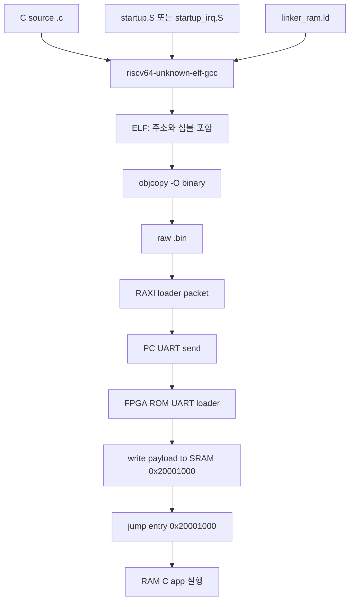
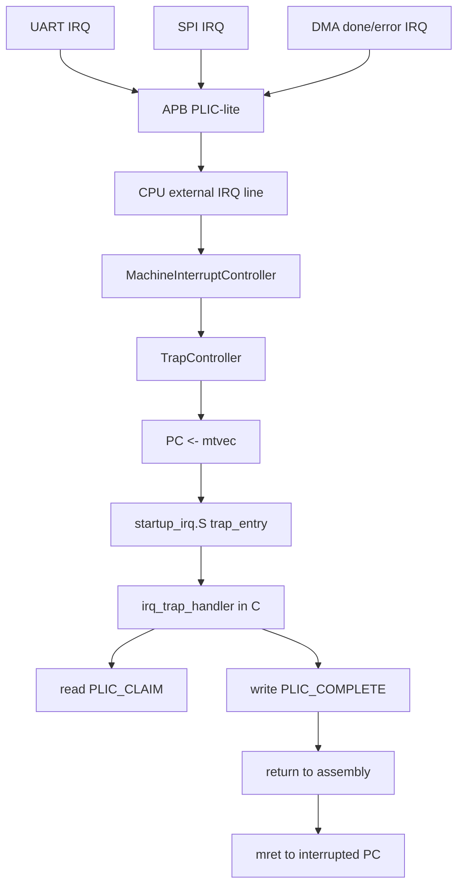

# RAM loader, linker, interrupt debug notes

이 문서는 2026-05-11 보드 bring-up 중 확인한 내용을 기준으로 정리한다.
핵심은 C RAM app이 어떻게 기계어가 되어 UART로 올라가는지, `linker_ram.ld`가 왜 필요한지, 그리고 현재 interrupt가 어디까지 구현되어 있는지이다.

## 1. 결론: 이번에 뭐가 문제였나

보드에서 `RGB DMA IRQ C` 앱이 LED `0xA0D6`에서 멈춘 것이 핵심 증상이었다.

`0xA0D6`의 의미는 다음과 같다.

- C interrupt handler에 들어왔다.
- DMA DONE interrupt ID 6을 처리했다.
- `PLIC_COMPLETE`에 6을 write했다.
- 그 직후 LED `0xA0D6`까지 찍었다.
- 하지만 assembly trap wrapper의 `call irq_trap_handler` 다음 LED `0xA0F0`까지 못 갔다.

즉 문제 지점은 DMA 자체나 PLIC claim 이전이 아니라, 대략 아래 구간이었다.

```text
C handler:
  sw PLIC_COMPLETE
  sw GPIO = A0D6
  ret

startup_irq.S:
  call irq_trap_handler
  sw GPIO = A0F0
  restore registers
  mret
```

의심한 RTL 문제는 `sw GPIO/PLIC_COMPLETE` 같은 APB write가 아직 bus wait 중인데, 같은 흐름에서 `ret`, `mret`, trap redirect 같은 PC redirect가 너무 일찍 latch될 수 있는 경우였다.

수정한 RTL:

- `HW/rtl/src/core/pipeline/PipelineControl.sv`
- `rTrapRedirectEn`, `rExRedirectEn`을 latch할 때 `!oBusWaitStall` 조건을 추가했다.

현재 형태:

```systemverilog
rTrapRedirectEn <= iTrapRedirectEn && !rTrapRedirectEn && !oBusWaitStall;

rExRedirectEn <= !iTrapRedirectEn && iExPcRedirectEn &&
                 !rTrapRedirectEn && !rExRedirectEn && !oBusWaitStall;
```

그리고 한 번 더 헷갈렸던 포인트가 있었다. RTL을 고친 뒤에도 FPGA에 새 bit를 안 올리면 당연히 보드 동작은 그대로다. 실제로 새 `risc_axi_uart_loader.bit`를 다시 program한 뒤 동작이 확인되었다.

추가로 bit build 쪽에도 실제 보드에 영향을 줄 수 있는 문제가 있었다.

- `HW/rtl/src/soc/SocTop.sv`
- 기본 ROM mem path가 오래된 경로였다.
- `src/timing_programs/link_demo.mem` 대신 `rtl/src/timing_programs/link_demo.mem`으로 맞췄다.

이건 testbench override 때문에 시뮬레이션에서는 숨어 있다가, bit build에서 `$readmemh` path로 드러난 문제다.

## 2. 전체 실행 흐름

현재 목표 흐름은 “FPGA ROM에는 UART bootloader만 고정으로 있고, PC에서 C app을 빌드해서 UART로 SRAM에 올리고 실행”이다.



GUI의 `Build` 버튼은 여기서 `ELF/BIN/packet` 생성까지만 한다.
`Build + Download`는 빌드 후 packet을 UART로 보내서 ROM loader가 SRAM에 쓰고 실행하게 한다.

GUI app 매핑은 여기 있다.

- `SW/loader_tools/loader_gui.py`

현재 주요 C app 위치:

- LED bringup: `SW/firmware_sources/ram_board_bringup_main.c`
- LED smoke: `SW/firmware_sources/ram_led_main.c`
- UART echo: `SW/firmware_sources/ram_uart_echo_main.c`
- RGB DMA polling: `SW/firmware_sources/ram_uart_dma_spi_rgb_poll_main.c`
- RGB DMA IRQ C: `SW/firmware_sources/ram_uart_dma_spi_rgb_irq_main.c`

## 3. 컴파일러와 빌드 스크립트

컴파일러는 `RISCV_GCC` 환경변수 또는 `PATH`에서 찾는 bare-metal RISC-V GCC를 사용한다.

```text
riscv64-unknown-elf-gcc
```

RAM app 빌드 스크립트:

- `SW/build_scripts/build_ram_app.ps1`

기본 컴파일 옵션:

```text
-march=rv32i_zicsr
-mabi=ilp32
-mcmodel=medany
-mstrict-align
-msmall-data-limit=0
-nostdlib
-nostartfiles
-ffreestanding
-fno-pic
-fno-builtin
-fno-asynchronous-unwind-tables
-fno-unwind-tables
-Os
-Wl,-T,SW/linker_scripts/linker_ram.ld
-Wl,--no-relax
```

중요한 뜻:

- `rv32i_zicsr`: 기본 RV32I에 CSR 명령어를 추가한다. `csrw mtvec`, `csrs mie`, `mret` 같은 interrupt 흐름 때문에 필요하다.
- `ilp32`: 32-bit int, long, pointer ABI.
- `nostdlib`, `nostartfiles`: libc와 기본 startup을 안 쓴다. `_start`, stack 초기화, `.bss` clear를 우리가 직접 한다.
- `ffreestanding`: OS 없는 bare-metal 환경.
- `linker_ram.ld`: 코드와 데이터 주소를 우리 SoC SRAM 주소에 맞춰 배치한다.

## 4. `linker_ram.ld`는 무엇인가

질문에서 말한 `linker.d`는 현재 프로젝트 기준으로는 아마 `linker_ram.ld`를 뜻한다.
이 파일은 컴파일러가 자동 생성한 것이 아니라, 이 MCU의 메모리맵에 맞춘 custom linker script다.

파일:

- `SW/linker_scripts/linker_ram.ld`

핵심 내용:

```ld
ENTRY(_start)

MEMORY
{
  SRAM_APP (rwx) : ORIGIN = 0x20001000, LENGTH = 0x3000
}

.text  > SRAM_APP
.data  > SRAM_APP
.bss   > SRAM_APP

. = ORIGIN(SRAM_APP) + LENGTH(SRAM_APP);
__stack_top = .;
```

이 뜻은 다음과 같다.

- `_start`가 프로그램 entry symbol이다.
- RAM app은 `0x20001000`부터 배치된다.
- app에 쓸 수 있는 영역은 `0x3000` bytes이다.
- 따라서 app 영역 끝은 `0x20001000 + 0x3000 = 0x20004000`이다.
- `__stack_top = 0x20004000`이다.
- startup code가 `la sp, __stack_top`을 하므로 stack pointer는 처음에 `0x20004000`이 된다.
- RISC-V stack은 아래 주소 방향으로 자란다.

왜 `0x20001000`인가:

- RTL 주소맵에서 SRAM base는 `0x20000000`이다.
- `AxiLiteSram`은 `P_ADDR_WIDTH=12` word RAM이라 4096 words, 즉 16KB이다.
- SRAM 전체 범위는 `0x20000000`부터 `0x20003FFF`까지로 보면 된다.
- app을 SRAM 맨 앞 `0x20000000`에 두면, C app의 debug scratch write가 첫 명령어를 덮을 수 있다.
- 현재 C debug helper는 `SRAM_BASE + 0`, `+4`, `+8`, `+12`에 상태값을 쓴다.
- 그래서 app code는 `0x20001000`부터 올리고, 아래 4KB는 debug scratch/여유 공간으로 둔다.

참고로 RGB DMA의 `DMA_BUF_ADDR`는 SRAM 주소가 아니라 `ApbAxiStreamDma` 내부 16KB image buffer의 offset이다.
즉 `DMA_BUF_ADDR=0`이 app code `0x20001000`을 직접 덮는 구조는 아니다.

현재 `RGB DMA IRQ C` map 예:

```text
SRAM_APP origin  0x20001000
SRAM_APP length  0x00003000
_start           0x20001000
trap_entry       0x20001080
reset_start      0x20001194
main             0x20001204
irq_trap_handler 0x2000175c
.bss start       0x20001964
__stack_top      0x20004000
```

이 정보는 빌드 후 생성되는 map 파일에서 확인할 수 있다.

- `SW/build_outputs/ram_uart_dma_spi_rgb_irq_app.map`

## 5. packet format과 UART download

RAM app 빌드 결과:

- `.elf`: 주소, 심볼, 섹션 정보를 포함한 실행 파일.
- `.bin`: 실제 SRAM에 쓸 raw instruction/data bytes.
- `.dump`: objdump disassembly.
- `_loader_packet.bin`: UART loader가 받을 packet.
- `_loader_packet.hex`: packet을 byte 단위 hex로 펼친 파일.

packet 생성 파일:

- `SW/loader_tools/make_loader_packet.py`

packet 구조:

```text
magic      4 bytes  "RAXI"
load_addr  4 bytes  little-endian
byte_count 4 bytes  little-endian
entry_addr 4 bytes  little-endian
checksum   4 bytes  payload byte sum
payload    N bytes  word-padded raw binary
```

기본값:

```text
load_addr = 0x20001000
entry     = 0x20001000
baud      = 115200
```

ROM loader bit:

- `HW/bitstreams/risc_axi_uart_loader.bit`
- mirror copy: `Project/Test/output/risc_axi_uart_loader.bit`

ROM loader mem:

- `HW/rtl/src/timing_programs/uart_loader.mem`

## 6. 현재 interrupt 구조

현재 구현은 “RISC-V machine external interrupt + PLIC-lite + direct mtvec handler” 구조다.



관련 RTL:

- PLIC-lite: `HW/rtl/src/bus/apb/ApbPlicLite.sv`
- APB peripheral mux: `HW/rtl/src/bus/apb/ApbSubsystem.sv`
- CPU interrupt pending selector: `HW/rtl/src/core/pipeline/MachineInterruptController.sv`
- trap redirect selector: `HW/rtl/src/core/pipeline/TrapController.sv`
- CSR state: `HW/rtl/src/core/pipeline/CsrFile.sv`

관련 SW:

- trap startup: `SW/firmware_sources/startup_irq.S`
- C handler: `SW/firmware_sources/ram_uart_dma_spi_rgb_irq_main.c`

현재 `startup_irq.S`는 `.vectors` 섹션을 app entry에 놓고, `_start + 0x80`에 `trap_entry`를 둔다.
하지만 이것은 “진짜 vectored interrupt table”은 아니다.

현재 방식:

- `reset_start`에서 `la t0, trap_entry`
- `csrw mtvec, t0`
- interrupt가 오면 항상 `mtvec` 하나로 점프
- `trap_entry`가 모든 register를 stack에 저장
- C 함수 `irq_trap_handler()` 호출
- 돌아오면 LED `0xA0F0`
- register restore
- `mret`

즉 현재는 direct mode handler다.
Vectored mode처럼 `mtvec + 4*cause`로 각 source별 entry에 자동 분기하는 구조는 현재 사용하지 않는다.

RTL에는 `P_ENABLE_MTVEC_VECTORED` parameter가 있지만 기본값은 꺼져 있다.
따라서 지금은 C handler가 `PLIC_CLAIM`을 읽어서 source ID를 직접 switch-case로 dispatch한다.

## 7. PLIC-lite register map

PLIC base:

```c
#define PLIC_BASE 0x400F0000u
```

offset:

```text
0x00 ENABLE
0x04 PENDING
0x08 ENABLED_PENDING
0x0C CLAIM
0x10 COMPLETE
0x14 THRESHOLD
0x20 PRIORITY[0], IRQ ID 1
0x24 PRIORITY[1], IRQ ID 2
...
```

현재 IRQ ID:

```text
1 UART TX
2 UART RX
3 SPI TX
4 SPI RX
5 unused
6 DMA DONE
7 DMA ERROR
```

중요한 구현 차이:

- 일반 PLIC 문서에서는 `CLAIM` read가 pending clear까지 하는 경우가 많다.
- 이 프로젝트의 `ApbPlicLite`는 `CLAIM` read가 side effect를 만들지 않는다.
- pending clear/gateway release는 handler가 `PLIC_COMPLETE`에 claim ID를 write할 때 한다.

그래서 handler는 반드시 다음 순서를 지켜야 한다.

```c
claim_id = MMIO32(PLIC_BASE + PLIC_CLAIM);
// source별 peripheral clear
MMIO32(PLIC_BASE + PLIC_COMPLETE) = claim_id;
```

## 8. 현재 SW interrupt는 어디까지 되어 있나

여기서 용어를 나눠야 한다.

### RISC-V software interrupt, MSIP

RISC-V spec상의 software interrupt는 `mcause=3`, `mip.MSIP`, `mie.MSIE` 쪽이다.

현재 SoC top에서는 CPU의 `iSoftwareIrq`가 `1'b0`에 묶여 있다.

```systemverilog
.iSoftwareIrq(1'b0)
```

즉 spec 의미의 software interrupt source는 아직 실제 peripheral로 구현되어 있지 않다.
CSR 파일은 `mip/mie`의 software bit를 다룰 수 있지만, SoC 외부에서 MSIP를 올리는 memory-mapped register는 아직 없다.

### Machine timer interrupt

Timer peripheral의 `oTimerIrq`는 CPU `iTimerIrq`로 연결되어 있다.
따라서 하드웨어 경로는 있다.
다만 현재 RGB IRQ C app은 timer interrupt를 enable/handle하지 않는다.

### Machine external interrupt, PLIC

현재 실제로 동작 확인한 주 경로는 이것이다.

- PLIC external interrupt cause: `mcause = 0x8000000B`
- C app에서 `mie.MEIE` set
- C app에서 `mstatus.MIE` set
- PLIC에서 DMA done/error enable
- DMA done 발생
- CPU가 `mtvec`으로 trap
- C handler에서 `PLIC_CLAIM=6`
- DMA clear
- `PLIC_COMPLETE=6`
- `mret`

### C handler의 source별 처리 상태

`ram_uart_dma_spi_rgb_irq_main.c`의 C handler에는 switch-case가 이미 있다.

```text
UART TX   case 있음, status clear 코드 있음
UART RX   case 있음, status clear 코드 있음
SPI TX    case 있음, status clear 코드 있음
SPI RX    case 있음, status clear 코드 있음
DMA DONE  case 있음, 실제 RGB IRQ app에서 enable/검증됨
DMA ERROR case 있음, 실제 RGB IRQ app에서 enable됨
```

하지만 현재 `RGB DMA IRQ C` app에서 실제 PLIC enable mask는 DMA만 켠다.

```c
#define PLIC_ENABLE_DMA (IRQ_BIT(IRQ_ID_DMA_DONE) | IRQ_BIT(IRQ_ID_DMA_ERROR))
plic_init(PLIC_ENABLE_DMA);
```

따라서 UART/SPI interrupt case는 코드상 준비되어 있지만, 이 app에서는 enable하지 않는다.
나중에 공부/확장하려면 `PLIC_ENABLE_DMA`를 UART/SPI까지 넓히고, peripheral ctrl의 IRQ enable bit도 켜야 한다.

## 9. RGB DMA IRQ C의 LED breadcrumb

현재 IRQ C app은 LED를 디버거처럼 쓴다.

주요 코드 위치:

- `SW/firmware_sources/ram_uart_dma_spi_rgb_irq_main.c`

주요 LED:

```text
0x1080 app start
0x1180 UART init done
0x1280 SPI init done
0x1380 before PLIC init
0x1480 PLIC init done
0x2180 RX DMA IRQ wait
0xA006 DMA_DONE handler entered
0xA016 DMA done clear passed
0xA0C6 before PLIC complete for claim 6
0xA0D6 after PLIC complete for claim 6
0xA0F0 returned from C handler to trap assembly
0x2380 main resumed after RX IRQ
0x3180 TX DMA IRQ wait
0x538D frame done
```

그래서 예전 `A0D6` stuck은 매우 좋은 단서였다.
PLIC complete write까지는 됐고, 그 다음 C handler return/trap return 주변이 문제라는 뜻이었기 때문이다.

## 10. 검증용 probe

이번 문제를 줄이기 위해 probe를 추가했다.

대표 probe:

- `SW/firmware_sources/ram_trap_call_probe.S`
- `SW/build_scripts/download_ram_trap_call_probe.ps1`
- `HW/tb/soc/tb_SocTopUartLoaderRamTrapCallProbe.sv`
- `HW/vivado_tools/run_ram_trap_call_probe_sim.tcl`

이 probe는 RAM-loaded app path에서 다음을 직접 확인한다.

```text
trap_entry
call trap_probe_handler
handler에서 GPIO A0C6
PLIC_COMPLETE write
GPIO A0D6
ret
trap wrapper에서 GPIO A0F0
mret
main에서 GPIO 55AA
```

즉 우리가 실제로 의심한 `A0D6 -> ret -> A0F0 -> mret` 구간만 작게 떼어 검증하는 테스트다.

확인했던 대표 시뮬레이션:

```text
run_jalr_mret_probe_sim.tcl       PASS
run_trap_call_probe_sim.tcl       PASS
run_c_smoke_sim.tcl               PASS
run_ram_trap_call_probe_sim.tcl   PASS
```

보드에서도 새 bit를 올린 뒤 IRQ C path가 동작했다.

## 11. 앞으로 확장할 때 주의점

1. RAM app 주소를 바꿀 때는 `linker_ram.ld`, loader packet `load_addr/entry`, startup의 `mtvec` 설정이 서로 맞아야 한다.
2. `__stack_top`은 linker가 만든 symbol이다. C 코드가 아니라 linker script에서 나온다.
3. interrupt source를 추가할 때는 peripheral IRQ output, `ApbSubsystem` source bit, PLIC ID, C handler switch-case, PLIC enable mask, peripheral clear sequence를 함께 맞춰야 한다.
4. 현재 direct `mtvec` 방식이라 vector table dispatch는 C handler의 switch-case가 담당한다.
5. 진짜 vectored mode를 하고 싶으면 RTL parameter, `mtvec` mode bit, `.vectors` layout을 같이 설계해야 한다.
6. bit를 새로 만들었으면 반드시 FPGA에 새 bit를 program해야 한다. SW packet만 다시 올리는 것으로 RTL 수정은 반영되지 않는다.
