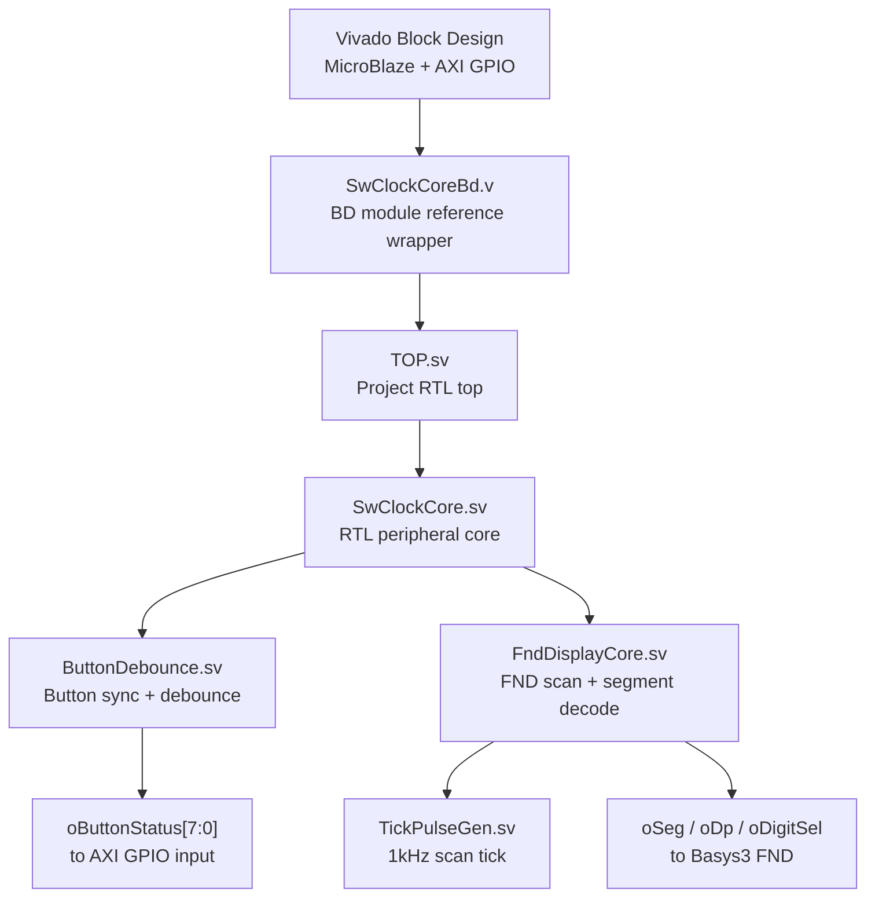
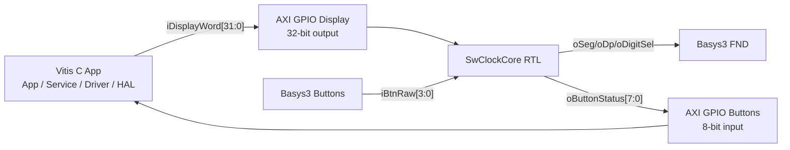
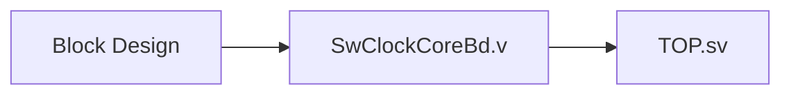
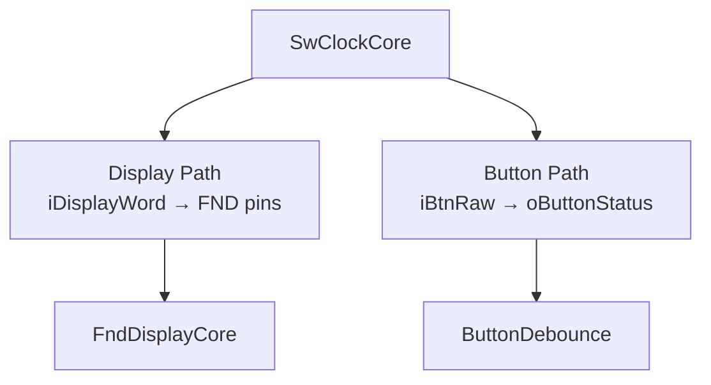
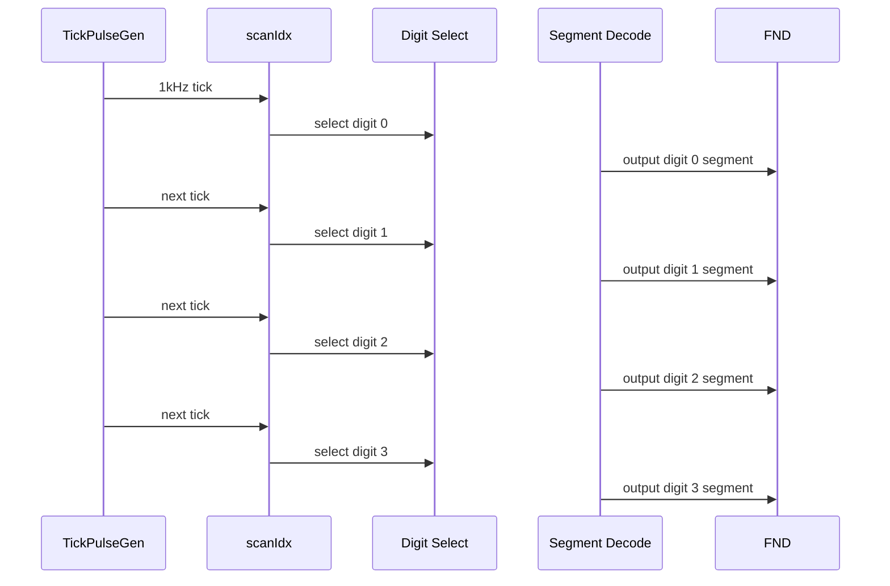
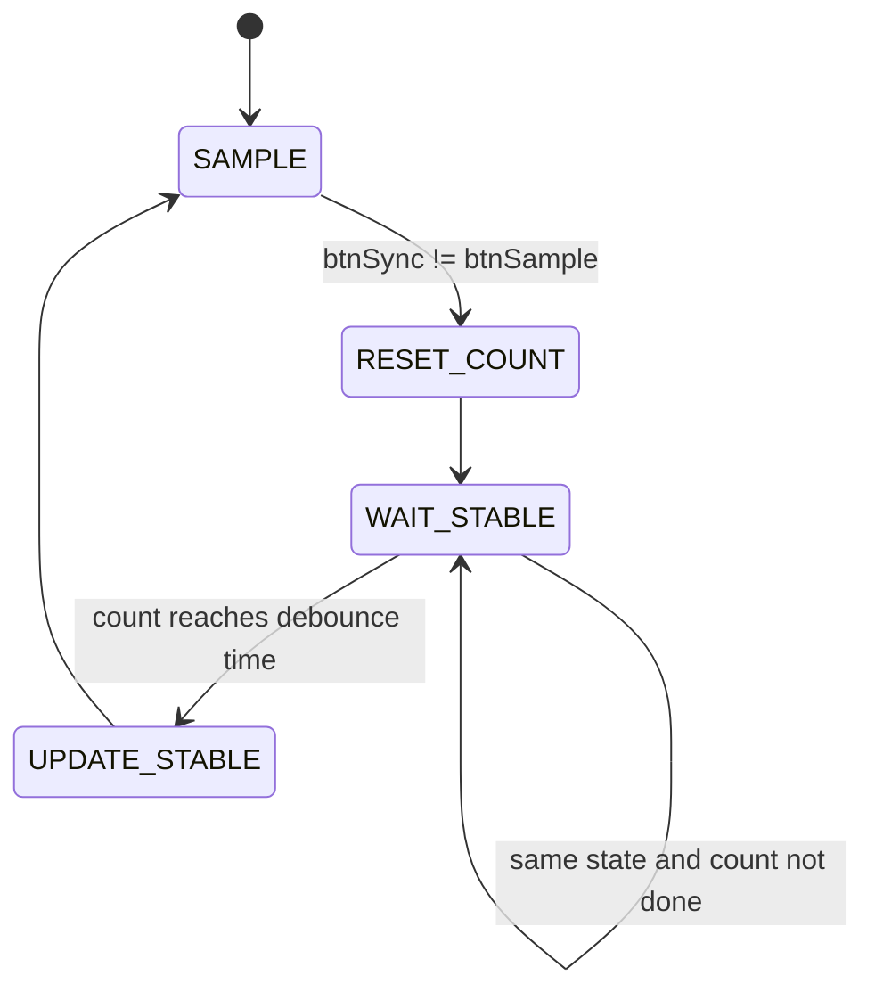
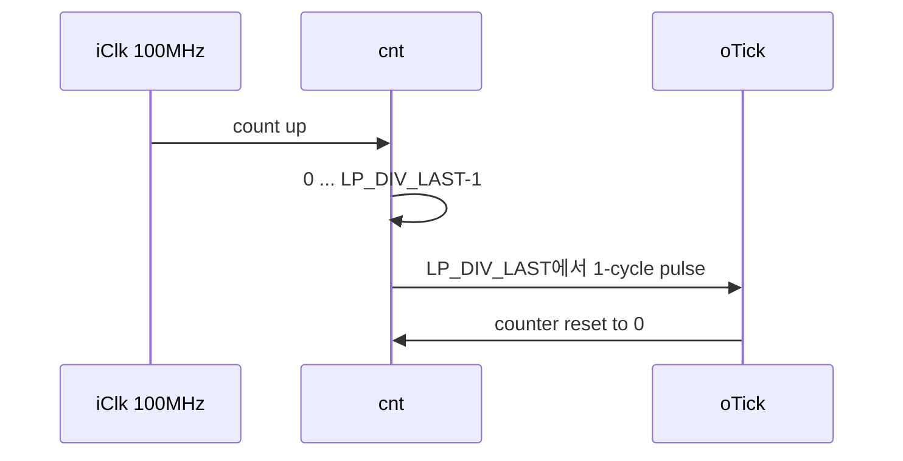
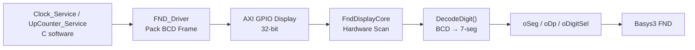
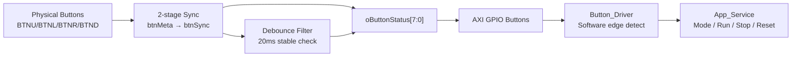

# 🧭 SW_CLOCK RTL 코드 설명 보고서

## 0. 한눈에 보는 설계 요약 ✨

| 구분 | 내용 |
|---|---|
| 프로젝트 | `SW_CLOCK` |
| 대상 보드 | Digilent Basys3 |
| FPGA Part | `xc7a35tcpg236-1` |
| RTL Top | `TOP` |
| 주요 입력 | 100MHz Clock, Reset, Button 4개, Software Display Frame |
| 주요 출력 | FND Segment, Decimal Point, Digit Select, Button Status |
| 핵심 역할 | RTL이 FND 스캔과 버튼 디바운스를 담당하고, MicroBlaze C 앱은 표시 데이터와 서비스 제어를 담당 |
| UART | ❌ 사용하지 않음 |

본 설계는 **MicroBlaze 소프트웨어와 FPGA RTL을 계층적으로 분리**한 구조이다.

- 🧠 **Software / Vitis C**: UpCounter, Clock 서비스 상태를 계산하고 표시할 BCD frame을 생성한다.
- ⚙️ **RTL Core**: FND를 빠르게 scan하고, 버튼 입력을 동기화 및 debounce한다.
- 🔌 **AXI GPIO**: Software와 RTL 사이의 display frame, button status 전달 통로로 사용된다.

---

## 1. 전체 RTL 계층 구조 🏗️



### 파일별 역할 📁

| 파일 | 모듈 | 역할 |
|---|---|---|
| `src/SwClockCoreBd.v` | `SwClockCoreBd` | Vivado Block Design에서 SystemVerilog RTL을 안정적으로 참조하기 위한 plain Verilog wrapper |
| `src/TOP.sv` | `TOP` | 프로젝트 최상위 RTL wrapper |
| `src/SwClockCore.sv` | `SwClockCore` | FND 표시 경로와 버튼 입력 경로를 묶는 핵심 RTL core |
| `src/FndDisplayCore.sv` | `FndDisplayCore` | Software display frame을 받아 FND 4자리를 hardware scan |
| `src/ButtonDebounce.sv` | `ButtonDebounce` | 물리 버튼 입력을 clock domain에 동기화하고 debounce |
| `src/TickPulseGen.sv` | `TickPulseGen` | 100MHz clock을 원하는 tick 주파수로 분주 |

---

## 2. 설계 의도 🎯

이 RTL은 모든 기능을 하드웨어로만 처리하지도 않고, 모든 표시 제어를 소프트웨어로만 처리하지도 않는다.

| 기능 | 담당 계층 | 이유 |
|---|---|---|
| UpCounter 값 계산 | Software | 서비스 로직 변경이 쉽고 C 계층 분리에 적합 |
| Clock `MM:SS` 계산 | Software | 시간 상태, 모드 제어, reset/run/stop 정책을 구조체로 관리하기 좋음 |
| FND digit scan | RTL | 1kHz 수준의 반복 출력은 software polling보다 hardware가 안정적 |
| 7-segment decode | RTL | 표시 pin 제어를 RTL 내부에서 일관되게 처리 |
| Button debounce | RTL | 물리 버튼 bouncing 제거는 hardware filter가 안정적 |
| Button event 해석 | Software | mode/run/stop/reset 정책은 application layer에서 처리 |

즉, 이 프로젝트의 핵심은 다음과 같다.

> 🧩 **소프트웨어는 “무엇을 표시할지” 결정하고, RTL은 “어떻게 안정적으로 표시할지” 담당한다.**

---

## 3. Software ↔ RTL 인터페이스 🔁

RTL은 AXI GPIO를 통해 software와 연결된다.



### Display Frame 비트맵 🧾

`iDisplayWord[31:0]`는 software가 RTL로 넘기는 표시 frame이다.

| Bit Range | 이름 | 설명 | 예시 |
|---:|---|---|---|
| `[3:0]` | Digit 0 | 가장 오른쪽 자리 BCD | 초 1의 자리 |
| `[7:4]` | Digit 1 | 오른쪽에서 두 번째 자리 BCD | 초 10의 자리 |
| `[11:8]` | Digit 2 | 왼쪽에서 두 번째 자리 BCD | 분 1의 자리 |
| `[15:12]` | Digit 3 | 가장 왼쪽 자리 BCD | 분 10의 자리 |
| `[19:16]` | DP Mask | digit별 decimal point enable |
| `[23:20]` | Blank Mask | digit별 blank enable |
| `[31:24]` | Reserved | 현재 미사용 |

시계 모드의 `MM:SS` 표시 예시는 다음과 같다.

| 표시 | Digit 3 | Digit 2 | Digit 1 | Digit 0 | DP |
|---|---:|---:|---:|---:|---|
| `12.34` 형태 | `1` | `2` | `3` | `4` | Digit 2 DP 점멸 |

> Basys3 FND에는 실제 colon이 없기 때문에, RTL은 DP를 이용해 `MM.SS` 형태로 시계 구분감을 준다.

### Button Status 비트맵 🕹️

`oButtonStatus[7:0]`는 RTL이 software로 넘기는 버튼 상태이다.

| Bit Range | 이름 | 설명 |
|---:|---|---|
| `[3:0]` | Debounced Button State | debounce 완료된 안정 상태 |
| `[7:4]` | Raw Sync Button State | 2-stage synchronizer를 지난 raw 상태 |

버튼 기능은 software 계층에서 다음처럼 해석한다.

| Button | RTL Bit | Software 기능 |
|---|---:|---|
| BTNU | bit 0 | UpCounter / Clock mode 전환 |
| BTNL | bit 1 | Stop / Pause |
| BTNR | bit 2 | Run / Start |
| BTND | bit 3 | 선택된 서비스 reset |
| BTNC | 별도 reset port | system reset |

---

## 4. 모듈별 상세 설명 🔍

## 4.1 `SwClockCoreBd` 🧱

| 항목 | 내용 |
|---|---|
| 파일 | `src/SwClockCoreBd.v` |
| 언어 | Verilog |
| 위치 | Vivado Block Design module reference 경계 |
| 핵심 역할 | SystemVerilog `TOP`을 Vivado BD에서 안정적으로 인스턴스화 |

Vivado Block Design에서 SystemVerilog module reference를 직접 사용할 때 도구 호환성 문제가 생길 수 있으므로, plain Verilog wrapper를 둔다.



이 wrapper는 기능을 직접 구현하지 않고, parameter와 port를 `TOP`으로 그대로 전달한다.

---

## 4.2 `TOP` 🚪

| 항목 | 내용 |
|---|---|
| 파일 | `src/TOP.sv` |
| 역할 | 프로젝트 최상위 RTL wrapper |
| 특징 | 내부 기능은 `SwClockCore`에 위임 |

`TOP`은 복잡한 로직을 넣지 않는 얇은 wrapper이다.

### 주요 Port

| Port | 방향 | 폭 | 설명 |
|---|---|---:|---|
| `iClk` | Input | 1 | 100MHz system clock |
| `iRstn` | Input | 1 | active-low reset |
| `iDisplayWord` | Input | 32 | software가 전달한 FND 표시 frame |
| `iBtnRaw` | Input | 4 | Basys3 물리 버튼 입력 |
| `oButtonStatus` | Output | 8 | debounce/raw-sync 버튼 상태 |
| `oSeg` | Output | 7 | active-low segment A~G |
| `oDp` | Output | 1 | active-low decimal point |
| `oDigitSel` | Output | 4 | active-low digit select |

> ✅ `TOP`은 “외부 연결 정리”에 집중하고, 실제 동작은 `SwClockCore`가 담당한다.

---

## 4.3 `SwClockCore` 🧠

| 항목 | 내용 |
|---|---|
| 파일 | `src/SwClockCore.sv` |
| 역할 | RTL peripheral core |
| 포함 모듈 | `ButtonDebounce`, `FndDisplayCore` |

`SwClockCore`는 두 개의 독립적인 데이터 경로를 묶는다.



### 내부 연결

| 내부 신호 | 의미 |
|---|---|
| `wButtonDebounce2Core_BtnStable` | debounce 완료된 버튼 상태 |
| `wButtonDebounce2Core_BtnRawSync` | clock domain 동기화만 된 버튼 상태 |

`oButtonStatus`는 두 상태를 하나로 묶어 software에 전달한다.

```text
oButtonStatus[7:4] = raw-sync state
oButtonStatus[3:0] = debounced stable state
```

---

## 4.4 `FndDisplayCore` 💡

| 항목 | 내용 |
|---|---|
| 파일 | `src/FndDisplayCore.sv` |
| 역할 | FND hardware scan engine |
| 입력 | `iDisplayWord[31:0]` |
| 출력 | `oSeg`, `oDp`, `oDigitSel` |

이 모듈은 software가 만든 32-bit display frame을 받아, 4자리 FND를 빠르게 번갈아 켠다.

### FND Scan 원리 ⚡

4자리 FND는 모든 자리를 동시에 켜는 것이 아니라, 매우 빠르게 한 자리씩 선택한다.



사람 눈에는 잔상 효과 때문에 4자리가 동시에 켜진 것처럼 보인다.

### Digit Select 패턴 🔢

Basys3 FND는 active-low 방식이므로 `0`인 digit만 켜진다.

| `scanIdx` | 선택 digit | `oDigitSel` | 의미 |
|---:|---:|---|---|
| `0` | Digit 0 | `1110` | 가장 오른쪽 자리 ON |
| `1` | Digit 1 | `1101` | 오른쪽에서 두 번째 ON |
| `2` | Digit 2 | `1011` | 왼쪽에서 두 번째 ON |
| `3` | Digit 3 | `0111` | 가장 왼쪽 자리 ON |

### Segment Decode 🧩

`DecodeDigit()` 함수는 4-bit BCD/hex 값을 active-low 7-segment pattern으로 변환한다.

| 숫자 | Segment Pattern | 표시 |
|---:|---|---|
| `0` | `100_0000` | 0 |
| `1` | `111_1001` | 1 |
| `2` | `010_0100` | 2 |
| `3` | `011_0000` | 3 |
| `8` | `000_0000` | 모든 segment ON |
| Blank | `111_1111` | 모든 segment OFF |

### DP와 Blank 처리 🌙

| 조건 | 동작 |
|---|---|
| `blankMask[scanIdx] == 1` | 해당 digit segment와 DP 모두 OFF |
| `dpMask[scanIdx] == 1` | 해당 digit의 decimal point ON |
| `dpMask[scanIdx] == 0` | 해당 digit의 decimal point OFF |

`oDp`도 active-low이므로 내부 enable 값과 출력 값이 반대이다.

```text
curDp = 1 → oDp = 0 → DP ON
curDp = 0 → oDp = 1 → DP OFF
```

---

## 4.5 `ButtonDebounce` 🕹️

| 항목 | 내용 |
|---|---|
| 파일 | `src/ButtonDebounce.sv` |
| 역할 | 버튼 CDC 동기화 + debounce |
| 기본 debounce 시간 | 20ms |

물리 버튼은 누르는 순간 깨끗하게 `0 → 1`로 바뀌지 않고, 짧은 시간 동안 여러 번 흔들린다. 이 현상을 bouncing이라고 한다.

```text
이상적인 버튼:      ____████████████
실제 물리 버튼:    __█_██_█_███████
debounce 결과:     ______███████████
```

### 처리 단계 🧼

| 단계 | 신호 | 설명 |
|---:|---|---|
| 1 | `btnMeta` | raw button 1차 sampling |
| 2 | `btnSync` | 2차 sampling, clock domain 동기화 |
| 3 | `btnSample` | 현재 후보 버튼 상태 저장 |
| 4 | `debounceCnt` | 후보 상태가 유지된 시간 측정 |
| 5 | `oBtnStable` | debounce 완료된 안정 상태 출력 |

### Debounce 동작 흐름



### 기본 설정 기준 ⏱️

| Parameter | 값 | 의미 |
|---|---:|---|
| `P_CLK_HZ` | `100_000_000` | 100MHz board clock |
| `P_DEBOUNCE_MS` | `20` | 20ms 동안 유지되어야 안정 상태로 인정 |
| `LP_CYCLES_PER_MS` | `100_000` | 100MHz 기준 1ms clock cycle 수 |
| `LP_DEBOUNCE_CYCLES` | `2_000_000` | 20ms debounce cycle 수 |

---

## 4.6 `TickPulseGen` ⏲️

| 항목 | 내용 |
|---|---|
| 파일 | `src/TickPulseGen.sv` |
| 역할 | clock divider |
| 출력 | 지정 주파수의 1-cycle pulse |

`TickPulseGen`은 `P_CLK_HZ`와 `P_TICK_HZ`를 이용해 분주비를 계산한다.

```text
LP_DIV = P_CLK_HZ / P_TICK_HZ
```

예를 들어 FND scan용으로 `100MHz → 1kHz` tick을 만들면:

```text
100,000,000 / 1,000 = 100,000 cycles
```

즉, 100,000 clock마다 `oTick`이 1 clock cycle 동안 `1`이 된다.



---

## 5. FND 표시 데이터 흐름 🖥️



### 예시: Clock `12:34` 표시

| 항목 | 값 |
|---|---|
| Digit 3 | `1` |
| Digit 2 | `2` |
| Digit 1 | `3` |
| Digit 0 | `4` |
| DP Mask | Digit 2 점멸 |
| 실제 표시 느낌 | `12.34` |

Frame 구조:

```text
iDisplayWord[15:0]  = 0x1234 형태의 BCD nibble 조합
iDisplayWord[19:16] = DP mask
iDisplayWord[23:20] = Blank mask
```

---

## 6. 버튼 입력 데이터 흐름 🕹️➡️🧠



### 역할 분리

| 단계 | 담당 | 처리 내용 |
|---|---|---|
| Raw 입력 | Board | 실제 버튼 전기 신호 |
| 동기화 | RTL | metastability 위험 감소 |
| Debounce | RTL | bouncing 제거 |
| Edge detect | Software | 눌림 event 판단 |
| 서비스 제어 | Software | mode/run/stop/reset 수행 |

---

## 7. Reset과 Clock 정책 🔄

| 신호 | Active Level | 설명 |
|---|---|---|
| `iClk` | rising edge | 모든 RTL 동작 기준 clock |
| `iRstn` | active-low | RTL 내부 register 초기화 |
| `iBtnC` | active-high board reset | Vivado BD의 reset IP를 거쳐 `iRstn`으로 변환 |

Reset 시 주요 상태:

| 모듈 | Reset 결과 |
|---|---|
| `FndDisplayCore` | `scanIdx = 0` |
| `ButtonDebounce` | sync/state/counter 모두 0 |
| `TickPulseGen` | counter 0, tick 0 |

---

## 8. 설계 장점 🌟

| 장점 | 설명 |
|---|---|
| 안정적인 FND 표시 | FND scan이 RTL에서 수행되어 software delay 영향이 작음 |
| 버튼 입력 신뢰성 | debounce를 RTL에서 처리해 software event가 깔끔해짐 |
| 계층 분리 | C service logic과 RTL pin control이 분리되어 유지보수 쉬움 |
| 확장성 | display frame bit를 확장하면 blink, symbol, mode indicator 추가 가능 |
| UART 배제 | 과제 조건에 맞게 UART/AXI UARTLite 없이 FND/Button만 사용 |

---

## 9. 검증 포인트 ✅

| 검증 항목 | 기대 결과 |
|---|---|
| RTL syntax | Vivado `xvlog` 통과 |
| Vivado BD 생성 | `SwClockCoreBd` module reference 포함 |
| Implementation | bitstream 생성 성공 |
| Timing | user timing constraints met |
| Vitis build | platform/application build 성공 |
| Board run | FPGA program + MicroBlaze ELF download/run 가능 |

---

## 10. 최종 결론 🏁

`SW_CLOCK` RTL은 **FND와 Button을 다루는 하드웨어 전용 peripheral core**로 설계되었다.

가장 중요한 구조적 특징은 다음 세 가지이다.

| 핵심 | 설명 |
|---|---|
| 🖥️ FND scan은 RTL | 빠르고 주기적인 digit scan을 hardware가 담당 |
| 🕹️ Button debounce는 RTL | 물리 버튼 입력을 안정적인 상태 값으로 변환 |
| 🧠 기능 정책은 Software | UpCounter / Clock / mode control은 C 계층에서 담당 |

따라서 본 설계는 단순한 FND 출력 예제가 아니라, **MicroBlaze software와 FPGA RTL의 역할을 명확히 분리한 embedded FPGA system**이다.

> ✅ Software는 “표시할 값과 서비스 상태”를 결정하고,  
> ✅ RTL은 “보드 입출력을 안정적으로 구동”한다.

