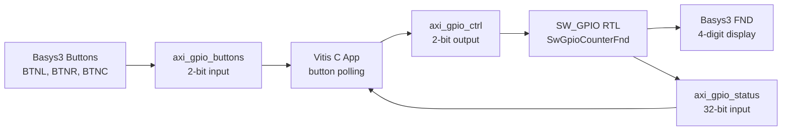
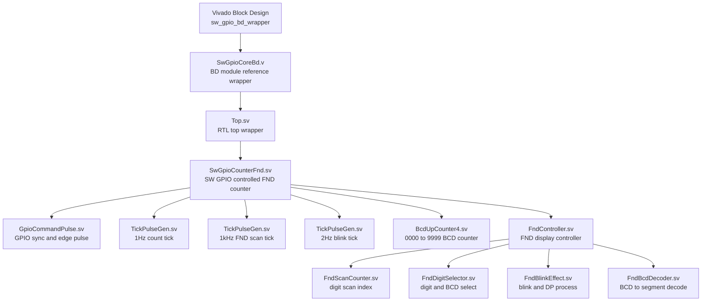
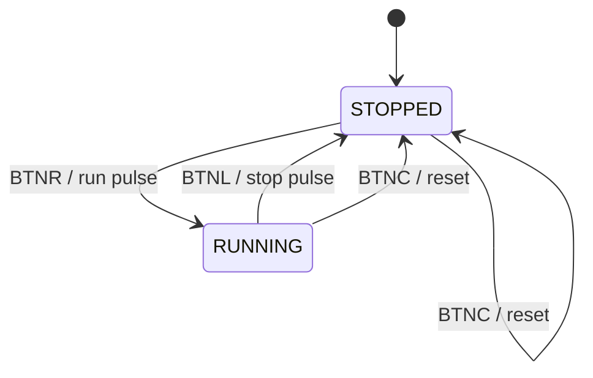

# R E P O R T

## [HW : SW_GPIO]

| 항목 | 내용 |
|---|---|
| 제출일 | 2026년 4월 27일 |
| 성명 | 한정호 |
| 개발 환경 | Vivado 2025.2, Vitis Unified IDE 2025.2 |
| 대상 보드 | Digilent Basys3, Artix-7 xc7a35tcpg236-1 |
| 구현 언어 | SystemVerilog, C |

---

## 1. 서론

본 보고서에서는 Basys3 보드에서 동작하는 SW_GPIO 기반 FND 카운터 시스템의 설계 및 구현 과정을 기술한다. 설계 목표는 Vitis에서 실행되는 C 프로그램이 AXI GPIO를 통해 RTL 모듈을 제어하고, RTL은 4자리 FND에 0000부터 9999까지 증가하는 up-counter 값을 표시하도록 구성하는 것이다.

초기 검토 과정에서 UART 기반 제어 방식은 과제 의도와 맞지 않는 것으로 판단하였고, 최종 설계에서는 UART 관련 IP와 소프트웨어 입출력을 제외하였다. 최종 제어 방식은 Basys3의 물리 버튼을 Vitis 소프트웨어에서 polling하고, software GPIO 명령으로 RTL 카운터의 run/stop 상태를 제어하는 구조이다.

---

## 2. 본론

### 2.1 전체 시스템 구조

본 설계는 MicroBlaze 기반 block design과 사용자 RTL 모듈을 결합한 구조이다. Basys3 버튼 입력은 AXI GPIO 입력 IP로 연결되고, Vitis C 프로그램이 버튼 상태를 읽어 AXI GPIO 출력 IP에 run/stop 명령을 쓴다. RTL은 해당 명령을 1클럭 pulse로 변환한 뒤 카운터 동작 상태를 갱신한다.



전체 동작 흐름은 다음과 같다.

| 단계 | 동작 |
|---|---|
| 1 | 사용자가 Basys3 버튼을 누른다. |
| 2 | `axi_gpio_buttons`가 버튼 상태를 MicroBlaze 주소 공간에 제공한다. |
| 3 | Vitis C 프로그램이 버튼 rising edge를 감지한다. |
| 4 | C 프로그램이 `axi_gpio_ctrl`에 run 또는 stop 명령 pulse를 출력한다. |
| 5 | RTL이 GPIO level 신호를 동기화하고 1클럭 pulse로 변환한다. |
| 6 | run 상태이면 1Hz tick마다 BCD counter가 증가한다. |
| 7 | FND controller가 1kHz scan tick으로 4자리 FND를 동적 표시한다. |

---

### 2.2 Basys3 버튼 매핑

최종 설계에서 버튼 기능은 다음과 같이 정의하였다.

| 버튼 | Basys3 핀 | BD 포트 | AXI GPIO bit | 기능 |
|---|---:|---|---:|---|
| BTNL | W19 | `iBtnCtrl[0]` | `axi_gpio_buttons[0]` | stop |
| BTNR | T17 | `iBtnCtrl[1]` | `axi_gpio_buttons[1]` | run |
| BTNC | U18 | `iBtnC` | reset input | system reset 및 counter clear |

BTNC는 `proc_sys_reset`의 active-high external reset으로 연결하였다. RTL 내부 reset은 active-low `iRstn`을 사용하므로, block design의 reset IP가 board reset을 RTL에 적합한 reset 신호로 변환한다.

---

### 2.3 Top RTL

최상위 RTL 모듈은 `Top.sv`이며, Vitis/AXI GPIO와 연결되는 단순한 control/status boundary를 제공한다.

| 포트 | 방향 | 비트 폭 | 설명 |
|---|---|---:|---|
| `iClk` | Input | 1 | 100MHz system clock |
| `iRstn` | Input | 1 | active-low reset |
| `iGpioCtrl` | Input | 2 | software GPIO command 입력 |
| `oSeg` | Output | 7 | FND segment 출력 |
| `oDp` | Output | 1 | FND decimal point 출력 |
| `oDigitSel` | Output | 4 | FND digit select 출력 |
| `oGpioStatus` | Output | 32 | software에서 읽을 상태 값 |

`iGpioCtrl` bit 정의는 다음과 같다.

| bit | 명령 | 설명 |
|---:|---|---|
| 0 | run | 카운터 증가 시작 |
| 1 | stop | 카운터 증가 정지 |

`oGpioStatus` bit 정의는 다음과 같다.

| bit range | 이름 | 설명 |
|---|---|---|
| `[15:0]` | `countBcd` | 4자리 BCD counter 값 |
| `[16]` | `runActive` | 현재 run 상태 |
| `[17]` | `rolloverPulse` | 9999에서 0000으로 넘어가는 1클럭 pulse |
| `[18]` | `runReqPulse` | run 명령 감지 pulse |
| `[19]` | `stopReqPulse` | stop 명령 감지 pulse |
| `[31:20]` | reserved | 0으로 고정 |

---

### 2.4 RTL 모듈 계층도

본 프로젝트의 RTL은 Vivado block design에서 직접 참조하기 위한 wrapper 계층과 실제 SystemVerilog 기능 계층으로 나누어진다. `SwGpioCoreBd.v`는 Vivado BD module reference용 plain Verilog wrapper이며, 내부에서 SystemVerilog top인 `Top.sv`를 인스턴스화한다.



RTL 계층별 역할은 다음과 같다.

| 계층 | 모듈 | 파일 | 주요 역할 |
|---:|---|---|---|
| 0 | `sw_gpio_bd_wrapper` | Vivado generated | MicroBlaze, AXI GPIO, reset, clock, 사용자 RTL을 포함하는 최상위 BD wrapper |
| 1 | `SwGpioCoreBd` | `src/SwGpioCoreBd.v` | Vivado BD에서 SystemVerilog `Top`을 안정적으로 참조하기 위한 plain Verilog shim |
| 2 | `Top` | `src/Top.sv` | SW_GPIO RTL top, GPIO control/status와 FND 출력 port 제공 |
| 3 | `SwGpioCounterFnd` | `src/SwGpioCounterFnd.sv` | run/stop 상태 제어, BCD counter, FND controller를 묶는 핵심 core |
| 4 | `GpioCommandPulse` | `src/GpioCommandPulse.sv` | AXI GPIO level command를 clock domain에 동기화하고 rising edge pulse 생성 |
| 4 | `TickPulseGen` | `src/TickPulseGen.sv` | 100MHz clock을 분주하여 1Hz, 1kHz, 2Hz one-cycle tick 생성 |
| 4 | `BcdUpCounter4` | `src/BcdUpCounter4.sv` | 4자리 BCD 값을 0000부터 9999까지 증가시키고 rollover pulse 생성 |
| 4 | `FndController` | `src/FndController.sv` | scan, digit select, blink, segment decode를 조합하여 FND 출력 생성 |
| 5 | `FndScanCounter` | `src/FndScanCounter.sv` | 1kHz tick마다 현재 표시할 digit index를 0~3으로 순환 |
| 5 | `FndDigitSelector` | `src/FndDigitSelector.sv` | scan index에 따라 BCD nibble, digit select, DP, blink bit 선택 |
| 5 | `FndBlinkEffect` | `src/FndBlinkEffect.sv` | 2Hz tick 기반 blink phase 생성, blanking 및 decimal point 후처리 |
| 5 | `FndBcdDecoder` | `src/FndBcdDecoder.sv` | 현재 BCD 값을 Basys3 active-low 7-segment pattern으로 변환 |

데이터 흐름 관점에서는 `axi_gpio_ctrl`에서 들어온 2-bit command가 `GpioCommandPulse`를 거쳐 `runActive` 상태를 바꾸고, `runActive`가 1인 동안 `TickPulseGen`의 1Hz tick이 `BcdUpCounter4`의 증가 입력으로 사용된다. 증가된 BCD 값은 `FndController` 내부의 scan/display 경로를 통해 segment와 digit select 신호로 변환된다.

---

### 2.5 주요 RTL 모듈

#### A. `SwGpioCounterFnd`

`SwGpioCounterFnd`는 본 프로젝트의 핵심 RTL이다. GPIO command bit를 입력으로 받아 run/stop 상태를 관리하고, run 상태일 때 1Hz tick마다 BCD counter를 증가시킨다.

주요 내부 신호는 다음과 같다.

| 신호 | 설명 |
|---|---|
| `cmdPulse[1:0]` | GPIO command rising edge pulse |
| `runReqPulse` | run 명령 pulse |
| `stopReqPulse` | stop 명령 pulse |
| `tickCount` | counter 증가용 1Hz tick |
| `tick1kHz` | FND scan용 1kHz tick |
| `tick2Hz` | blink 기능용 2Hz tick |
| `runActive` | 현재 카운터 동작 상태 |
| `countBcd[15:0]` | 4자리 BCD counter 값 |

run/stop 상태 전이는 다음과 같다.



#### B. `GpioCommandPulse`

`GpioCommandPulse`는 Vitis에서 출력한 GPIO level 신호를 RTL clock domain으로 동기화하고, 상승 edge를 1클럭 pulse로 변환한다. AXI GPIO 출력은 software가 짧은 시간 동안 1로 쓴 뒤 다시 0으로 내리는 level 신호이므로, RTL에서는 이를 pulse로 변환하여 중복 명령 처리를 방지한다.

구성은 다음과 같다.

| 단계 | 설명 |
|---|---|
| 1 | `cmdMeta`로 1차 동기화 |
| 2 | `cmdSync`로 2차 동기화 |
| 3 | `cmdSyncD1`에 이전 값을 저장 |
| 4 | `cmdSync & ~cmdSyncD1`로 rising edge pulse 생성 |

#### C. `BcdUpCounter4`

`BcdUpCounter4`는 0000부터 9999까지 증가하는 4자리 BCD counter이다. `iInc`가 1클럭 pulse로 들어올 때만 증가하며, 9999 이후에는 0000으로 rollover된다.

| 조건 | 동작 |
|---|---|
| reset | counter = 0000 |
| `iClear` | counter = 0000 |
| `iInc` and counter != 9999 | BCD 값 1 증가 |
| `iInc` and counter == 9999 | counter = 0000, rollover pulse 발생 |

#### D. `FndController`

FND 출력부는 기존 `SENSOR_HUB` 프로젝트의 FND 관련 구조를 재사용하였다. 1kHz scan tick으로 digit을 순차 선택하고, 현재 digit의 BCD 값을 7-segment pattern으로 변환한다.

사용 모듈은 다음과 같다.

| 모듈 | 역할 |
|---|---|
| `FndScanCounter` | 0~3 scan index 생성 |
| `FndDigitSelector` | 현재 digit select 및 BCD 선택 |
| `FndBlinkEffect` | blink mask 적용 |
| `FndBcdDecoder` | BCD to 7-segment decode |

---

### 2.6 Vivado IP Block Design

Vivado block design은 Tcl 자동화 스크립트 `tools/create_sw_gpio_bd_xsa.tcl`로 생성하였다. 생성 대상 보드는 Basys3의 Artix-7 `xc7a35tcpg236-1`이다.

Block design 구성은 다음과 같다.

| IP 또는 모듈 | 설정 | 역할 |
|---|---|---|
| `microblaze_0` | 100MHz, debug enabled | Vitis C application 실행 |
| local BRAM | 64KB | instruction/data memory |
| `axi_gpio_ctrl` | 2-bit output | software to RTL run/stop command |
| `axi_gpio_buttons` | 2-bit input | Basys3 BTNL/BTNR 입력 |
| `axi_gpio_status` | 32-bit input | RTL 상태 readback |
| `proc_sys_reset` | active-high external reset | BTNC reset 처리 |
| `uSwGpioCore` | RTL module reference | FND counter core |

AXI GPIO 주소 배치는 Vitis에서 생성된 `xparameters.h` 기준으로 다음과 같다.

| Peripheral | Base Address | Width | Direction |
|---|---:|---:|---|
| `AXI_GPIO_CTRL` | `0x40000000` | 2-bit | output |
| `AXI_GPIO_BUTTONS` | `0x40010000` | 2-bit | input |
| `AXI_GPIO_STATUS` | `0x40020000` | 32-bit | input |

UART 관련 IP는 최종 block design에 포함하지 않았다. 따라서 `axi_uartlite`, `iUartRx`, `oUartTx`는 사용하지 않는다.

---

### 2.7 Address Map

MicroBlaze에서 접근하는 주요 memory/peripheral address map은 다음과 같다.

| Address Range | Size | Block | Access | 설명 |
|---:|---:|---|---|---|
| `0x00000000` - `0x0000FFFF` | 64KB | Local BRAM | R/W | MicroBlaze instruction/data memory |
| `0x40000000` - `0x4000FFFF` | 64KB | `axi_gpio_ctrl` | W/R | Vitis SW에서 RTL로 run/stop command 출력 |
| `0x40010000` - `0x4001FFFF` | 64KB | `axi_gpio_buttons` | R | Basys3 BTNL/BTNR 버튼 입력 read |
| `0x40020000` - `0x4002FFFF` | 64KB | `axi_gpio_status` | R | RTL counter 상태 readback |

BTNC reset은 memory mapped register가 아니라 `iBtnC` external reset port로 직접 연결된다. 따라서 reset은 software register write가 아닌 보드 버튼 입력으로 처리된다.

---

### 2.8 Register Map

본 설계에서 사용하는 AXI GPIO는 모두 single channel 구성이다. 실제 AXI GPIO register offset은 공통적으로 `DATA = base + 0x00`, `TRI = base + 0x04`를 사용한다. Interrupt 기능은 사용하지 않는다.

#### A. `axi_gpio_ctrl`

`axi_gpio_ctrl`은 MicroBlaze가 RTL로 명령을 출력하기 위한 2-bit output GPIO이다.

| Register | Address | Access | Reset/Init | 설명 |
|---|---:|---|---:|---|
| `GPIO_DATA` | `0x40000000` | W/R | `0x00000000` | RTL command level 출력 |
| `GPIO_TRI` | `0x40000004` | W/R | SW init `0x00000000` | bit=0이면 output |

`GPIO_DATA` bit field는 다음과 같다.

| Bit | Name | Access | 값 | 설명 |
|---:|---|---|---:|---|
| 0 | `CMD_RUN` | W | `1` | RTL `iGpioCtrl[0]`에 run command 전달 |
| 1 | `CMD_STOP` | W | `1` | RTL `iGpioCtrl[1]`에 stop command 전달 |
| `[31:2]` | reserved | W | `0` | 사용하지 않음 |

Vitis C code는 command bit를 잠시 1로 출력한 뒤 다시 0으로 내린다. RTL의 `GpioCommandPulse`가 이 level 변화를 rising edge pulse로 변환한다.

#### B. `axi_gpio_buttons`

`axi_gpio_buttons`는 Basys3 버튼 상태를 읽기 위한 2-bit input GPIO이다.

| Register | Address | Access | Reset/Init | 설명 |
|---|---:|---|---:|---|
| `GPIO_DATA` | `0x40010000` | R | board input | BTNL/BTNR 버튼 상태 |
| `GPIO_TRI` | `0x40010004` | W/R | SW init `0xFFFFFFFF` | bit=1이면 input |

`GPIO_DATA` bit field는 다음과 같다.

| Bit | Name | Access | 버튼 | 설명 |
|---:|---|---|---|---|
| 0 | `BTN_STOP` | R | BTNL | stop 요청 버튼 |
| 1 | `BTN_RUN` | R | BTNR | run 요청 버튼 |
| `[31:2]` | reserved | R | - | 사용하지 않음 |

Vitis C code는 현재 버튼 값과 이전 버튼 값을 비교하여 rising edge만 command로 변환한다.

#### C. `axi_gpio_status`

`axi_gpio_status`는 RTL 내부 상태를 software에서 확인하기 위한 32-bit input GPIO이다.

| Register | Address | Access | Reset/Init | 설명 |
|---|---:|---|---:|---|
| `GPIO_DATA` | `0x40020000` | R | RTL output | counter/status readback |
| `GPIO_TRI` | `0x40020004` | W/R | SW init `0xFFFFFFFF` | bit=1이면 input |

`GPIO_DATA` bit field는 다음과 같다.

| Bit Range | Name | Access | 설명 |
|---|---|---|---|
| `[3:0]` | `digit_ones` | R | 1의 자리 BCD |
| `[7:4]` | `digit_tens` | R | 10의 자리 BCD |
| `[11:8]` | `digit_hundreds` | R | 100의 자리 BCD |
| `[15:12]` | `digit_thousands` | R | 1000의 자리 BCD |
| `[16]` | `runActive` | R | counter run 상태 |
| `[17]` | `rolloverPulse` | R | 9999에서 0000으로 넘어갈 때 1클럭 pulse |
| `[18]` | `runReqPulse` | R | run command 감지 pulse monitor |
| `[19]` | `stopReqPulse` | R | stop command 감지 pulse monitor |
| `[31:20]` | reserved | R | 0으로 고정 |

현재 application에서는 status 값을 `LastStatus` 변수에 저장하여 debug 시 확인할 수 있도록 하였고, UART 출력은 사용하지 않는다.

---

### 2.9 Basys3 XDC 제약

보드 핀 제약은 `constrs/basys3_sw_gpio_bd.xdc`에 작성하였다.

| 기능 | 포트 | 핀 | 설명 |
|---|---|---:|---|
| Clock | `iClk100Mhz` | W5 | 100MHz oscillator |
| Reset | `iBtnC` | U18 | BTNC |
| Stop | `iBtnCtrl[0]` | W19 | BTNL |
| Run | `iBtnCtrl[1]` | T17 | BTNR |
| Segment | `oSeg[6:0]` | W7, W6, U8, V8, U5, V5, U7 | FND segment |
| Decimal point | `oDp` | V7 | FND DP |
| Digit select | `oDigitSel[3:0]` | U2, U4, V4, W4 | FND anode select |

FND는 Basys3 common-anode 구조에 맞추어 active-low 출력으로 구동한다.

---

### 2.10 Vitis Software

Vitis application은 `vitis/sw_gpio_app/src/main.c`에 작성하였다. UART 입출력은 사용하지 않고, AXI GPIO driver만 사용한다.

사용 header는 다음과 같다.

```c
#include "xgpio.h"
#include "xparameters.h"
#include "xstatus.h"
```

버튼과 command bit 정의는 다음과 같다.

| 이름 | 값 | 설명 |
|---|---:|---|
| `BTN_STOP_MASK` | `0x1` | BTNL 입력 bit |
| `BTN_RUN_MASK` | `0x2` | BTNR 입력 bit |
| `CMD_RUN` | `0x1` | RTL `iGpioCtrl[0]` run command |
| `CMD_STOP` | `0x2` | RTL `iGpioCtrl[1]` stop command |

소프트웨어 동작은 다음 순서로 수행된다.

| 단계 | 설명 |
|---|---|
| 1 | `XGpio_Initialize`로 ctrl/buttons/status GPIO 초기화 |
| 2 | ctrl GPIO는 output, buttons/status GPIO는 input으로 direction 설정 |
| 3 | while loop에서 buttons GPIO를 계속 polling |
| 4 | 이전 버튼 상태와 비교하여 rising edge 감지 |
| 5 | BTNR rising edge이면 `CMD_RUN` pulse 출력 |
| 6 | BTNL rising edge이면 `CMD_STOP` pulse 출력 |
| 7 | status GPIO를 읽어 `LastStatus`에 저장 |

명령 출력은 level 신호를 일정 시간 유지한 뒤 0으로 되돌리는 방식이다.

```c
static void send_command(unsigned int cmd)
{
    XGpio_DiscreteWrite(&GpioCtrl, GPIO_CH, cmd);
    small_delay();
    XGpio_DiscreteWrite(&GpioCtrl, GPIO_CH, 0U);
    small_delay();
}
```

---

## 3. 구현 및 빌드 결과

### 3.1 Vivado 결과

Vivado Tcl 스크립트를 통해 block design 생성, implementation, bitstream 생성, XSA export를 수행하였다.

생성 산출물은 다음과 같다.

| 산출물 | 경로 |
|---|---|
| XSA | `output/xsa/SW_GPIO_Basys3.xsa` |
| Vivado project | `output/vivado/sw_gpio_buttons_bd_project/` |
| Bitstream | `output/vivado/sw_gpio_buttons_bd_project/SW_GPIO_Basys3.runs/impl_1/sw_gpio_bd_wrapper.bit` |

Timing summary 결과는 다음과 같다.

| 항목 | 결과 |
|---|---:|
| WNS | 2.246 ns |
| TNS | 0.000 ns |
| Setup failing endpoints | 0 |
| Hold worst slack | 0.032 ns |
| User timing constraints | Met |

DRC routed report에서는 error 없이 warning 1건이 보고되었다. 해당 warning은 AXI interconnect 내부 reset pipe net의 no routable loads 관련 항목으로, bitstream 생성과 보드 실행에는 영향을 주지 않았다.

---

### 3.2 Vitis Platform/Application 결과

Vitis Unified IDE Python CLI를 사용하여 새 XSA 기반 platform과 application을 생성하였다. Windows 경로 길이 제한을 피하기 위해 workspace는 짧은 경로인 `C:/tmp/swgpio_vitis`를 사용하였다.

| 항목 | 값 |
|---|---|
| Workspace | `C:/tmp/swgpio_vitis` |
| Platform name | `swgpio_pfm` |
| Application name | `swgpio_app` |
| Domain | `mb` |
| CPU | `microblaze_0` |
| OS | standalone |

Application build 결과는 다음과 같다.

| 항목 | 크기 |
|---|---:|
| text | 4363 bytes |
| data | 212 bytes |
| bss | 3497 bytes |
| total | 8072 bytes |
| ELF | `C:/tmp/swgpio_vitis/swgpio_app/build/swgpio_app.elf` |

---

### 3.3 Board Run 결과

Vitis Python CLI와 XSDB를 이용하여 실제 Basys3 보드에 bitstream을 program하고 MicroBlaze에 ELF를 download하였다.

실행 절차는 다음과 같다.

| 단계 | 결과 |
|---|---|
| hw_server connect | 성공 |
| JTAG target detect | `xc7a35t`, `MicroBlaze Debug Module`, `MicroBlaze #0` 확인 |
| FPGA program | `SW_GPIO_Basys3.bit` program 성공 |
| ELF download | `swgpio_app.elf` download 성공 |
| MicroBlaze continue | application running |

최종 동작은 다음과 같다.

| 조작 | 기대 동작 |
|---|---|
| BTNR 누름 | FND counter run |
| BTNL 누름 | FND counter stop |
| BTNC 누름 | system reset 및 FND 0000 초기화 |

---

## 4. 결론

본 프로젝트에서는 Basys3 보드에서 Vitis 소프트웨어와 RTL을 AXI GPIO로 연결하여 FND up-counter를 제어하는 SW_GPIO 시스템을 구현하였다. UART 기반 제어를 제거하고, 과제 요구사항에 맞게 BTNR/BTNL/BTNC 버튼을 이용한 제어 구조로 변경하였다.

RTL은 SystemVerilog로 작성하였으며, `GpioCommandPulse`, `BcdUpCounter4`, `FndController`로 기능을 분리하였다. Vivado block design에서는 MicroBlaze, AXI GPIO 3개, RTL module reference를 구성하고, XSA를 export하였다. Vitis에서는 새 XSA 기반 platform과 standalone application을 생성하고, 버튼 polling C code를 빌드하여 실제 Basys3 보드에서 실행까지 확인하였다.

따라서 본 설계는 요구사항인 VIVADO + VITIS 활용, FND 모듈 재사용, Basys3 버튼 기반 run/stop/reset 제어, 0000~9999 up-counter 표시를 만족한다.

---

## 5. 산출물 정리

| 구분 | 파일 |
|---|---|
| RTL top | `src/Top.sv` |
| Counter/FND core | `src/SwGpioCounterFnd.sv` |
| GPIO pulse | `src/GpioCommandPulse.sv` |
| BCD counter | `src/BcdUpCounter4.sv` |
| FND controller | `src/FndController.sv` |
| Basys3 constraints | `constrs/basys3_sw_gpio_bd.xdc` |
| Vivado BD/XSA script | `tools/create_sw_gpio_bd_xsa.tcl` |
| Vitis platform/app script | `tools/create_vitis_buttons_app.py` |
| Board run script | `tools/run_sw_gpio_buttons.py` |
| Vitis C source | `vitis/sw_gpio_app/src/main.c` |
| XSA | `output/xsa/SW_GPIO_Basys3.xsa` |
| Vitis ELF | `C:/tmp/swgpio_vitis/swgpio_app/build/swgpio_app.elf` |
